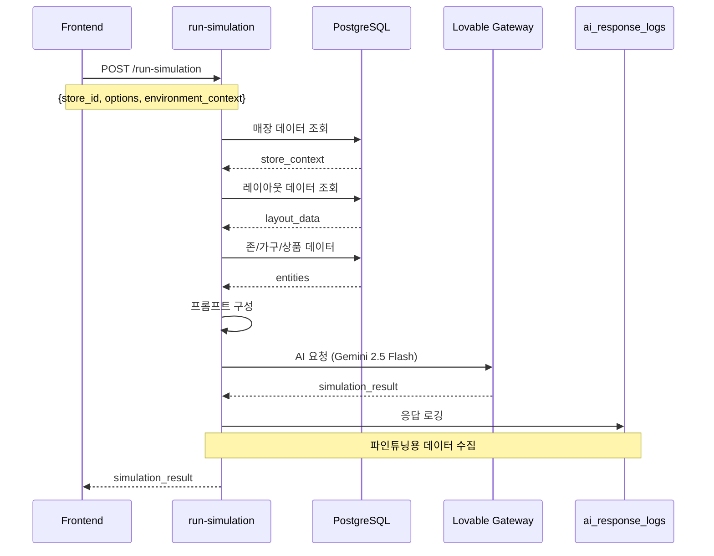

# NEURALTWIN 서비스 플로우 가이드

> **버전**: 1.1
> **최종 업데이트**: 2026-01-06
> **변경 이력**:
> - v1.1: AI 함수 역할 분담 아키텍처 추가, advanced-ai-inference deprecated 처리, staffing 최적화 추가
> **문서 목적**: NEURALTWIN Customer Dashboard의 전체 시스템 아키텍처 및 서비스 플로우 정의

---

## 목차

1. [시스템 아키텍처 개요](#1-시스템-아키텍처-개요)
2. [전체 서비스 플로우](#2-전체-서비스-플로우)
3. [페이지별 서비스 플로우](#3-페이지별-서비스-플로우)
4. [Edge Function 플로우](#4-edge-function-플로우)
5. [데이터 플로우](#5-데이터-플로우)
6. [AI 통합 플로우](#6-ai-통합-플로우)
7. [인증 및 권한 플로우](#7-인증-및-권한-플로우)

---

## 1. 시스템 아키텍처 개요

### 1.1 전체 아키텍처 다이어그램


### 1.2 기술 스택

| 계층 | 기술 | 용도 |
|------|------|------|
| **Frontend** | React 18 + TypeScript | UI 프레임워크 |
| **3D 렌더링** | Three.js + React Three Fiber | 디지털 트윈 시각화 |
| **상태 관리** | Zustand | 클라이언트 상태 |
| **서버 상태** | TanStack Query | API 캐싱 및 동기화 |
| **스타일링** | Tailwind CSS + shadcn/ui | UI 컴포넌트 |
| **백엔드** | Supabase Edge Functions (Deno) | 서버리스 API |
| **데이터베이스** | PostgreSQL + PostGIS | 관계형 + 공간 데이터 |
| **AI Gateway** | Lovable API Gateway | AI API 중계 |
| **AI 모델** | Gemini 2.5 Flash | 시뮬레이션 및 최적화 |

---

## 2. 전체 서비스 플로우

### 2.1 애플리케이션 라우팅 구조


### 2.2 페이지 개요

| 경로 | 페이지 | 주요 기능 |
|------|--------|-----------|
| `/auth` | AuthPage | 로그인/회원가입 |
| `/insight-hub` | InsightHubPage | 매장 인사이트 대시보드 |
| `/studio` | DigitalTwinStudioPage | 3D 매장 시뮬레이션 |
| `/roi-measurement` | ROIMeasurementPage | ROI 분석 및 측정 |
| `/settings` | SettingsPage | 설정 관리 |

---

## 3. 페이지별 서비스 플로우

### 3.1 Insight Hub 서비스 플로우


**데이터 소스:**
- `daily_kpis` - 일별 KPI 집계
- `hourly_visitors` - 시간대별 방문자
- `zone_transitions` - 존 간 이동
- `product_performance` - 상품 실적
- `sales_transactions` - 판매 트랜잭션

### 3.2 Digital Twin Studio 서비스 플로우


**Edge Function 호출:**
- `run-simulation` - AI 시뮬레이션
- `generate-optimization` - 최적화 제안
- `advanced-ai-inference` - 고급 AI 분석

### 3.3 ROI Measurement 서비스 플로우


### 3.4 Settings 서비스 플로우


---

## 4. Edge Function 플로우

### 4.1 Edge Function 목록

| 함수명 | 유형 | 설명 | 상태 |
|--------|------|------|------|
| `generate-optimization` | AI | 가구/상품/인력 배치 최적화 | ✅ Active |
| `run-simulation` | AI | 트래픽/매출/시나리오 시뮬레이션 | ✅ Active |
| `retail-ai-inference` | AI | 소매 AI 추론 | ✅ Active |
| `advanced-ai-inference` | AI | 고급 AI 분석 | ⚠️ Deprecated |
| `unified-ai` | AI | 통합 AI 인터페이스 | ✅ Active |

#### AI 함수 역할 분담 (2024-01 아키텍처)

```
┌─────────────────────────────────────────────────────────────┐
│                     현재 아키텍처                            │
├─────────────────────────────────────────────────────────────┤
│                                                              │
│  [시뮬레이션 담당]              [최적화 담당]                  │
│                                                              │
│   run-simulation              generate-optimization          │
│   ├─ 트래픽/매출 예측          ├─ 가구 배치 최적화 (furniture)│
│   ├─ 혼잡도 분석               ├─ 상품 배치 최적화 (product)  │
│   ├─ diagnostic_issues        ├─ 인력 배치 최적화 (staffing) │
│   └─ 시나리오 시뮬레이션       ├─ 통합 최적화 (both)          │
│                                ├─ 동선/VMD/연관성 분석         │
│                                └─ 매출/전환율 예측             │
│                                                              │
│  [Deprecated - 마이그레이션 중]                              │
│   advanced-ai-inference                                      │
│   ├─ layout_optimization → generate-optimization (both)     │
│   ├─ staffing_optimization → generate-optimization (staffing)│
│   ├─ flow_simulation → 유지 (분석용)                         │
│   └─ congestion_simulation → 유지 (분석용)                   │
│                                                              │
└─────────────────────────────────────────────────────────────┘
```

| 함수명 | 유형 | 설명 |
|--------|------|------|
| `etl-hourly-visitors` | ETL | 시간별 방문자 집계 |
| `etl-daily-kpis` | ETL | 일별 KPI 집계 |
| `etl-zone-transitions` | ETL | 존 이동 집계 |
| `analyze-associations` | Analytics | 연관 분석 |
| `analyze-flow` | Analytics | 동선 분석 |
| `send-notification` | Utility | 알림 발송 |

### 4.2 AI 시뮬레이션 플로우 (run-simulation)



### 4.3 최적화 제안 플로우 (generate-optimization)


### 4.4 ETL 파이프라인 플로우


---

## 5. 데이터 플로우

### 5.1 데이터베이스 스키마 개요

```mermaid
erDiagram
    stores ||--o{ layouts : has
    stores ||--o{ daily_kpis : has
    stores ||--o{ hourly_visitors : has

    layouts ||--o{ furniture : contains
    layouts ||--o{ products : contains
    layouts ||--o{ zones : contains

    zones ||--o{ zone_transitions : from
    zones ||--o{ zone_transitions : to

    products ||--o{ product_performance : has
    products ||--o{ sales_transactions : in

    stores ||--o{ ai_response_logs : generates

    stores {
        uuid id PK
        string name
        string address
        jsonb settings
    }

    layouts {
        uuid id PK
        uuid store_id FK
        jsonb floor_data
        jsonb metadata
    }

    furniture {
        uuid id PK
        uuid layout_id FK
        string type
        jsonb position
        jsonb dimensions
    }

    zones {
        uuid id PK
        uuid layout_id FK
        string name
        string zone_type
        jsonb polygon
    }

    ai_response_logs {
        uuid id PK
        uuid store_id FK
        string function_name
        string simulation_type
        jsonb input_variables
        jsonb ai_response
        jsonb context_metadata
    }
```

### 5.2 실시간 데이터 플로우


---

## 6. AI 통합 플로우

### 6.1 AI Gateway 아키텍처


### 6.2 프리셋 시나리오 플로우


### 6.3 AI 시뮬레이션 → AI 최적화 연결 플로우


### 6.4 진단 이슈 컨텍스트 구조

```typescript
interface DiagnosticIssuesContext {
  priority_issues: {
    id: string;
    type: string;              // 'congestion' | 'bottleneck' | 'deadzone'
    severity: 'critical' | 'warning' | 'info';
    title: string;
    zone_id: string;
    zone_name: string;
    description: string;
    impact: {
      revenueImpact: number;   // 예상 매출 손실
      trafficImpact: number;
      conversionImpact: number;
    };
    recommendations: string[];
  }[];
  scenario_context: {          // 시뮬레이션 프리셋 시나리오
    id: string;
    name: string;
    description: string;
    risk_tags: string[];
  } | null;
  environment_context: {       // 환경 설정
    weather: string;
    holiday_type: string;
    time_of_day: string;
    traffic_multiplier: number;
  } | null;
  simulation_kpis: {           // 시뮬레이션 KPI
    visitors: number;
    revenue: number;
    conversion: number;
    avg_dwell: number;
  } | null;
}
```

### 6.5 AI 응답 로깅 플로우


---

## 7. 인증 및 권한 플로우

### 7.1 인증 플로우


### 7.2 권한 체크 플로우


### 7.3 RLS (Row Level Security) 플로우

```mermaid
flowchart TB
    subgraph "요청"
        CLIENT[클라이언트 요청]
        JWT[JWT Token]
    end

    subgraph "Supabase"
        AUTH[auth.uid() 추출]
        RLS[RLS Policy 적용]
        QUERY[쿼리 실행]
    end

    subgraph "데이터 필터링"
        STORE_ACCESS[매장 접근 권한]
        DATA_FILTER[데이터 필터링]
    end

    CLIENT --> JWT
    JWT --> AUTH
    AUTH --> RLS
    RLS --> STORE_ACCESS
    STORE_ACCESS --> DATA_FILTER
    DATA_FILTER --> QUERY
```

---

## 부록

### A. 환경 변수

| 변수명 | 용도 |
|--------|------|
| `SUPABASE_URL` | Supabase 프로젝트 URL |
| `SUPABASE_ANON_KEY` | 공개 API 키 |
| `SUPABASE_SERVICE_ROLE_KEY` | 서비스 역할 키 (서버용) |
| `LOVABLE_API_KEY` | AI Gateway API 키 |

### B. 관련 문서

- [NEURALTWIN_USER_FLOW.md](./NEURALTWIN_USER_FLOW.md) - 사용자 플로우 가이드
- [DIGITAL_TWIN_STUDIO_QA_GUIDE.md](./DIGITAL_TWIN_STUDIO_QA_GUIDE.md) - QA 가이드
- [AI_FINETUNING_DATASET_QA_GUIDE.md](./AI_FINETUNING_DATASET_QA_GUIDE.md) - AI 데이터셋 QA 가이드

---

## 버전 히스토리

| 버전 | 날짜 | 변경 내용 |
|------|------|-----------|
| 1.0 | 2026-01-06 | 초기 문서 작성 |
| 1.1 | 2026-01-06 | AI 시뮬레이션 → AI 최적화 연결 플로우 추가 (섹션 6.3, 6.4) |
