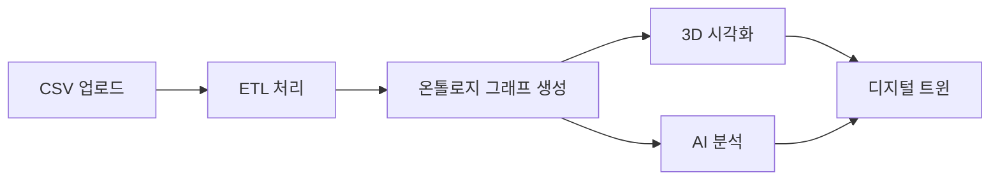

# NEURALTWIN 필수 데이터셋 명세서

> **생성일**: 2025-11-21  
> **버전**: 1.0  
> **용도**: NEURALTWIN 데모 및 프로덕션 데이터셋 생성 가이드  
> **기반 온톨로지**: 엔티티 43개, 관계 89개

---

## 📋 목차

1. [데이터셋 개요](#데이터셋-개요)
2. [핵심 CSV 데이터셋](#핵심-csv-데이터셋)
3. [온톨로지 데이터](#온톨로지-데이터)
4. [3D 모델 데이터](#3d-모델-데이터)
5. [IoT 센서 데이터](#iot-센서-데이터)
6. [데이터 우선순위 및 생성 순서](#데이터-우선순위-및-생성-순서)

---

## 데이터셋 개요

### 전체 데이터셋 구조

```
NEURALTWIN 데이터셋
├── CSV 데이터 (15개 파일)
│   ├── 핵심 데이터 (7개) - Priority 1
│   ├── 분석 데이터 (5개) - Priority 2
│   └── 고급 데이터 (3개) - Priority 3
├── 온톨로지 데이터 (JSON)
│   ├── Entity Types (43개)
│   └── Relation Types (89개)
└── 3D 모델 데이터
    ├── GLB 파일 (10-15개)
    └── JSON 메타데이터
```

### 데이터 흐름



---

## 핵심 CSV 데이터셋

### Priority 1: 핵심 데모 데이터 (필수)

#### 1. stores.csv
**목적**: 매장 기본 정보  
**최소 레코드**: 3개  
**관련 엔티티**: Store

| 컬럼명 | 타입 | 필수 | 설명 | 예시 |
|--------|------|------|------|------|
| store_code | string | ✓ | 매장 코드 (고유) | ST001 |
| store_name | string | ✓ | 매장명 | 강남 플래그십 |
| address | string | ✓ | 주소 | 서울 강남구 테헤란로 123 |
| area_sqm | number | ✓ | 매장 면적 (㎡) | 450.5 |
| opening_date | date | ○ | 개점일 | 2023-03-15 |
| store_format | string | ○ | 매장 포맷 | flagship |
| region | string | ○ | 권역 | 서울 |
| district | string | ○ | 상권 | 강남역 |
| manager_name | string | ○ | 매장 책임자 | 김매니저 |

**데이터 생성 규칙**:
- store_code는 "ST" + 3자리 숫자
- store_format: flagship, standard, compact 중 선택
- area_sqm: 200-800 범위
- region: 서울, 경기, 부산 등

**샘플 데이터**:
```csv
store_code,store_name,address,area_sqm,opening_date,store_format,region,district,manager_name
ST001,강남 플래그십,서울 강남구 테헤란로 123,450.5,2023-03-15,flagship,서울,강남역,김매니저
ST002,홍대 스탠다드,서울 마포구 양화로 456,320.0,2023-06-01,standard,서울,홍대입구,이매니저
ST003,부산 센텀,부산 해운대구 센텀로 789,380.0,2023-09-10,flagship,부산,센텀시티,박매니저
```

---

#### 2. products.csv
**목적**: 제품 카탈로그  
**최소 레코드**: 50-100개  
**관련 엔티티**: Product, Brand

| 컬럼명 | 타입 | 필수 | 설명 | 예시 |
|--------|------|------|------|------|
| sku | string | ✓ | SKU 코드 (고유) | SKU-W-DRS-001 |
| product_name | string | ✓ | 제품명 | 플로럴 원피스 |
| category | string | ✓ | 카테고리 | 여성의류 |
| brand | string | ✓ | 브랜드명 | STYLE_CO |
| selling_price | number | ✓ | 판매가 | 89000 |
| cost_price | number | ○ | 원가 | 45000 |
| supplier | string | ○ | 공급업체 | 동대문패션 |
| lead_time_days | number | ○ | 리드타임 | 7 |

**데이터 생성 규칙**:
- sku 패턴: "SKU-{카테고리코드}-{타입코드}-{일련번호}"
  - W: Women, M: Men, K: Kids, A: Accessories
  - DRS: Dress, TOP: Top, BTM: Bottom, OUT: Outer, BAG: Bag, SHO: Shoes
- category: 여성의류, 남성의류, 아동의류, 액세서리, 신발, 가방
- selling_price: 19,000 ~ 299,000 (천원 단위)
- cost_price: selling_price의 40-60%
- lead_time_days: 3-14일

**샘플 데이터**:
```csv
sku,product_name,category,brand,selling_price,cost_price,supplier,lead_time_days
SKU-W-DRS-001,플로럴 원피스,여성의류,STYLE_CO,89000,45000,동대문패션,7
SKU-W-TOP-001,캐주얼 티셔츠,여성의류,BASIC_LINE,29000,15000,청계천의류,5
SKU-M-BTM-001,슬림핏 청바지,남성의류,DENIM_PRO,79000,40000,부산데님,10
SKU-A-BAG-001,크로스백,액세서리,LEATHER_STUDIO,59000,30000,가죽공방,7
```

---

#### 3. customers.csv
**목적**: 고객 프로필  
**최소 레코드**: 200-500명  
**관련 엔티티**: Customer

| 컬럼명 | 타입 | 필수 | 설명 | 예시 |
|--------|------|------|------|------|
| customer_id | string | ✓ | 고객 ID (고유) | C00001 |
| age_group | string | ✓ | 연령대 | 20-29 |
| gender | string | ✓ | 성별 | F |
| customer_segment | string | ✓ | 고객 세그먼트 | regular |
| signup_date | date | ✓ | 가입일 | 2024-01-15 |
| loyalty_tier | string | ○ | 멤버십 등급 | silver |

**데이터 생성 규칙**:
- customer_id: "C" + 5자리 숫자 (00001~99999)
- age_group: 10-19, 20-29, 30-39, 40-49, 50-59, 60+
- gender: M (남성), F (여성)
- customer_segment: new (신규), regular (일반), VIP
  - new: 30%, regular: 60%, VIP: 10%
- loyalty_tier: bronze, silver, gold, platinum
- signup_date: 최근 2년 이내

**고객 세그먼트별 특성**:
```
VIP (10%):
- loyalty_tier: gold/platinum
- 월 평균 구매: 3-5회
- 평균 객단가: 150,000원+

Regular (60%):
- loyalty_tier: silver/bronze
- 월 평균 구매: 1-2회
- 평균 객단가: 50,000-100,000원

New (30%):
- loyalty_tier: bronze
- 월 평균 구매: 0-1회
- 평균 객단가: 30,000-70,000원
```

**샘플 데이터**:
```csv
customer_id,age_group,gender,customer_segment,signup_date,loyalty_tier
C00001,20-29,F,VIP,2023-03-15,gold
C00002,30-39,F,regular,2023-08-22,silver
C00003,20-29,M,new,2024-11-01,bronze
C00004,40-49,F,VIP,2022-06-10,platinum
```

---

#### 4. visits.csv
**목적**: 매장 방문 기록  
**최소 레코드**: 2,000-5,000건  
**관련 엔티티**: Visit

| 컬럼명 | 타입 | 필수 | 설명 | 예시 |
|--------|------|------|------|------|
| visit_id | string | ✓ | 방문 ID (고유) | V0000001 |
| customer_id | string | ✓ | 고객 ID | C00001 |
| store_code | string | ✓ | 매장 코드 | ST001 |
| visit_date | date | ✓ | 방문 날짜 | 2024-11-15 |
| visit_time | time | ✓ | 방문 시간 | 14:30:00 |
| duration_minutes | number | ✓ | 체류 시간 (분) | 45 |
| zones_visited | string | ○ | 방문 구역 (쉼표 구분) | ZONE-WOMEN,ZONE-FITTING |
| did_purchase | boolean | ✓ | 구매 여부 | true |

**데이터 생성 규칙**:
- visit_id: "V" + 7자리 숫자
- visit_date: 최근 3개월 데이터
- visit_time: 10:00-20:00 (영업시간)
  - 피크타임: 12:00-14:00, 18:00-20:00
- duration_minutes: 5-120분
  - 구매한 경우: 평균 40-60분
  - 구매 안한 경우: 평균 15-30분
- did_purchase: true (30-40%), false (60-70%)
- zones_visited: 평균 2-4개 구역 방문

**요일별/시간대별 패턴**:
```
평일 (월-목):
- 11:00-13:00: 20%
- 13:00-17:00: 30%
- 17:00-20:00: 50%

주말 (금-일):
- 11:00-14:00: 40%
- 14:00-17:00: 35%
- 17:00-20:00: 25%
```

**샘플 데이터**:
```csv
visit_id,customer_id,store_code,visit_date,visit_time,duration_minutes,zones_visited,did_purchase
V0000001,C00001,ST001,2024-11-15,14:30:00,45,"ZONE-WOMEN,ZONE-FITTING",true
V0000002,C00002,ST001,2024-11-15,15:20:00,22,"ZONE-WOMEN",false
V0000003,C00003,ST002,2024-11-15,18:45:00,55,"ZONE-MEN,ZONE-SHOES,ZONE-CHECKOUT",true
```

---

#### 5. purchases.csv (sales.csv)
**목적**: 구매/판매 거래  
**최소 레코드**: 1,000-2,000건  
**관련 엔티티**: Sale

| 컬럼명 | 타입 | 필수 | 설명 | 예시 |
|--------|------|------|------|------|
| sale_id | string | ✓ | 판매 ID (고유) | S0000001 |
| visit_id | string | ✓ | 방문 ID | V0000001 |
| customer_id | string | ✓ | 고객 ID | C00001 |
| store_code | string | ✓ | 매장 코드 | ST001 |
| sale_date | date | ✓ | 판매 날짜 | 2024-11-15 |
| sale_time | time | ✓ | 판매 시간 | 15:15:00 |
| products_purchased | string | ✓ | 구매 제품 (쉼표 구분) | SKU-W-DRS-001,SKU-A-BAG-001 |
| quantities | string | ✓ | 수량 (쉼표 구분) | 1,1 |
| total_amount | number | ✓ | 총 금액 | 148000 |
| discount_amount | number | ○ | 할인 금액 | 0 |
| payment_method | string | ✓ | 결제 수단 | card |
| num_items | number | ✓ | 구매 품목 수 | 2 |

**데이터 생성 규칙**:
- sale_id: "S" + 7자리 숫자
- visit_id와 연결: did_purchase=true인 방문에만 판매 데이터 생성
- sale_time: visit_time + duration_minutes 즈음
- products_purchased: 1-5개 제품 (평균 2.3개)
- total_amount: 제품 가격 합계 - 할인
- discount_amount: 0 (70%), 10-30% 할인 (30%)
- payment_method: card (70%), cash (15%), mobile (15%)

**세그먼트별 구매 패턴**:
```
VIP:
- 평균 구매 품목: 3-5개
- 평균 객단가: 180,000원
- 할인율: 5-15%

Regular:
- 평균 구매 품목: 2-3개
- 평균 객단가: 75,000원
- 할인율: 0-20%

New:
- 평균 구매 품목: 1-2개
- 평균 객단가: 50,000원
- 할인율: 10-30%
```

**샘플 데이터**:
```csv
sale_id,visit_id,customer_id,store_code,sale_date,sale_time,products_purchased,quantities,total_amount,discount_amount,payment_method,num_items
S0000001,V0000001,C00001,ST001,2024-11-15,15:15:00,"SKU-W-DRS-001,SKU-A-BAG-001","1,1",148000,0,card,2
S0000002,V0000003,C00003,ST002,2024-11-15,19:40:00,"SKU-M-BTM-001","1",79000,15800,mobile,1
```

---

#### 6. zones.csv
**목적**: 매장 내 구역 정의  
**최소 레코드**: 매장당 8-15개 (총 30-50개)  
**관련 엔티티**: Zone, Entrance, CheckoutCounter, FittingRoom

| 컬럼명 | 타입 | 필수 | 설명 | 예시 |
|--------|------|------|------|------|
| zone_id | string | ✓ | 구역 ID (고유) | ZONE-ST001-WOMEN |
| store_code | string | ✓ | 매장 코드 | ST001 |
| zone_type | string | ✓ | 구역 유형 | sales_floor |
| zone_name | string | ✓ | 구역명 | 여성의류 |
| area_sqm | number | ✓ | 면적 (㎡) | 120.5 |
| purpose | string | ○ | 용도 | product_display |
| traffic_level | string | ○ | 통행량 수준 | high |

**데이터 생성 규칙**:
- zone_id: "ZONE-{매장코드}-{구역명}"
- zone_type 종류:
  - entrance: 입구
  - sales_floor: 판매 공간
  - fitting_room: 피팅룸
  - checkout: 계산대
  - storage: 창고
  - staff: 직원 공간
  - restroom: 화장실
  - aisle: 통로
- traffic_level: low, medium, high
- 매장당 필수 구역:
  - 입구 (1개)
  - 판매 공간 (4-8개)
  - 계산대 (1-2개)
  - 피팅룸 (1-2개)
  - 창고 (1개)

**표준 매장 구역 구성**:
```
플래그십 매장 (450㎡):
1. ENTRANCE (입구) - 20㎡
2. ZONE-WOMEN (여성의류) - 150㎡
3. ZONE-MEN (남성의류) - 120㎡
4. ZONE-ACCESSORIES (액세서리) - 60㎡
5. ZONE-SHOES (신발) - 50㎡
6. ZONE-FITTING (피팅룸) - 20㎡
7. ZONE-CHECKOUT (계산대) - 30㎡
8. ZONE-STORAGE (창고) - 40㎡
9. ZONE-STAFF (직원공간) - 10㎡
```

**샘플 데이터**:
```csv
zone_id,store_code,zone_type,zone_name,area_sqm,purpose,traffic_level
ZONE-ST001-ENTRANCE,ST001,entrance,메인 입구,20.0,customer_entry,high
ZONE-ST001-WOMEN,ST001,sales_floor,여성의류,150.0,product_display,high
ZONE-ST001-MEN,ST001,sales_floor,남성의류,120.0,product_display,medium
ZONE-ST001-FITTING,ST001,fitting_room,피팅룸,20.0,try_on,medium
ZONE-ST001-CHECKOUT,ST001,checkout,계산대,30.0,transaction,high
```

---

#### 7. staff.csv
**목적**: 직원 정보  
**최소 레코드**: 매장당 5-10명 (총 20-30명)  
**관련 엔티티**: Staff

| 컬럼명 | 타입 | 필수 | 설명 | 예시 |
|--------|------|------|------|------|
| staff_id | string | ✓ | 직원 ID (고유) | EMP001 |
| staff_name | string | ✓ | 직원명 | 김직원 |
| store_code | string | ✓ | 소속 매장 | ST001 |
| role | string | ✓ | 역할 | sales |
| hire_date | date | ✓ | 입사일 | 2023-06-01 |
| shift_schedule | string | ○ | 근무 시간대 | morning |

**데이터 생성 규칙**:
- staff_id: "EMP" + 3자리 숫자
- role 종류:
  - manager (1명/매장): 매장 관리자
  - sales (4-6명/매장): 판매 직원
  - stockist (2-3명/매장): 재고 관리
- shift_schedule: morning (10:00-16:00), afternoon (14:00-20:00), full (10:00-20:00)
- hire_date: 최근 3년 이내

**샘플 데이터**:
```csv
staff_id,staff_name,store_code,role,hire_date,shift_schedule
EMP001,김매니저,ST001,manager,2023-03-15,full
EMP002,이판매,ST001,sales,2023-06-01,morning
EMP003,박판매,ST001,sales,2023-06-01,afternoon
EMP004,최재고,ST001,stockist,2023-08-10,morning
```

---

### Priority 2: 분석 강화 데이터

#### 8. wifi_sensors.csv
**목적**: WiFi 센서 배치 정보  
**최소 레코드**: 매장당 8-12개  
**관련 엔티티**: WiFiSensor

| 컬럼명 | 타입 | 필수 | 설명 | 예시 |
|--------|------|------|------|------|
| sensor_id | string | ✓ | 센서 ID | WS-ST001-001 |
| store_code | string | ✓ | 매장 코드 | ST001 |
| zone_id | string | ✓ | 설치 구역 | ZONE-ST001-WOMEN |
| position_x | number | ✓ | X 좌표 (미터) | 15.5 |
| position_y | number | ✓ | Y 좌표 (미터) | 8.2 |
| position_z | number | ✓ | Z 좌표 (미터) | 2.8 |
| mac_address | string | ○ | MAC 주소 | 00:11:22:33:44:55 |
| ip_address | string | ○ | IP 주소 | 192.168.1.101 |
| detection_range_m | number | ○ | 탐지 범위 (미터) | 30 |

**센서 배치 원칙**:
- 구역당 1-2개 센서
- 천장 높이: 2.5-3.0m
- 탐지 범위: 25-35m
- 중복 커버리지: 최소 20%

**샘플 데이터**:
```csv
sensor_id,store_code,zone_id,position_x,position_y,position_z,mac_address,ip_address,detection_range_m
WS-ST001-001,ST001,ZONE-ST001-WOMEN,15.5,8.2,2.8,00:11:22:33:44:55,192.168.1.101,30
WS-ST001-002,ST001,ZONE-ST001-MEN,25.0,8.5,2.8,00:11:22:33:44:56,192.168.1.102,30
```

---

#### 9. wifi_tracking.csv
**목적**: WiFi 기반 위치 추적 데이터  
**최소 레코드**: 매장당 시간당 500-1,000개 포인트  
**관련 엔티티**: WiFiSensor, Customer, Visit

| 컬럼명 | 타입 | 필수 | 설명 | 예시 |
|--------|------|------|------|------|
| tracking_id | string | ✓ | 추적 ID | TRK-0000001 |
| sensor_id | string | ✓ | 감지 센서 | WS-ST001-001 |
| mac_address_hash | string | ✓ | 기기 MAC (해시) | hash_abc123 |
| timestamp | datetime | ✓ | 감지 시간 | 2024-11-15 14:30:15 |
| signal_strength | number | ✓ | 신호 강도 (dBm) | -65 |
| estimated_distance | number | ○ | 추정 거리 (미터) | 5.2 |
| zone_id | string | ○ | 추정 구역 | ZONE-ST001-WOMEN |

**데이터 생성 규칙**:
- tracking_id: "TRK-" + 7자리 숫자
- signal_strength: -90 ~ -40 dBm
  - -40 ~ -60: 매우 가까움 (0-5m)
  - -61 ~ -75: 가까움 (5-15m)
  - -76 ~ -90: 멀음 (15-30m)
- 고객당 방문 시 5-10초마다 1개 포인트
- MAC 주소는 해시 처리 (개인정보 보호)

**샘플 데이터**:
```csv
tracking_id,sensor_id,mac_address_hash,timestamp,signal_strength,estimated_distance,zone_id
TRK-0000001,WS-ST001-001,hash_abc123,2024-11-15 14:30:15,-65,5.2,ZONE-ST001-WOMEN
TRK-0000002,WS-ST001-001,hash_abc123,2024-11-15 14:30:25,-63,4.8,ZONE-ST001-WOMEN
```

---

#### 10. inventory_levels.csv
**목적**: 제품별 재고 현황  
**최소 레코드**: 제품당 1개 (50-100개)  
**관련 엔티티**: Inventory, Product

| 컬럼명 | 타입 | 필수 | 설명 | 예시 |
|--------|------|------|------|------|
| inventory_id | string | ✓ | 재고 ID | INV-ST001-SKU001 |
| store_code | string | ✓ | 매장 코드 | ST001 |
| sku | string | ✓ | 제품 SKU | SKU-W-DRS-001 |
| current_stock | number | ✓ | 현재 재고 | 12 |
| minimum_stock | number | ✓ | 최소 재고 | 5 |
| optimal_stock | number | ✓ | 적정 재고 | 20 |
| weekly_demand | number | ✓ | 주간 수요 | 8 |
| last_updated | datetime | ✓ | 마지막 업데이트 | 2024-11-15 09:00:00 |

**재고 레벨 산정**:
```
optimal_stock = weekly_demand * 2.5
minimum_stock = weekly_demand * 0.6
current_stock = optimal_stock ± 30% (랜덤)

재고 상태:
- 충분: current >= optimal
- 주의: minimum <= current < optimal
- 부족: current < minimum
```

**샘플 데이터**:
```csv
inventory_id,store_code,sku,current_stock,minimum_stock,optimal_stock,weekly_demand,last_updated
INV-ST001-SKU001,ST001,SKU-W-DRS-001,12,5,20,8,2024-11-15 09:00:00
INV-ST001-SKU002,ST001,SKU-W-TOP-001,3,4,15,6,2024-11-15 09:00:00
```

---

#### 11. brands.csv
**목적**: 브랜드 상세 정보  
**최소 레코드**: 10-20개  
**관련 엔티티**: Brand

| 컬럼명 | 타입 | 필수 | 설명 | 예시 |
|--------|------|------|------|------|
| brand_id | string | ✓ | 브랜드 ID | BRD001 |
| brand_name | string | ✓ | 브랜드명 | STYLE_CO |
| brand_category | string | ✓ | 브랜드 카테고리 | fashion |
| brand_tier | string | ✓ | 브랜드 등급 | premium |
| origin_country | string | ○ | 원산지 | Korea |

**브랜드 등급 분류**:
- luxury: 고가 명품 (가격대 200,000원+)
- premium: 프리미엄 (100,000-200,000원)
- standard: 일반 (50,000-100,000원)
- value: 저가 (50,000원 이하)

**샘플 데이터**:
```csv
brand_id,brand_name,brand_category,brand_tier,origin_country
BRD001,STYLE_CO,fashion,premium,Korea
BRD002,BASIC_LINE,fashion,standard,Korea
BRD003,DENIM_PRO,denim,premium,Korea
```

---

#### 12. promotions.csv
**목적**: 프로모션/이벤트 정보  
**최소 레코드**: 10-20개  
**관련 엔티티**: Promotion

| 컬럼명 | 타입 | 필수 | 설명 | 예시 |
|--------|------|------|------|------|
| promotion_id | string | ✓ | 프로모션 ID | PROMO001 |
| promotion_name | string | ✓ | 프로모션명 | 블랙프라이데이 |
| promotion_type | string | ✓ | 프로모션 유형 | discount |
| start_date | date | ✓ | 시작일 | 2024-11-20 |
| end_date | date | ✓ | 종료일 | 2024-11-30 |
| discount_rate | number | ○ | 할인율 (%) | 30 |
| applicable_categories | string | ○ | 대상 카테고리 | 여성의류,액세서리 |

**프로모션 유형**:
- discount: 정률 할인
- bogo: Buy One Get One
- bundle: 묶음 할인
- seasonal: 시즌 세일

**샘플 데이터**:
```csv
promotion_id,promotion_name,promotion_type,start_date,end_date,discount_rate,applicable_categories
PROMO001,블랙프라이데이,discount,2024-11-20,2024-11-30,30,"여성의류,남성의류"
PROMO002,원플러스원,bogo,2024-11-01,2024-11-15,0,액세서리
```

---

### Priority 3: 고급 분석 데이터

#### 13. dashboard_kpis.csv
**목적**: 일별 대시보드 KPI  
**최소 레코드**: 매장당 90일 (총 270개)  
**관련 엔티티**: (집계 데이터)

| 컬럼명 | 타입 | 필수 | 설명 | 예시 |
|--------|------|------|------|------|
| date | date | ✓ | 날짜 | 2024-11-15 |
| store_code | string | ✓ | 매장 코드 | ST001 |
| total_visits | number | ✓ | 총 방문 수 | 245 |
| total_purchases | number | ✓ | 총 구매 수 | 89 |
| total_revenue | number | ✓ | 총 매출 | 8450000 |
| conversion_rate | number | ✓ | 전환율 (%) | 36.3 |
| sales_per_sqm | number | ○ | 평당 매출 | 18777 |
| funnel_entry | number | ○ | 퍼널: 입장 | 245 |
| funnel_browse | number | ○ | 퍼널: 둘러봄 | 198 |
| funnel_fitting | number | ○ | 퍼널: 착용 | 112 |
| funnel_purchase | number | ○ | 퍼널: 구매 | 89 |

**KPI 계산 공식**:
```
conversion_rate = (total_purchases / total_visits) * 100
sales_per_sqm = total_revenue / area_sqm
avg_transaction = total_revenue / total_purchases
```

**요일별 트렌드**:
```
월-목: 방문 70-90명/일, 전환율 30-35%
금-일: 방문 120-150명/일, 전환율 35-42%
```

**샘플 데이터**:
```csv
date,store_code,total_visits,total_purchases,total_revenue,conversion_rate,sales_per_sqm,funnel_entry,funnel_browse,funnel_fitting,funnel_purchase
2024-11-15,ST001,245,89,8450000,36.3,18777,245,198,112,89
2024-11-16,ST002,180,68,6120000,37.8,19125,180,152,95,68
```

---

#### 14. economic_indicators.csv
**목적**: 경제 지표 데이터  
**최소 레코드**: 90일  
**관련 엔티티**: (외부 데이터)

| 컬럼명 | 타입 | 필수 | 설명 | 예시 |
|--------|------|------|------|------|
| date | date | ✓ | 날짜 | 2024-11-15 |
| indicator_type | string | ✓ | 지표 유형 | consumer_price_index |
| indicator_value | number | ✓ | 지표 값 | 112.5 |
| region | string | ○ | 지역 | Korea |
| unit | string | ○ | 단위 | index |

**지표 유형**:
- consumer_price_index: 소비자물가지수
- consumer_confidence: 소비자심리지수
- retail_sales_index: 소매판매액지수
- unemployment_rate: 실업률

**샘플 데이터**:
```csv
date,indicator_type,indicator_value,region,unit
2024-11-15,consumer_price_index,112.5,Korea,index
2024-11-15,consumer_confidence,98.2,Korea,index
```

---

#### 15. holidays_events.csv
**목적**: 공휴일 및 이벤트  
**최소 레코드**: 연간 주요 일정 50-100개  
**관련 엔티티**: (달력 데이터)

| 컬럼명 | 타입 | 필수 | 설명 | 예시 |
|--------|------|------|------|------|
| date | date | ✓ | 날짜 | 2024-12-25 |
| event_name | string | ✓ | 이벤트명 | 크리스마스 |
| event_type | string | ✓ | 이벤트 유형 | public_holiday |
| impact_level | string | ○ | 영향도 | high |
| description | string | ○ | 설명 | 연말 쇼핑 시즌 |

**이벤트 유형**:
- public_holiday: 공휴일
- shopping_season: 쇼핑 시즌
- company_event: 자체 이벤트
- weather_event: 기상 이벤트

**샘플 데이터**:
```csv
date,event_name,event_type,impact_level,description
2024-12-25,크리스마스,public_holiday,high,연말 쇼핑 시즌
2024-11-11,빼빼로데이,shopping_season,medium,사탕/초콜릿 판촉
```

---

## 온톨로지 데이터

### 엔티티 타입 JSON 생성

**파일명**: `entity_types.json`

```json
[
  {
    "name": "Store",
    "label": "매장",
    "description": "오프라인 리테일 매장",
    "color": "#3b82f6",
    "icon": "Store",
    "model_3d_url": "https://example.com/models/store.glb",
    "model_3d_type": "building",
    "model_3d_dimensions": {
      "width": 20,
      "height": 4,
      "depth": 30
    },
    "properties": [
      {
        "name": "store_code",
        "type": "string",
        "required": true,
        "description": "매장 코드"
      },
      {
        "name": "store_name",
        "type": "string",
        "required": true,
        "description": "매장명"
      }
    ]
  }
]
```

**생성 방법**:
1. `docs/CURRENT_ONTOLOGY_SCHEMA.md` 참조
2. 43개 엔티티 타입 전체를 JSON 배열로 변환
3. `/schema-builder` 페이지에서 일괄 업로드

---

### 관계 타입 JSON 생성

**파일명**: `relation_types.json`

```json
[
  {
    "name": "contains",
    "label": "포함함",
    "description": "A가 B를 포함함",
    "source_entity_type": "Store",
    "target_entity_type": "Zone",
    "directionality": "directed",
    "properties": []
  }
]
```

**생성 방법**:
1. `docs/CURRENT_ONTOLOGY_SCHEMA.md`의 관계 타입 89개 참조
2. JSON 배열로 변환
3. `/schema-builder` 페이지에서 업로드

---

## 3D 모델 데이터

### 필수 3D 모델 목록

| 모델명 | 파일명 | 엔티티 타입 | 우선순위 |
|--------|--------|-------------|----------|
| 선반 | `shelf_standard_5tier.glb` | Shelf | P1 |
| 랙 | `rack_round_clothes.glb` | Rack | P1 |
| 디스플레이 테이블 | `table_display_rectangular.glb` | DisplayTable | P1 |
| 계산대 | `counter_checkout_single.glb` | CheckoutCounter | P1 |
| 피팅룸 | `fittingroom_small_mirror.glb` | FittingRoom | P2 |
| 마네킹 | `mannequin_female_standing.glb` | Mannequin | P2 |
| WiFi 센서 | `sensor_wifi_ceiling.glb` | WiFiSensor | P2 |
| 카메라 | `camera_dome_ceiling.glb` | Camera | P2 |
| 입구 | `entrance_automatic_door.glb` | Entrance | P3 |
| 벽 | `wall_interior_standard.glb` | Wall | P3 |

### 3D 모델 메타데이터 JSON

**파일명**: `shelf_standard_5tier.json`

```json
{
  "model_filename": "shelf_standard_5tier.glb",
  "entity_type": "Shelf",
  "dimensions": {
    "width": 1.2,
    "height": 2.0,
    "depth": 0.4
  },
  "metadata": {
    "num_shelves": 5,
    "adjustable": true,
    "max_load_kg": 50,
    "material": "steel",
    "color": "white"
  },
  "default_position": {
    "x": 0,
    "y": 0,
    "z": 0
  },
  "default_rotation": {
    "x": 0,
    "y": 0,
    "z": 0
  },
  "default_scale": {
    "x": 1,
    "y": 1,
    "z": 1
  }
}
```

---

## IoT 센서 데이터

### WiFi 추적 데이터 생성 가이드

**시간당 포인트 수**: 500-1,000개  
**데이터 기간**: 최근 1주일  
**고유 MAC 주소**: 300-500개

**생성 알고리즘**:

```python
# 의사코드
for each visit in visits:
    duration_seconds = visit.duration_minutes * 60
    tracking_interval = 5-10초 (랜덤)
    
    current_time = visit.visit_time
    zones = visit.zones_visited.split(',')
    
    for each zone in zones:
        zone_duration = duration_seconds / len(zones)
        sensor = get_sensor_in_zone(zone)
        
        while current_time < visit_time + zone_duration:
            create_tracking_point(
                sensor_id=sensor.id,
                mac_hash=hash(visit.customer_id),
                timestamp=current_time,
                signal_strength=random(-90, -40),
                zone_id=zone
            )
            current_time += tracking_interval
```

**신호 강도 패턴**:
```
구역 진입: -85 ~ -75 dBm
구역 중앙: -65 ~ -45 dBm
구역 이탈: -90 ~ -80 dBm
```

---

## 데이터 우선순위 및 생성 순서

### Phase 1: 기본 데모 (필수)

**목표**: 기본 분석 기능 작동  
**소요 시간**: 1-2시간

```
1. stores.csv (3개 매장)
2. zones.csv (매장당 8개 구역)
3. products.csv (50개 제품)
4. brands.csv (10개 브랜드)
5. customers.csv (200명)
6. visits.csv (1,000건)
7. purchases.csv (300건)
```

**검증 항목**:
- ✓ 매장별 매출 조회
- ✓ 제품별 판매량 조회
- ✓ 고객 세그먼트 분석
- ✓ 일별 방문/구매 트렌드

---

### Phase 2: 고급 분석 (권장)

**목표**: WiFi 추적, 재고 관리, 대시보드 KPI  
**소요 시간**: 2-3시간

```
8. wifi_sensors.csv (매장당 10개)
9. wifi_tracking.csv (5,000 포인트)
10. inventory_levels.csv (제품당 1건)
11. staff.csv (매장당 7명)
12. dashboard_kpis.csv (90일)
```

**검증 항목**:
- ✓ 구역별 고객 동선 시각화
- ✓ 재고 부족 알림
- ✓ 직원 배치 최적화
- ✓ KPI 대시보드

---

### Phase 3: 전체 기능 (완전)

**목표**: 모든 고급 기능 활성화  
**소요 시간**: 1-2시간

```
13. promotions.csv (15개)
14. economic_indicators.csv (90일)
15. holidays_events.csv (50개)
16. 온톨로지 데이터 업로드
17. 3D 모델 업로드
```

**검증 항목**:
- ✓ 프로모션 효과 분석
- ✓ 경제 지표 상관관계
- ✓ 3D 디지털 트윈 렌더링
- ✓ AI 시뮬레이션

---

## 데이터 정합성 체크리스트

### 필수 관계 검증

```sql
-- 1. 모든 visit에 customer와 store 존재
SELECT v.* 
FROM visits v
LEFT JOIN customers c ON v.customer_id = c.customer_id
LEFT JOIN stores s ON v.store_code = s.store_code
WHERE c.customer_id IS NULL OR s.store_code IS NULL;
-- 결과: 0건

-- 2. 모든 purchase에 visit 존재
SELECT p.*
FROM purchases p
LEFT JOIN visits v ON p.visit_id = v.visit_id
WHERE v.visit_id IS NULL;
-- 결과: 0건

-- 3. did_purchase=true인 visit에는 purchase 존재
SELECT v.*
FROM visits v
LEFT JOIN purchases p ON v.visit_id = p.visit_id
WHERE v.did_purchase = true AND p.sale_id IS NULL;
-- 결과: 0건

-- 4. 모든 zone이 유효한 store에 속함
SELECT z.*
FROM zones z
LEFT JOIN stores s ON z.store_code = s.store_code
WHERE s.store_code IS NULL;
-- 결과: 0건
```

### 데이터 범위 검증

```sql
-- 날짜 범위 체크
SELECT 
  MIN(visit_date) as earliest_visit,
  MAX(visit_date) as latest_visit,
  COUNT(*) as total_visits
FROM visits;
-- 예상: 최근 3개월 데이터

-- 전환율 범위 체크
SELECT 
  store_code,
  AVG(CASE WHEN did_purchase THEN 1 ELSE 0 END) * 100 as conversion_rate
FROM visits
GROUP BY store_code;
-- 예상: 30-40% 범위
```

---

## 데이터 생성 도구

### GPT 프롬프트 템플릿

```
당신은 리테일 데이터 생성 전문가입니다.

다음 조건으로 {파일명}.csv 데이터를 생성해주세요:

**매장 정보**:
- 매장 코드: ST001
- 매장명: 강남 플래그십
- 면적: 450㎡
- 매장 포맷: flagship

**데이터 요구사항**:
- 파일명: {파일명}.csv
- 레코드 수: {개수}
- 기간: {기간}
- 컬럼: {컬럼 목록}

**제약 조건**:
- {제약 조건 1}
- {제약 조건 2}

**출력 형식**:
- CSV 형식
- 헤더 포함
- UTF-8 인코딩
- 날짜 형식: YYYY-MM-DD
- 시간 형식: HH:MM:SS

샘플 데이터 5건을 먼저 보여주고, 전체 데이터를 생성해주세요.
```

### Python 스크립트 예시

```python
import pandas as pd
import numpy as np
from datetime import datetime, timedelta

# visits.csv 생성 예시
def generate_visits(num_visits=1000):
    visits = []
    start_date = datetime.now() - timedelta(days=90)
    
    for i in range(num_visits):
        visit_date = start_date + timedelta(
            days=np.random.randint(0, 90),
            hours=np.random.randint(10, 20),
            minutes=np.random.randint(0, 60)
        )
        
        did_purchase = np.random.random() < 0.35  # 35% 전환율
        duration = np.random.randint(15, 30) if not did_purchase \
                   else np.random.randint(40, 80)
        
        visits.append({
            'visit_id': f'V{i+1:07d}',
            'customer_id': f'C{np.random.randint(1, 201):05d}',
            'store_code': np.random.choice(['ST001', 'ST002', 'ST003']),
            'visit_date': visit_date.strftime('%Y-%m-%d'),
            'visit_time': visit_date.strftime('%H:%M:%S'),
            'duration_minutes': duration,
            'did_purchase': did_purchase
        })
    
    df = pd.DataFrame(visits)
    df.to_csv('visits.csv', index=False, encoding='utf-8')
    return df

# 실행
visits_df = generate_visits(1000)
print(f"Generated {len(visits_df)} visit records")
```

---

## 업로드 경로 및 순서

### 1. CSV 데이터 업로드

**경로**: `/data-management/unified`  
**순서**:

```
1. stores.csv
2. zones.csv
3. products.csv
4. brands.csv
5. customers.csv
6. staff.csv
7. wifi_sensors.csv
8. visits.csv
9. purchases.csv
10. inventory_levels.csv
11. promotions.csv
12. wifi_tracking.csv
13. dashboard_kpis.csv
14. economic_indicators.csv
15. holidays_events.csv
```

### 2. 온톨로지 스키마 업로드

**경로**: `/schema-builder`

```
1. Entity Types JSON 업로드
2. Relation Types JSON 업로드
3. 스키마 검증 및 저장
```

### 3. 3D 모델 업로드

**경로**: `/digital-twin/setup-3d-data`

```
1. GLB 파일 업로드 (Storage)
2. JSON 메타데이터 업로드
3. 엔티티 타입 매핑
4. 3D 뷰어 미리보기
```

### 4. ETL 처리

**경로**: `/data-management/unified`

```
1. CSV 선택
2. 엔티티 타입 매핑
3. 관계 타입 매핑
4. ETL 실행
5. 그래프 생성 확인
```

---

## 품질 검증 가이드

### 데이터 품질 메트릭

```
✓ 완전성 (Completeness)
  - 필수 컬럼 누락: 0%
  - NULL 값 비율: < 5%

✓ 정확성 (Accuracy)
  - 날짜 형식 오류: 0%
  - 숫자 범위 오류: 0%
  - 외래키 무결성: 100%

✓ 일관성 (Consistency)
  - 중복 레코드: 0%
  - 상호 모순: 0%

✓ 적시성 (Timeliness)
  - 최신 데이터: 최근 90일
  - 업데이트 주기: 일별
```

### 자동 검증 스크립트

```sql
-- 데이터 품질 리포트
SELECT 
  'stores' as table_name,
  COUNT(*) as total_records,
  COUNT(DISTINCT store_code) as unique_stores,
  SUM(CASE WHEN store_code IS NULL THEN 1 ELSE 0 END) as null_codes
FROM stores

UNION ALL

SELECT 
  'products' as table_name,
  COUNT(*) as total_records,
  COUNT(DISTINCT sku) as unique_skus,
  SUM(CASE WHEN sku IS NULL THEN 1 ELSE 0 END) as null_skus
FROM products;
```

---

## 참고 자료

### 관련 문서

- `CURRENT_ONTOLOGY_SCHEMA.md`: 온톨로지 스키마 전체 정의
- `GPT_DATASET_GENERATION_GUIDE.md`: GPT 기반 데이터 생성 가이드
- `WIFI_TRACKING_CSV_GUIDE.md`: WiFi 추적 데이터 상세 명세
- `3D_MODEL_FILENAME_SPECIFICATION.md`: 3D 모델 파일 명명 규칙
- `DATA_MANAGEMENT_GUIDE.md`: 데이터 관리 전체 가이드

### 샘플 파일 위치

```
/samples/
├── csv/
│   ├── stores_sample.csv
│   ├── products_sample.csv
│   ├── customers_sample.csv
│   └── visits_sample.csv
├── ontology/
│   ├── entity_types_sample.json
│   └── relation_types_sample.json
└── 3d/
    ├── shelf_standard_5tier.glb
    └── shelf_standard_5tier.json
```

---

## 버전 관리

- **Version**: 1.0.0
- **Last Updated**: 2025-11-21
- **Authors**: NEURALTWIN Team
- **Status**: Active

---

## 변경 이력

| 날짜 | 버전 | 변경 내용 | 작성자 |
|------|------|-----------|--------|
| 2025-11-21 | 1.0.0 | 초안 작성 | AI Assistant |

---

**문의**: 이 문서에 대한 질문이나 개선 사항이 있으면 팀에 문의해주세요.
