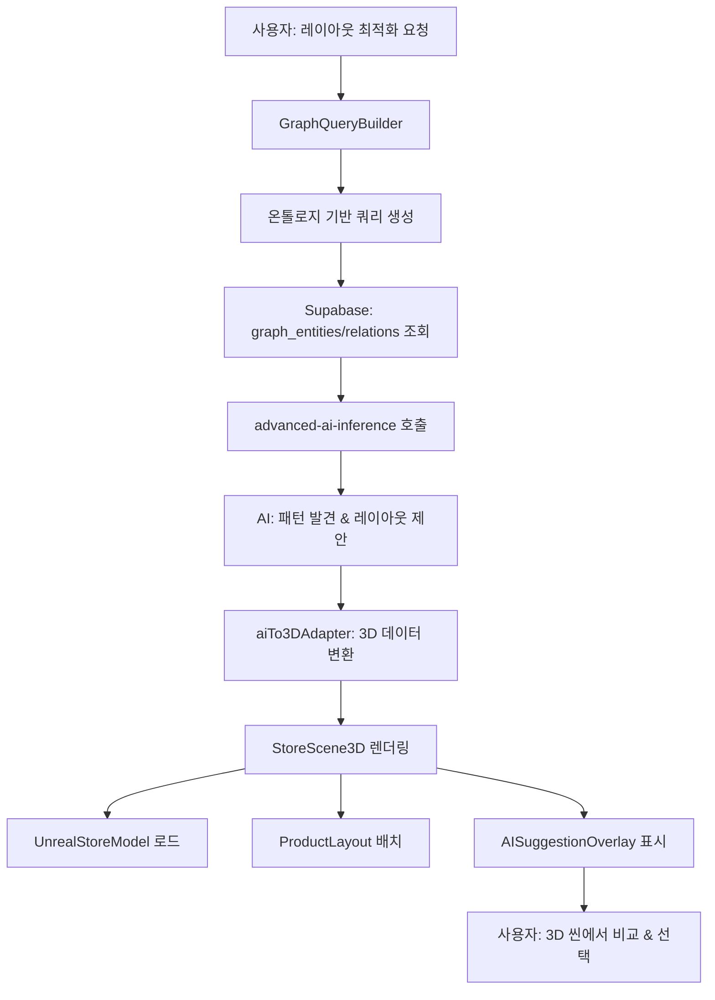

# NeuralTwin 통합 아키텍처 가이드

## 개요

NeuralTwin은 **온톨로지 스키마** 기반의 데이터 모델링, **AI 추론**, **3D 디지털 트윈** 시각화를 통합한 차세대 리테일 인텔리전스 플랫폼입니다.

### 핵심 아키텍처 원칙

```
온톨로지 스키마 (Single Source of Truth)
         ↓
실제 데이터 임포트 & 그래프 구축
         ↓
AI 추론 & 분석 (패턴 발견, 예측, 시뮬레이션)
         ↓
3D 디지털 트윈 시각화 (Unreal + Three.js 하이브리드)
         ↓
사용자 인터랙션 & 의사결정
```

---

## 1. 데이터 레이어 (Foundation)

### 1.1 온톨로지 스키마 정의

**목적**: 도메인 지식을 구조화하고 데이터 일관성을 보장

#### 엔티티 타입 (Entity Types)
```typescript
// 테이블: ontology_entity_types
{
  id: uuid,
  name: "Product",
  label: "제품",
  properties: [
    { name: "sku", type: "string", required: true },
    { name: "name", type: "string", required: true },
    { name: "category", type: "string", required: false },
    { name: "price", type: "number", required: true },
    { name: "cost", type: "number", required: true },
    { name: "supplier", type: "string", required: false }
  ],
  color: "#3b82f6",
  icon: "Package"
}
```

#### 관계 타입 (Relation Types)
```typescript
// 테이블: ontology_relation_types
{
  id: uuid,
  name: "PURCHASED_WITH",
  label: "함께 구매됨",
  source_entity_type: "Customer",
  target_entity_type: "Product",
  directionality: "directed",
  properties: [
    { name: "purchase_date", type: "datetime", required: true },
    { name: "quantity", type: "number", required: true },
    { name: "total_amount", type: "number", required: true }
  ]
}
```

### 1.2 데이터 임포트 & ETL

#### 워크플로우
```
CSV/Excel 업로드
    ↓
[user_data_imports] 테이블에 raw_data 저장
    ↓
auto-map-etl Edge Function 호출
    ↓
AI 기반 온톨로지 매칭 (Lovable AI)
    ↓
schema-etl Edge Function 호출
    ↓
[graph_entities] & [graph_relations] 생성
```

#### 자동 매핑 예시
```typescript
// auto-map-etl 결과
{
  entity_mappings: [
    {
      entity_type_id: "uuid-of-Product",
      mappings: [
        { source_column: "제품코드", target_property: "sku" },
        { source_column: "제품명", target_property: "name" },
        { source_column: "판매가", target_property: "price" }
      ],
      label_template: "{{name}} ({{sku}})"
    }
  ],
  relation_mappings: [
    {
      relation_type_id: "uuid-of-PURCHASED_WITH",
      source_entity_key: "고객ID",
      target_entity_key: "제품코드",
      property_mappings: [
        { source_column: "구매일자", target_property: "purchase_date" },
        { source_column: "수량", target_property: "quantity" }
      ]
    }
  ]
}
```

### 1.3 그래프 데이터베이스

#### 엔티티 인스턴스
```sql
-- graph_entities 테이블
SELECT 
  e.id,
  e.label,  -- "삼성 갤럭시 S24 (SAMS24)"
  e.properties,  -- {"sku": "SAMS24", "price": 1200000, "category": "스마트폰"}
  et.name as entity_type,  -- "Product"
  et.color,
  et.icon
FROM graph_entities e
JOIN ontology_entity_types et ON et.id = e.entity_type_id
WHERE e.user_id = auth.uid();
```

#### 관계 인스턴스
```sql
-- graph_relations 테이블
SELECT 
  r.id,
  r.source_entity_id,  -- 고객#456
  r.target_entity_id,  -- 제품#SAMS24
  r.properties,  -- {"purchase_date": "2024-01-15", "quantity": 1}
  r.weight,  -- 1.0 (연관 강도)
  rt.name as relation_type,  -- "PURCHASED_WITH"
  rt.label  -- "함께 구매됨"
FROM graph_relations r
JOIN ontology_relation_types rt ON rt.id = r.relation_type_id
WHERE r.user_id = auth.uid();
```

---

## 2. AI 추론 레이어 (Intelligence)

### 2.1 그래프 쿼리 빌더

**목적**: 온톨로지 기반으로 복잡한 그래프 쿼리를 구성

#### GraphQueryBuilder 컴포넌트
```typescript
// src/features/data-management/ontology/components/GraphQueryBuilder.tsx

interface GraphQuery {
  // 엔티티 필터
  entityTypes: string[];  // ["Product", "Customer"]
  entityFilters: {
    property: string;
    operator: 'eq' | 'gt' | 'lt' | 'contains';
    value: any;
  }[];
  
  // 관계 필터
  relationTypes: string[];  // ["PURCHASED_WITH", "LOCATED_AT"]
  relationFilters: {
    property: string;
    operator: string;
    value: any;
  }[];
  
  // 그래프 탐색
  traversal: {
    startEntityId?: string;
    maxHops: number;  // N-hop 쿼리
    direction: 'outgoing' | 'incoming' | 'both';
  };
}
```

#### 사용 예시: 레이아웃 시뮬레이션
```typescript
const layoutQuery: GraphQuery = {
  entityTypes: ["Product"],
  entityFilters: [
    { property: "category", operator: "eq", value: "전자제품" }
  ],
  relationTypes: ["PURCHASED_WITH"],
  relationFilters: [
    { property: "purchase_date", operator: "gt", value: "2024-01-01" }
  ],
  traversal: {
    maxHops: 2,
    direction: "both"
  }
};

// 쿼리 실행
const { nodes, edges } = await executeGraphQuery(layoutQuery);
```

### 2.2 AI 추론 엔진

**Edge Function**: `advanced-ai-inference`

#### 지원 추론 타입
1. **Causal Inference** (인과 추론)
   - 예: "프로모션 → 매출 증가" 인과 관계 파악
   
2. **Anomaly Detection** (이상 탐지)
   - 예: 재고 감소 속도가 평소보다 3배 빠른 제품 탐지
   
3. **Predictive Modeling** (예측 모델링)
   - 예: 다음 주 제품별 수요 예측
   
4. **Pattern Discovery** (패턴 발견)
   - 예: "맥주 + 기저귀" 같은 연관 구매 패턴

#### 레이아웃 시뮬레이션을 위한 AI 호출
```typescript
// src/features/profit-center/personalization/pages/LayoutSimulatorPage.tsx

const runLayoutOptimization = async () => {
  // Step 1: 온톨로지 기반 데이터 쿼리
  const { data: products } = await supabase
    .from('graph_entities')
    .select(`
      id, label, properties,
      entity_type:ontology_entity_types!inner(name)
    `)
    .eq('entity_type.name', 'Product')
    .eq('user_id', user.id);

  const { data: purchaseRelations } = await supabase
    .from('graph_relations')
    .select(`
      source_entity_id, target_entity_id, properties, weight,
      relation_type:ontology_relation_types!inner(name)
    `)
    .eq('relation_type.name', 'PURCHASED_WITH')
    .eq('user_id', user.id);

  // Step 2: AI 추론 호출
  const { data: aiResult } = await supabase.functions.invoke('advanced-ai-inference', {
    body: {
      inference_type: 'pattern_discovery',
      data: products,
      graph_data: {
        nodes: products.map(p => ({
          id: p.id,
          label: p.label,
          type: p.entity_type.name,
          properties: p.properties
        })),
        edges: purchaseRelations.map(r => ({
          source: r.source_entity_id,
          target: r.target_entity_id,
          type: r.relation_type.name,
          properties: r.properties,
          weight: r.weight
        }))
      },
      parameters: {
        min_support: 0.3,  // 최소 30% 동시 구매율
        min_confidence: 0.6,  // 최소 60% 신뢰도
        pattern_types: ['association', 'sequential', 'clustering']
      }
    }
  });

  // Step 3: AI 결과 파싱
  const layoutSuggestions = aiResult.patterns.map(pattern => ({
    patternType: pattern.pattern_type,
    description: pattern.description,
    products: pattern.items.map(item => ({
      entityId: item.entity_id,
      label: item.label,
      category: item.properties.category,
      sales: item.properties.sales || 0
    })),
    metrics: {
      support: pattern.support,
      confidence: pattern.confidence,
      expectedLift: pattern.lift
    },
    recommendation: pattern.actionable_insight
  }));

  return layoutSuggestions;
};
```

### 2.3 AI → 3D 어댑터

**목적**: AI 추론 결과를 3D 시각화 데이터로 변환

#### 어댑터 함수
```typescript
// src/utils/aiTo3DAdapter.ts

export interface Product3D {
  id: string;
  entityId: string;
  label: string;
  position: { x: number; y: number; z: number };
  dimensions: { width: number; height: number; depth: number };
  category: string;
  sales: number;
  color: string;
}

export function convertAILayoutTo3D(
  aiPatterns: AIPattern[],
  storeLayout: StoreLayout
): Product3D[] {
  const products: Product3D[] = [];
  
  // 연관 패턴별로 제품을 그룹화
  const clusters = aiPatterns.filter(p => p.pattern_type === 'clustering');
  
  clusters.forEach((cluster, clusterIndex) => {
    const clusterCenter = {
      x: (clusterIndex % 4) * 10,  // 4열 그리드
      z: Math.floor(clusterIndex / 4) * 10
    };
    
    cluster.items.forEach((item, itemIndex) => {
      const angle = (itemIndex / cluster.items.length) * Math.PI * 2;
      const radius = 3;  // 클러스터 내 반경
      
      products.push({
        id: `product-${item.entity_id}`,
        entityId: item.entity_id,
        label: item.label,
        position: {
          x: clusterCenter.x + Math.cos(angle) * radius,
          y: 0,
          z: clusterCenter.z + Math.sin(angle) * radius
        },
        dimensions: {
          width: 1,
          height: 1.5,
          depth: 0.5
        },
        category: item.properties.category,
        sales: item.properties.sales || 0,
        color: getCategoryColor(item.properties.category)
      });
    });
  });
  
  return products;
}

// 동선 히트맵 데이터 변환
export function convertTrafficDataTo3D(
  trafficData: TrafficData[],
  storeLayout: StoreLayout
): HeatmapData[] {
  return trafficData.map(data => ({
    zone: data.zone_name,
    position: getZonePosition(data.zone_name, storeLayout),
    intensity: data.visitor_count / data.max_capacity,
    color: getHeatColor(data.visitor_count / data.max_capacity)
  }));
}
```

---

## 3. 디지털 트윈 레이어 (Visualization)

### 3.1 하이브리드 3D 아키텍처

**Unreal Engine 베이스 모델 + Three.js 동적 레이어**

#### 스토리지 구조
```sql
-- Supabase Storage 버킷 생성
INSERT INTO storage.buckets (id, name, public) 
VALUES ('3d-assets', '3d-assets', true);

-- RLS 정책
CREATE POLICY "Public read access"
ON storage.objects FOR SELECT
USING (bucket_id = '3d-assets');

CREATE POLICY "Admin upload access"
ON storage.objects FOR INSERT
WITH CHECK (
  bucket_id = '3d-assets' AND
  auth.jwt() ->> 'role' = 'admin'
);
```

#### 에셋 구조
```
3d-assets/
├── stores/
│   ├── store-base-optimized.glb       (25MB, LOD 포함)
│   ├── store-base-lod0.glb            (50MB, 고품질)
│   ├── store-base-lod1.glb            (15MB, 중품질)
│   └── store-base-lod2.glb            (5MB, 저품질)
├── products/
│   ├── shelf-metal-001.glb
│   ├── product-phone-001.glb
│   └── product-laptop-001.glb
└── textures/
    ├── floor-concrete-4k.ktx2          (KTX2 압축)
    └── wall-painted-2k.ktx2
```

### 3.2 R3F Scene 구조

#### 메인 씬 컴포넌트
```typescript
// src/features/store-analysis/digital-twin/components/StoreScene3D.tsx

import { Canvas } from '@react-three/fiber';
import { OrbitControls, Environment, Loader } from '@react-three/drei';
import { Suspense } from 'react';

export function StoreScene3D({ 
  layoutData, 
  trafficData, 
  aiSuggestions 
}: StoreScene3DProps) {
  return (
    <>
      <Canvas
        camera={{ position: [0, 15, 20], fov: 60 }}
        shadows
        gl={{ antialias: true, alpha: false }}
      >
        {/* 환경 설정 */}
        <Environment preset="warehouse" />
        <ambientLight intensity={0.3} />
        <directionalLight
          position={[10, 20, 5]}
          intensity={0.8}
          castShadow
          shadow-mapSize={[2048, 2048]}
        />

        {/* Unreal 베이스 모델 */}
        <Suspense fallback={<LoadingPlaceholder />}>
          <UnrealStoreModel url="/3d-assets/stores/store-base-optimized.glb" />
        </Suspense>

        {/* 동적 데이터 레이어 */}
        <ProductLayout products={layoutData.products} />
        <TrafficHeatmap data={trafficData} />
        <CustomerAvatars visitors={trafficData.visitors} />
        
        {/* AI 제안 오버레이 */}
        {aiSuggestions.enabled && (
          <AISuggestionOverlay suggestions={aiSuggestions.data} />
        )}

        {/* 컨트롤 */}
        <OrbitControls 
          enableDamping
          dampingFactor={0.05}
          minDistance={5}
          maxDistance={100}
        />
      </Canvas>
      <Loader />
    </>
  );
}
```

#### Unreal 모델 로더
```typescript
// src/features/store-analysis/digital-twin/components/UnrealStoreModel.tsx

import { useGLTF } from '@react-three/drei';
import { useEffect } from 'react';

export function UnrealStoreModel({ url }: { url: string }) {
  const { scene } = useGLTF(url);

  useEffect(() => {
    // 그림자 설정
    scene.traverse((child) => {
      if (child instanceof THREE.Mesh) {
        child.castShadow = true;
        child.receiveShadow = true;
        
        // 머티리얼 품질 향상
        if (child.material) {
          const mat = child.material as THREE.MeshStandardMaterial;
          mat.envMapIntensity = 1.5;
          if (mat.map) {
            mat.map.anisotropy = 16;  // 텍스처 선명도
          }
        }
      }
    });
  }, [scene]);

  return <primitive object={scene} />;
}

// 프리로드
useGLTF.preload('/3d-assets/stores/store-base-optimized.glb');
```

#### 제품 배치 레이어
```typescript
// src/features/store-analysis/digital-twin/components/ProductLayout.tsx

export function ProductLayout({ products }: { products: Product3D[] }) {
  return (
    <group name="product-layout">
      {products.map(product => (
        <ProductMesh
          key={product.id}
          position={[product.position.x, product.position.y, product.position.z]}
          dimensions={product.dimensions}
          color={product.color}
          userData={{
            entityId: product.entityId,
            label: product.label,
            category: product.category,
            sales: product.sales
          }}
        />
      ))}
    </group>
  );
}

function ProductMesh({ position, dimensions, color, userData }) {
  const [hovered, setHovered] = useState(false);
  
  return (
    <mesh
      position={position}
      userData={userData}
      onPointerOver={() => setHovered(true)}
      onPointerOut={() => setHovered(false)}
      castShadow
    >
      <boxGeometry args={[dimensions.width, dimensions.height, dimensions.depth]} />
      <meshStandardMaterial 
        color={hovered ? '#fbbf24' : color}
        emissive={hovered ? '#fbbf24' : '#000000'}
        emissiveIntensity={hovered ? 0.3 : 0}
      />
    </mesh>
  );
}
```

#### 히트맵 오버레이
```typescript
// src/features/store-analysis/digital-twin/components/TrafficHeatmap.tsx

import { useTexture } from '@react-three/drei';
import { useFrame } from '@react-three/fiber';

export function TrafficHeatmap({ data }: { data: HeatmapData[] }) {
  const heatmapTexture = useMemo(() => {
    const canvas = document.createElement('canvas');
    canvas.width = 512;
    canvas.height = 512;
    const ctx = canvas.getContext('2d')!;
    
    // 히트맵 렌더링
    data.forEach(zone => {
      const gradient = ctx.createRadialGradient(
        zone.position.x * 10 + 256,
        zone.position.z * 10 + 256,
        0,
        zone.position.x * 10 + 256,
        zone.position.z * 10 + 256,
        zone.intensity * 50
      );
      gradient.addColorStop(0, `rgba(255, 0, 0, ${zone.intensity})`);
      gradient.addColorStop(1, 'rgba(255, 0, 0, 0)');
      
      ctx.fillStyle = gradient;
      ctx.fillRect(0, 0, 512, 512);
    });
    
    return new THREE.CanvasTexture(canvas);
  }, [data]);

  return (
    <mesh position={[0, 0.1, 0]} rotation={[-Math.PI / 2, 0, 0]}>
      <planeGeometry args={[50, 30]} />
      <meshBasicMaterial 
        map={heatmapTexture}
        transparent
        opacity={0.6}
        depthWrite={false}
      />
    </mesh>
  );
}
```

#### AI 제안 오버레이
```typescript
// src/features/store-analysis/digital-twin/components/AISuggestionOverlay.tsx

export function AISuggestionOverlay({ suggestions }: { suggestions: LayoutSuggestion[] }) {
  return (
    <group name="ai-suggestions">
      {suggestions.map(suggestion => (
        <group key={suggestion.id}>
          {/* 제안 제품 위치 (반투명 초록색) */}
          {suggestion.products.map(product => (
            <mesh
              key={`suggestion-${product.entityId}`}
              position={[product.position.x, product.position.y + 2, product.position.z]}
            >
              <boxGeometry args={[1, 1.5, 0.5]} />
              <meshStandardMaterial 
                color="#10b981"
                transparent
                opacity={0.5}
                emissive="#10b981"
                emissiveIntensity={0.3}
              />
            </mesh>
          ))}
          
          {/* 화살표 (현재 위치 → 제안 위치) */}
          {suggestion.movements.map(movement => (
            <ArrowHelper
              key={`arrow-${movement.productId}`}
              from={movement.currentPosition}
              to={movement.suggestedPosition}
              color="#10b981"
            />
          ))}
        </group>
      ))}
    </group>
  );
}
```

### 3.3 성능 최적화

#### LOD 시스템
```typescript
import { Lod } from '@react-three/drei';

<Lod distances={[0, 20, 50]}>
  {/* LOD 0: High quality (0-20m) */}
  <UnrealStoreModel url="/3d-assets/stores/store-base-lod0.glb" />
  
  {/* LOD 1: Medium quality (20-50m) */}
  <UnrealStoreModel url="/3d-assets/stores/store-base-lod1.glb" />
  
  {/* LOD 2: Low quality (50m+) */}
  <UnrealStoreModel url="/3d-assets/stores/store-base-lod2.glb" />
</Lod>
```

#### 인스턴싱 (다수 객체 렌더링)
```typescript
import { Instances, Instance } from '@react-three/drei';

<Instances limit={1000} range={1000}>
  <boxGeometry args={[0.3, 1.8, 0.3]} />
  <meshStandardMaterial color="#3b82f6" />
  
  {visitors.map(visitor => (
    <Instance 
      key={visitor.id}
      position={[visitor.x, 0, visitor.z]}
    />
  ))}
</Instances>
```

---

## 4. 통합 워크플로우 (End-to-End)

### 4.1 레이아웃 시뮬레이션 예시



### 4.2 구현 코드 (Full Stack)

#### 페이지 컴포넌트
```typescript
// src/features/profit-center/personalization/pages/LayoutSimulator3DPage.tsx

import { useState } from 'react';
import { useQuery } from '@tanstack/react-query';
import { StoreScene3D } from '@/features/store-analysis/digital-twin/components/StoreScene3D';
import { GraphQueryBuilder } from '@/features/data-management/ontology/components/GraphQueryBuilder';
import { convertAILayoutTo3D } from '@/utils/aiTo3DAdapter';
import { supabase } from '@/integrations/supabase/client';

export default function LayoutSimulator3DPage() {
  const [graphQuery, setGraphQuery] = useState<GraphQuery | null>(null);
  const [showAISuggestion, setShowAISuggestion] = useState(false);

  // 온톨로지 기반 데이터 쿼리
  const { data: graphData } = useQuery({
    queryKey: ['graph-data', graphQuery],
    queryFn: async () => {
      if (!graphQuery) return null;
      
      const { data: entities } = await supabase
        .from('graph_entities')
        .select(`
          id, label, properties,
          entity_type:ontology_entity_types!inner(name, properties)
        `)
        .in('entity_type.name', graphQuery.entityTypes);

      const { data: relations } = await supabase
        .from('graph_relations')
        .select(`
          source_entity_id, target_entity_id, properties, weight,
          relation_type:ontology_relation_types!inner(name)
        `)
        .in('relation_type.name', graphQuery.relationTypes);

      return { entities, relations };
    },
    enabled: !!graphQuery
  });

  // AI 레이아웃 최적화
  const { data: aiSuggestions, isLoading: aiLoading } = useQuery({
    queryKey: ['ai-layout', graphData],
    queryFn: async () => {
      if (!graphData) return null;

      const { data } = await supabase.functions.invoke('advanced-ai-inference', {
        body: {
          inference_type: 'pattern_discovery',
          data: graphData.entities,
          graph_data: {
            nodes: graphData.entities.map(e => ({
              id: e.id,
              label: e.label,
              type: e.entity_type.name,
              properties: e.properties
            })),
            edges: graphData.relations.map(r => ({
              source: r.source_entity_id,
              target: r.target_entity_id,
              type: r.relation_type.name,
              properties: r.properties,
              weight: r.weight
            }))
          },
          parameters: {
            min_support: 0.3,
            min_confidence: 0.6,
            pattern_types: ['association', 'clustering']
          }
        }
      });

      return data;
    },
    enabled: !!graphData
  });

  // 3D 데이터 변환
  const layoutData = useMemo(() => {
    if (!graphData) return { current: [], suggested: [] };

    const currentLayout = convertAILayoutTo3D(
      graphData.entities.map(e => ({
        entity_id: e.id,
        label: e.label,
        properties: e.properties,
        pattern_type: 'current'
      })),
      { width: 50, depth: 30 }
    );

    const suggestedLayout = aiSuggestions
      ? convertAILayoutTo3D(aiSuggestions.patterns, { width: 50, depth: 30 })
      : [];

    return { current: currentLayout, suggested: suggestedLayout };
  }, [graphData, aiSuggestions]);

  return (
    <div className="h-screen flex flex-col">
      {/* 쿼리 빌더 */}
      <div className="h-64 border-b p-4 overflow-auto">
        <GraphQueryBuilder 
          onQueryChange={setGraphQuery}
        />
      </div>

      {/* 3D 뷰 */}
      <div className="flex-1 relative">
        <StoreScene3D
          layoutData={{
            products: showAISuggestion 
              ? layoutData.suggested 
              : layoutData.current
          }}
          trafficData={[]}
          aiSuggestions={{
            enabled: showAISuggestion,
            data: aiSuggestions?.patterns || []
          }}
        />

        {/* 컨트롤 패널 */}
        <div className="absolute top-4 right-4 bg-background/80 backdrop-blur p-4 rounded-lg">
          <h3 className="font-semibold mb-2">레이아웃 비교</h3>
          <div className="flex gap-2">
            <Button 
              variant={!showAISuggestion ? 'default' : 'outline'}
              onClick={() => setShowAISuggestion(false)}
            >
              현재 레이아웃
            </Button>
            <Button 
              variant={showAISuggestion ? 'default' : 'outline'}
              onClick={() => setShowAISuggestion(true)}
              disabled={aiLoading}
            >
              AI 제안 레이아웃
            </Button>
          </div>

          {aiSuggestions && (
            <div className="mt-4 text-sm">
              <p className="text-muted-foreground">예상 효과:</p>
              <p className="font-semibold text-green-600">
                매출 +{aiSuggestions.patterns[0]?.lift * 100 || 0}%
              </p>
            </div>
          )}
        </div>
      </div>
    </div>
  );
}
```

---

## 5. 구현 체크리스트

### ✅ 이미 완료된 것
- [x] 온톨로지 스키마 빌더 (Entity Types, Relation Types)
- [x] 데이터 임포트 & ETL (auto-map-etl, schema-etl)
- [x] AI 추론 엣지 함수 (advanced-ai-inference)
- [x] 기본 레이아웃 시뮬레이터 (2D)
- [x] 그래프 데이터베이스 함수 (graph_n_hop_query, graph_shortest_path)

### ❌ 구현 필요
- [ ] **GraphQueryBuilder 통합**: 각 기능 페이지에서 온톨로지 기반 쿼리 가능하도록
- [ ] **AI → 3D 어댑터**: `src/utils/aiTo3DAdapter.ts` 구현
- [ ] **Supabase Storage 버킷**: `3d-assets` 버킷 생성 + RLS 정책
- [ ] **3D 컴포넌트 구현**:
  - [ ] `StoreScene3D.tsx`
  - [ ] `UnrealStoreModel.tsx`
  - [ ] `ProductLayout.tsx`
  - [ ] `TrafficHeatmap.tsx`
  - [ ] `AISuggestionOverlay.tsx`
- [ ] **R3F 패키지 설치**: `@react-three/fiber`, `@react-three/drei`
- [ ] **3D 페이지 생성**: `LayoutSimulator3DPage.tsx`
- [ ] **스키마 → AI 프롬프트 변환기**: 온톨로지를 AI가 이해할 수 있는 컨텍스트로 변환

### 🚀 우선순위 높은 작업 (Phase 1)
1. Supabase Storage 버킷 생성 (3d-assets)
2. R3F 패키지 설치 및 기본 3D 씬 구현
3. GraphQueryBuilder를 LayoutSimulator에 통합
4. AI → 3D 어댑터 구현

### 📈 우선순위 중간 작업 (Phase 2)
5. Unreal 모델 로더 및 LOD 시스템
6. 제품 배치 레이어 구현
7. AI 제안 오버레이 구현

### 🎯 우선순위 낮은 작업 (Phase 3)
8. 히트맵 오버레이 (실시간 동선 데이터)
9. 고객 아바타 인스턴싱
10. 성능 최적화 (프러스텀 컬링, 텍스처 압축)

---

## 6. 핵심 원칙 요약

### Single Source of Truth
**온톨로지 스키마**가 모든 데이터, AI 추론, 3D 시각화의 기준이 됩니다.

### Data Flow
```
온톨로지 정의 → 실제 데이터 → 그래프 구축 → AI 분석 → 3D 시각화
```

### Separation of Concerns
- **데이터 레이어**: 온톨로지 + 그래프 DB
- **로직 레이어**: AI 추론 엣지 함수
- **프레젠테이션 레이어**: R3F 3D 씬

### Scalability
- Supabase RLS로 멀티테넌시 보장
- Unreal 에셋 CDN으로 글로벌 배포
- LOD 시스템으로 성능 확보

---

## 다음 단계

1. **Supabase Storage 셋업**: `3d-assets` 버킷 생성 및 RLS 정책 설정
2. **R3F 기본 씬 구현**: TrafficHeatmap3D 또는 LayoutSimulator3D 중 하나 선택하여 프로토타입
3. **GraphQueryBuilder 통합**: 선택한 기능에 온톨로지 쿼리 추가
4. **AI 어댑터 구현**: AI 결과를 3D 좌표로 변환하는 로직 작성
