# NEURALTWIN 사용자 플로우 가이드

> **버전**: 1.1
> **최종 업데이트**: 2026-01-06
> **변경 이력**:
> - v1.1: 인력 배치 최적화 (staffing) 유형 추가
> **문서 목적**: NEURALTWIN Customer Dashboard의 사용자 경험 및 기능별 유저 플로우 정의

---

## 목차

1. [사용자 유형 및 역할](#1-사용자-유형-및-역할)
2. [온보딩 플로우](#2-온보딩-플로우)
3. [주요 사용자 여정](#3-주요-사용자-여정)
4. [페이지별 사용자 플로우](#4-페이지별-사용자-플로우)
5. [기능별 상세 플로우](#5-기능별-상세-플로우)
6. [에러 및 예외 처리 플로우](#6-에러-및-예외-처리-플로우)

---

## 1. 사용자 유형 및 역할

### 1.1 사용자 역할 정의

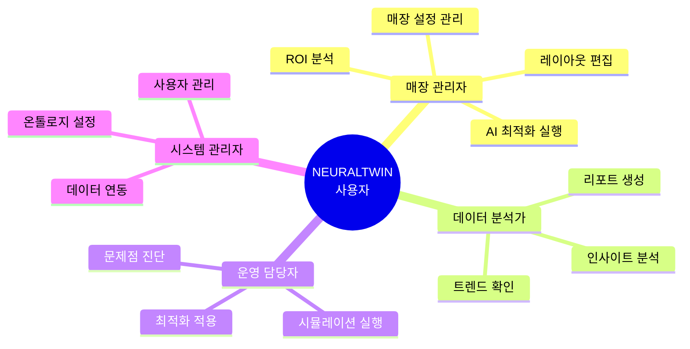

### 1.2 역할별 주요 기능 접근

| 기능 | 매장 관리자 | 데이터 분석가 | 운영 담당자 | 시스템 관리자 |
|------|-------------|---------------|-------------|---------------|
| Insight Hub | ✅ | ✅ | ✅ | ✅ |
| Digital Twin Studio | ✅ | 👁️ (읽기) | ✅ | ✅ |
| ROI Measurement | ✅ | ✅ | 👁️ (읽기) | ✅ |
| Store Settings | ✅ | ❌ | ❌ | ✅ |
| Ontology Settings | ❌ | ❌ | ❌ | ✅ |
| Data Management | ✅ | 👁️ (읽기) | ❌ | ✅ |

---

## 2. 온보딩 플로우

### 2.1 신규 사용자 온보딩

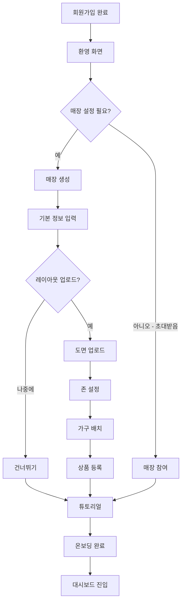

### 2.2 온보딩 단계별 상세

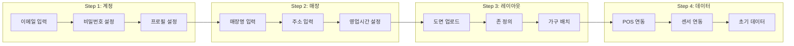

---

## 3. 주요 사용자 여정

### 3.1 매장 최적화 여정

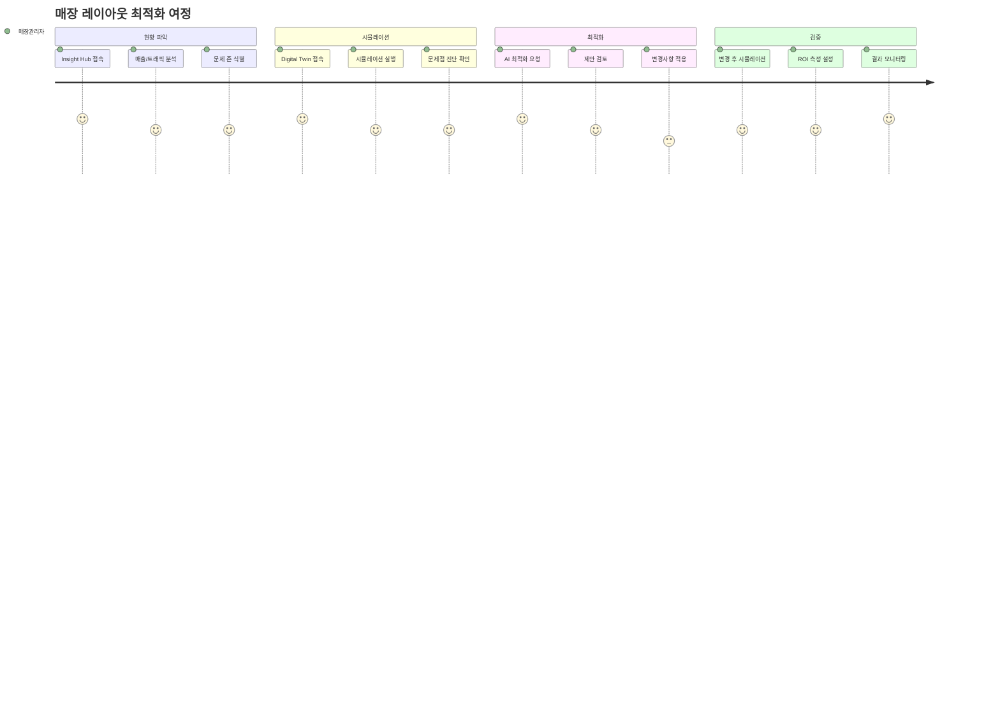

### 3.2 일일 운영 모니터링 여정

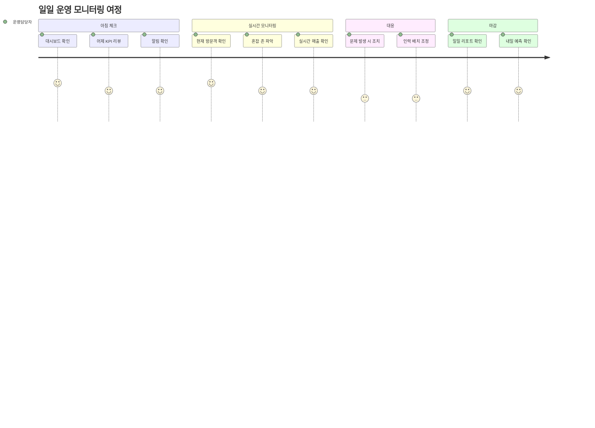

### 3.3 데이터 분석 여정

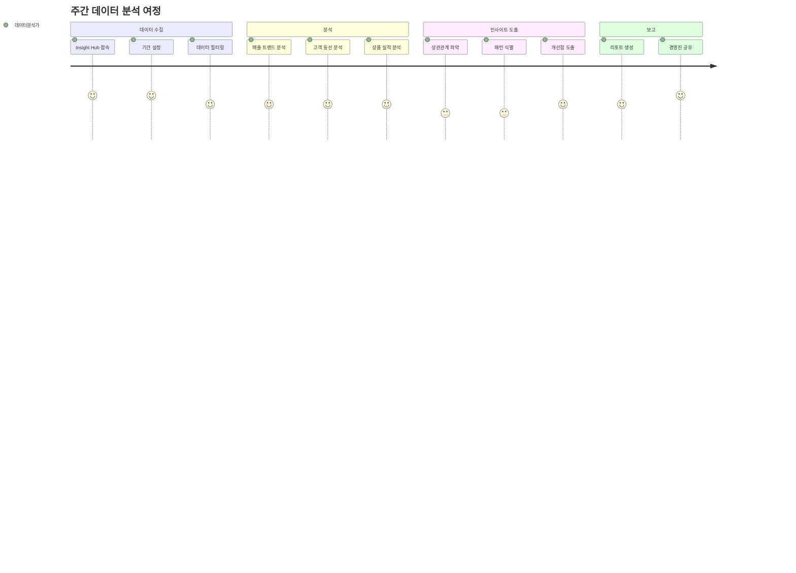

---

## 4. 페이지별 사용자 플로우

### 4.1 Insight Hub 사용자 플로우

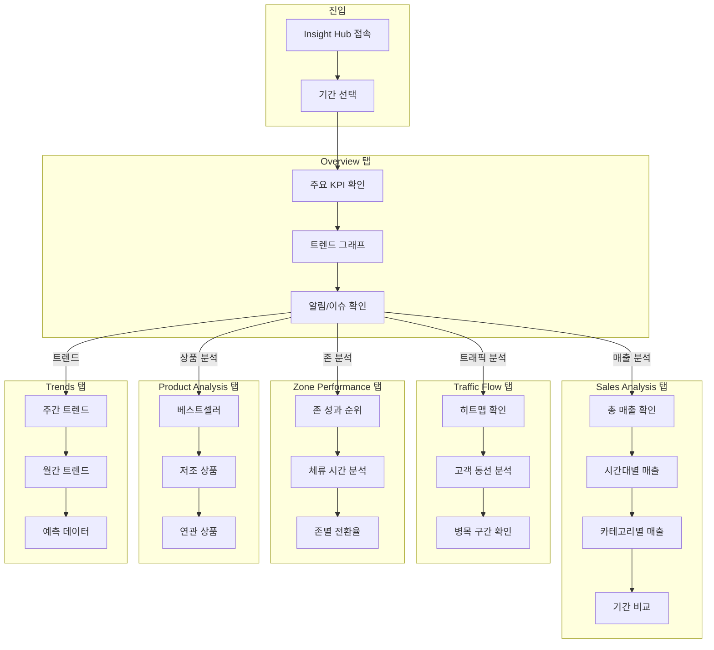

### 4.2 Digital Twin Studio 사용자 플로우

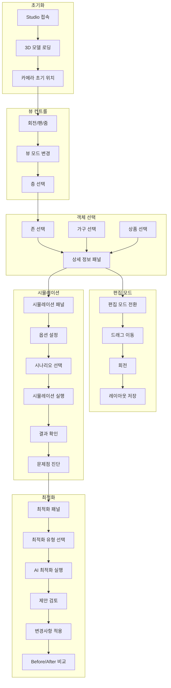

### 4.3 ROI Measurement 사용자 플로우

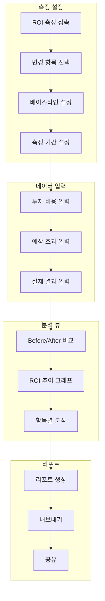

### 4.4 Settings 사용자 플로우

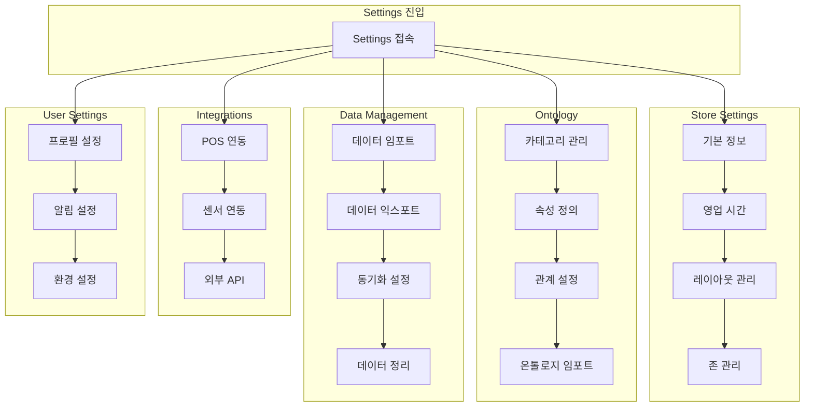

---

## 5. 기능별 상세 플로우

### 5.1 AI 시뮬레이션 실행 플로우

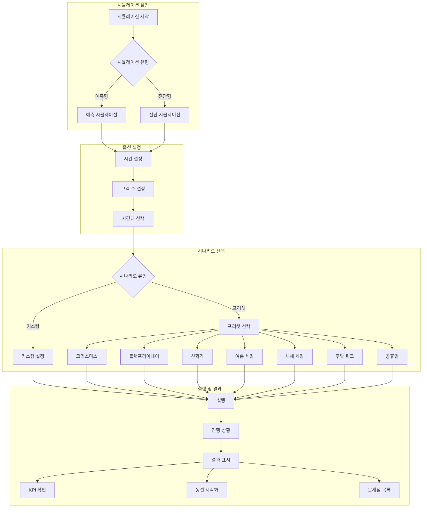

### 5.2 AI 최적화 실행 플로우

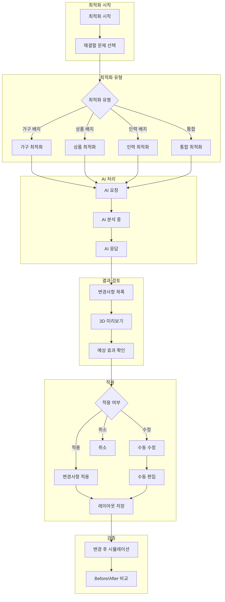

### 5.3 AI 시뮬레이션 → AI 최적화 연결 플로우

시뮬레이션에서 발견된 문제점을 최적화로 연결하는 통합 사용자 플로우입니다.

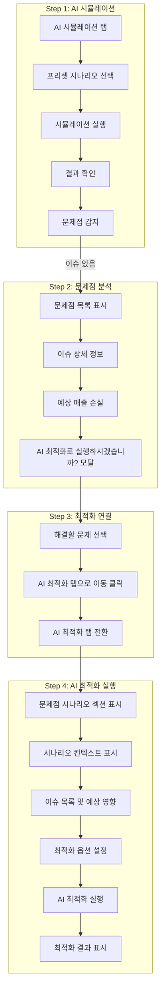

#### 사용자 인터랙션 상세

| 단계 | 사용자 액션 | 시스템 응답 |
|------|------------|------------|
| 1 | 프리셋 시나리오 선택 (예: 블랙프라이데이) | 환경 설정 자동 적용, 고객 수 조정 |
| 2 | "AI 예측 시뮬레이션 실행" 클릭 | 시뮬레이션 실행, 결과 및 문제점 표시 |
| 3 | 문제점 목록에서 해결할 이슈 확인 | 각 이슈의 위험도, 위치, 예상 영향 표시 |
| 4 | "AI 최적화로 해결하기" 클릭 | 최적화 모달 표시 |
| 5 | 해결할 문제 체크박스 선택 | 선택된 이슈 수 및 예상 회복 금액 표시 |
| 6 | "AI 최적화 탭으로 이동" 클릭 | AI 최적화 탭으로 전환, 문제점 시나리오 전달 |
| 7 | 최적화 옵션 설정 (유형, 변수) | 옵션 선택 UI |
| 8 | "AI 최적화 실행" 클릭 | AI가 진단 이슈를 최우선으로 해결하는 최적화 실행 |
| 9 | 최적화 결과 검토 | 권장사항, 예상 개선 효과, 3D 미리보기 |

#### 전달되는 진단 이슈 컨텍스트

시뮬레이션에서 최적화로 전달되는 데이터:

| 항목 | 설명 |
|------|------|
| `priority_issues` | 선택된 문제점 목록 (type, severity, zone, impact) |
| `scenario_context` | 적용된 프리셋 시나리오 정보 |
| `environment_context` | 환경 설정 (날씨, 시간대, 휴일) |
| `simulation_kpis` | 시뮬레이션 KPI 결과 |

### 5.4 데이터 임포트 플로우

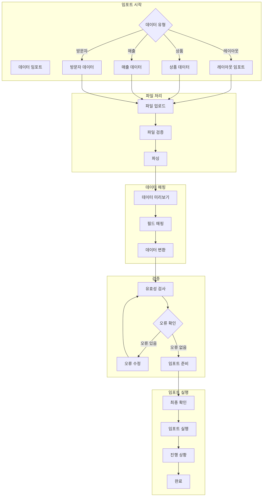

### 5.4 존 관리 플로우

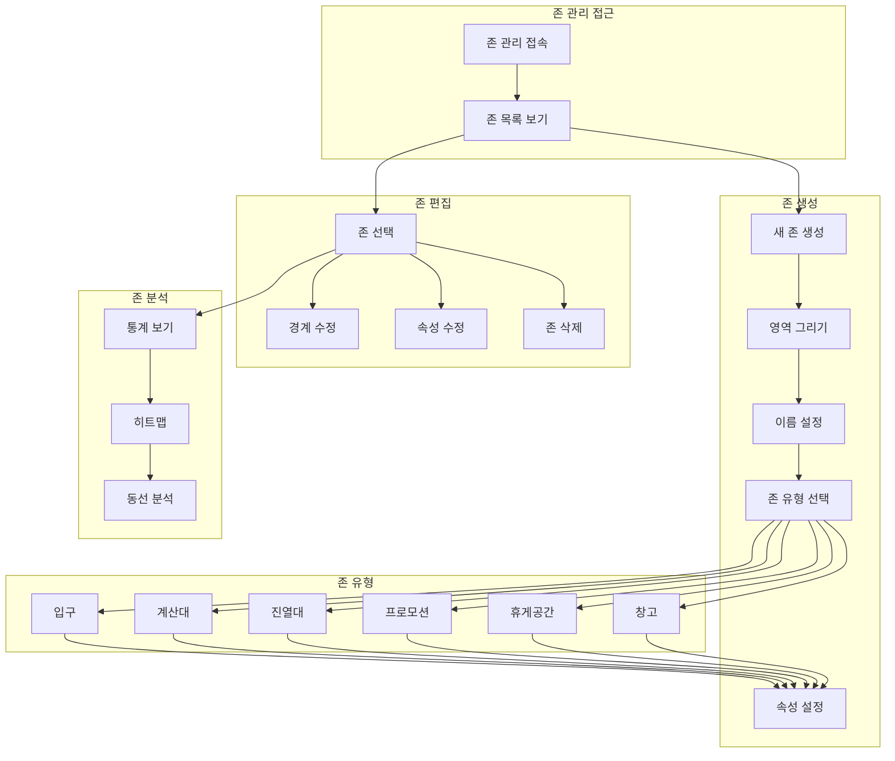

---

## 6. 에러 및 예외 처리 플로우

### 6.1 일반 에러 처리

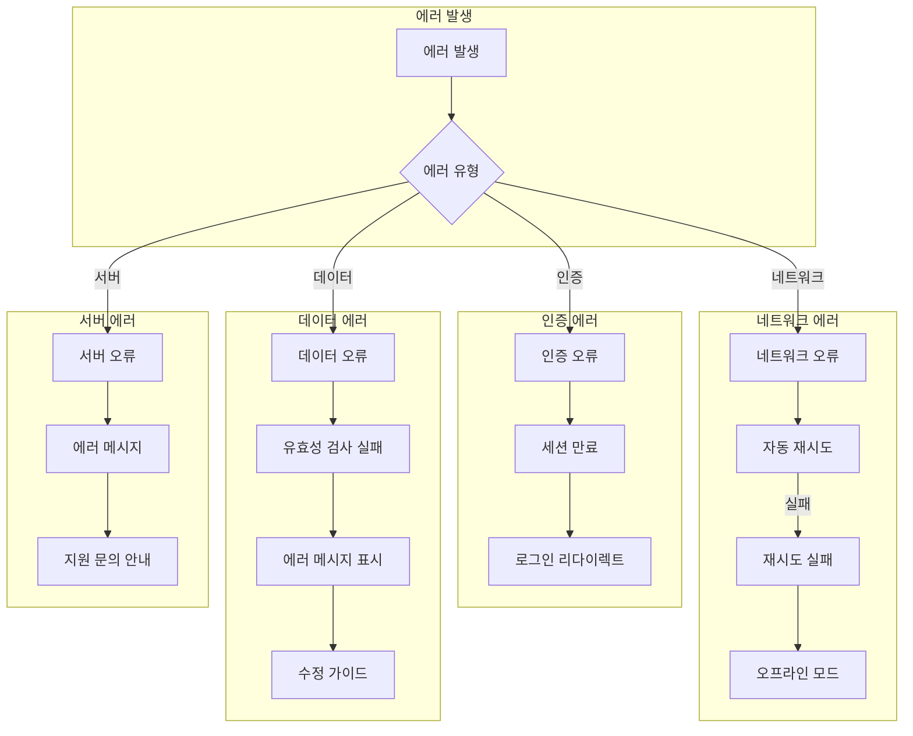

### 6.2 AI 기능 에러 처리

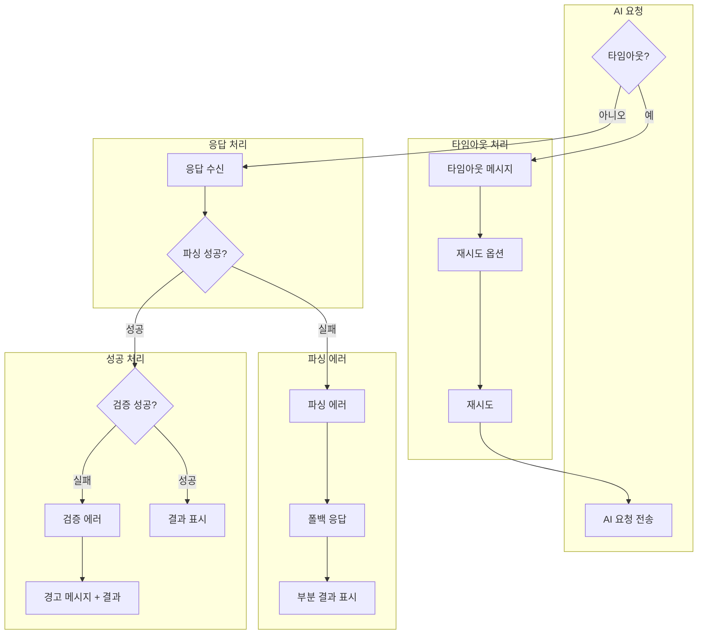

### 6.3 데이터 저장 실패 처리

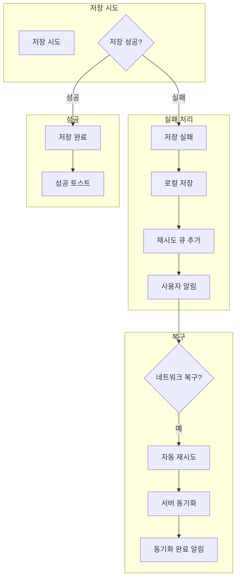

---

## 부록

### A. UI 컴포넌트 인터랙션 가이드

| 컴포넌트 | 인터랙션 | 결과 |
|----------|----------|------|
| 3D 캔버스 | 좌클릭 드래그 | 카메라 회전 |
| 3D 캔버스 | 우클릭 드래그 | 카메라 팬 |
| 3D 캔버스 | 스크롤 | 줌 인/아웃 |
| 객체 | 클릭 | 선택 |
| 객체 | 더블클릭 | 상세 정보 |
| 존 | 호버 | 하이라이트 |
| 차트 | 호버 | 툴팁 표시 |
| 테이블 행 | 클릭 | 상세 보기 |

### B. 키보드 단축키

| 단축키 | 기능 |
|--------|------|
| `Esc` | 선택 해제 / 모달 닫기 |
| `Delete` | 선택 항목 삭제 |
| `Ctrl+S` | 저장 |
| `Ctrl+Z` | 실행 취소 |
| `Ctrl+Y` | 다시 실행 |
| `Space` | 시뮬레이션 일시정지/재생 |

### C. 관련 문서

- [NEURALTWIN_SERVICE_FLOW.md](./NEURALTWIN_SERVICE_FLOW.md) - 서비스 플로우 가이드
- [DIGITAL_TWIN_STUDIO_QA_GUIDE.md](./DIGITAL_TWIN_STUDIO_QA_GUIDE.md) - QA 가이드
- [AI_FINETUNING_DATASET_QA_GUIDE.md](./AI_FINETUNING_DATASET_QA_GUIDE.md) - AI 데이터셋 QA 가이드

---

## 버전 히스토리

| 버전 | 날짜 | 변경 내용 |
|------|------|-----------|
| 1.0 | 2026-01-06 | 초기 문서 작성 |
| 1.1 | 2026-01-06 | AI 시뮬레이션 → AI 최적화 연결 플로우 추가 (섹션 5.3) |
