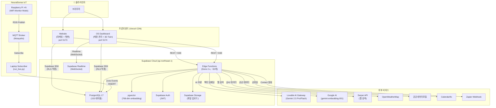
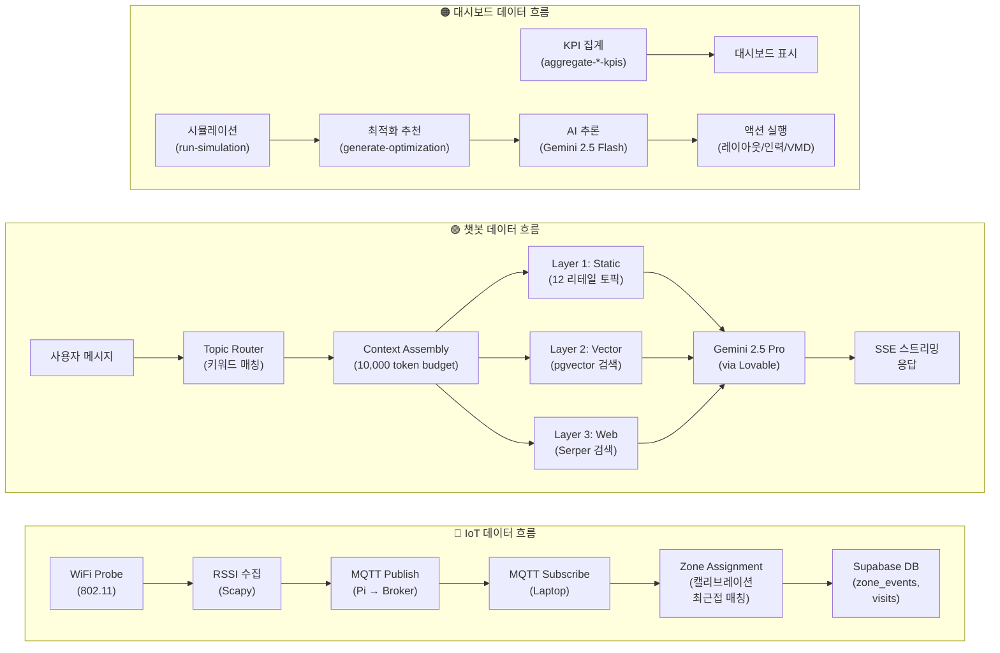
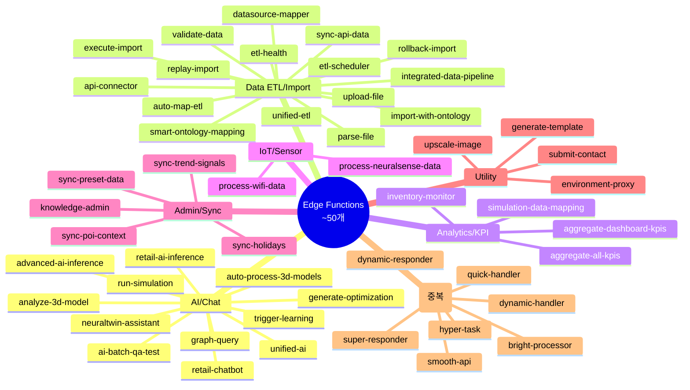
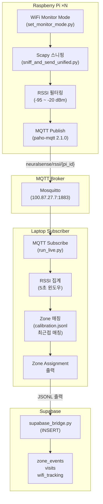
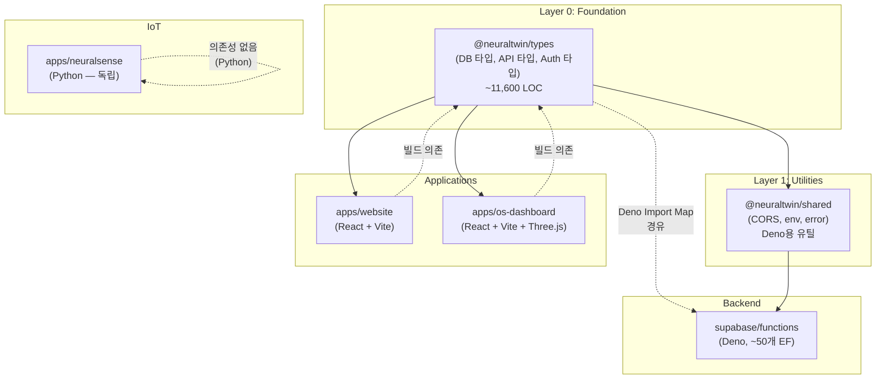

# NeuralTwin 시스템 아키텍처 (System Architecture)

> **버전**: 1.0
> **최종 수정**: 2026-02-25
> **대상 독자**: 백엔드 엔지니어 (신규 온보딩 / 외부 협업자)
> **레포지토리**: `NEURALTWIN_INTEGRATED` (모노레포)

---

## 목차 (Table of Contents)

1. [프로젝트 개요 (Executive Summary)](#1-프로젝트-개요-executive-summary)
2. [모노레포 디렉토리 구조](#2-모노레포-디렉토리-구조)
3. [런타임 환경 매트릭스](#3-런타임-환경-매트릭스)
4. [시스템 아키텍처 다이어그램](#4-시스템-아키텍처-다이어그램)
5. [Supabase 백엔드 상세](#5-supabase-백엔드-상세)
6. [AI 서비스 아키텍처](#6-ai-서비스-아키텍처)
7. [NeuralSense IoT 파이프라인](#7-neuralsense-iot-파이프라인)
8. [프론트엔드 ↔ 백엔드 통신 패턴](#8-프론트엔드--백엔드-통신-패턴)
9. [공유 패키지 의존성 그래프](#9-공유-패키지-의존성-그래프)
10. [배포 아키텍처](#10-배포-아키텍처)
11. [알려진 기술 부채 및 개선 과제](#11-알려진-기술-부채-및-개선-과제)
12. [부록: 빠른 시작 가이드](#12-부록-빠른-시작-가이드-quick-start-for-backend-engineers)

---

## 1. 프로젝트 개요 (Executive Summary)

**NeuralTwin**은 오프라인 리테일 매장의 고객 행동을 IoT 센서로 실시간 수집하고, AI로 분석하여 매장 운영 최적화를 지원하는 SaaS 플랫폼입니다.

핵심 가치 제안: **IoT 센서(WiFi Probe) → 실시간 데이터 수집 → AI 분석(Gemini 2.5) → 리테일 인사이트 → 매장 최적화**

기존 4개의 독립 레포지토리를 하나의 모노레포(`NEURALTWIN_INTEGRATED`)로 통합하여, 공유 타입·유틸리티를 중심으로 일관된 개발 경험을 제공합니다.

### 서비스 구성

| 코드명 | 서비스 | 설명 |
|--------|--------|------|
| **E** | Website (`apps/website`) | 마케팅 웹사이트 + AI 리테일 챗봇 (방문자 대상) |
| **D** | OS Dashboard (`apps/os-dashboard`) | 매장 관리 대시보드 + AI 어시스턴트 (운영자 대상) |
| **C** | Edge Functions (`supabase/functions`) | Supabase Edge Functions 백엔드 (~50개, Deno 런타임) |
| **B** | NeuralSense (`apps/neuralsense`) | IoT 센서 시스템 (Python, Raspberry Pi × N) |
| **A** | Shared Packages (`packages/*`) | 공유 타입·유틸리티·UI 패키지 |

---

## 2. 모노레포 디렉토리 구조

```
neuraltwin_integrated/
├── apps/
│   ├── website/                 ← [E] 마케팅 웹사이트 + AI 챗봇 (React + Vite)
│   │   ├── src/
│   │   │   ├── components/      # UI 컴포넌트
│   │   │   ├── pages/           # 페이지 (Home, Solutions, Contact 등)
│   │   │   ├── hooks/           # 커스텀 훅 (useChat, useAuth 등)
│   │   │   ├── integrations/    # Supabase 클라이언트
│   │   │   ├── i18n/            # 다국어 (KO/EN)
│   │   │   └── lib/             # 유틸리티
│   │   ├── vite.config.ts
│   │   └── package.json
│   │
│   ├── os-dashboard/            ← [D] 매장 운영 대시보드 (React + Vite + Three.js)
│   │   ├── src/
│   │   │   ├── components/      # UI 컴포넌트 (8개 하위 디렉토리)
│   │   │   ├── features/        # 피처 모듈
│   │   │   ├── store/           # Zustand 상태 관리
│   │   │   ├── services/        # API 서비스 레이어
│   │   │   ├── hooks/           # 커스텀 훅
│   │   │   └── types/           # 로컬 타입 정의
│   │   ├── vite.config.ts       # 코드 스플리팅 (vendor-react, vendor-three, vendor-data)
│   │   └── package.json
│   │
│   └── neuralsense/             ← [B] IoT 센서 (Python, pnpm 외부)
│       ├── neuralsense_pi/      # Raspberry Pi 코드 (Scapy + MQTT)
│       │   ├── sniff_and_send_unified.py
│       │   ├── set_monitor_mode.py
│       │   └── requirements.txt # paho-mqtt, scapy
│       ├── config.py            # 중앙 설정 (MQTT, RSSI 파라미터)
│       ├── run_live.py          # MQTT 구독 + 존 할당 (메인 엔트리)
│       ├── calibrate_interactive.py
│       ├── zones.csv            # 존 정의 (19 zones)
│       └── requirements.txt     # paho-mqtt
│
├── packages/
│   ├── types/                   ← @neuraltwin/types (공유 TypeScript 타입)
│   │   └── src/
│   │       ├── database.types.ts    # Supabase 자동생성 (~11,600 LOC, 153 테이블)
│   │       ├── database.helpers.ts  # Views, Functions, FunctionArgs 헬퍼
│   │       ├── auth.types.ts        # AppRole, AuthState, JWTPayload
│   │       ├── api.types.ts         # ApiResponse<T>, PaginatedResponse<T>
│   │       └── index.ts
│   │
│   └── shared/                  ← @neuraltwin/shared (공유 유틸리티)
│       └── src/
│           ├── cors.ts              # CORS 헤더 (neuraltwin.com, vercel, localhost)
│           ├── env.ts               # requireEnv(), getEnvConfig() (Deno)
│           ├── error.ts             # ErrorResponse, errorResponse()
│           └── deno.d.ts            # Deno 앰비언트 타입 선언
│
├── supabase/
│   └── supabase/
│       ├── functions/           ← [C] Edge Functions (~50개, Deno 런타임)
│       │   ├── _shared/         # EF 공유 모듈 (아래 상세)
│       │   ├── retail-chatbot/          # 웹사이트 AI 챗봇 (26 파일)
│       │   ├── neuraltwin-assistant/    # OS 대시보드 AI (34 파일)
│       │   ├── ... (나머지 ~48개)
│       │   └── deno.json        # Import Map (@supabase/supabase-js@2.89.0)
│       ├── config.toml          # Supabase 로컬 개발 설정
│       └── migrations/          # DB 마이그레이션
│
├── turbo.json                   # Turborepo 태스크 오케스트레이션
├── pnpm-workspace.yaml          # pnpm 워크스페이스 (apps/*, packages/*)
├── package.json                 # 루트 스크립트 + Turborepo
├── .env.example                 # 환경 변수 템플릿
└── CLAUDE.md                    # 프로젝트 규칙
```

### 디렉토리별 역할 요약

| 디렉토리 | 런타임 | 빌드 도구 | 설명 |
|----------|--------|-----------|------|
| `apps/website` | Node.js → 브라우저 | Vite 5.4 | 마케팅 + 챗봇, React SPA |
| `apps/os-dashboard` | Node.js → 브라우저 | Vite 5.4 | 대시보드 + 3D 트윈, React SPA |
| `apps/neuralsense` | Python 3.7+ | 없음 | IoT 센서, Raspberry Pi |
| `packages/types` | — | tsc | 공유 타입 (DB 자동생성 타입 포함) |
| `packages/shared` | Deno | tsc | EF용 CORS·환경변수·에러 유틸 |
| `supabase/functions` | Deno 2.x | 없음 (직접 실행) | 서버리스 백엔드 API |

---

## 3. 런타임 환경 매트릭스

4개의 서로 다른 런타임이 공존하는 하이브리드 아키텍처입니다.

| 항목 | Website (E) | OS Dashboard (D) | Backend EF (C) | NeuralSense (B) |
|------|:-----------:|:-----------------:|:--------------:|:---------------:|
| **런타임** | Node.js (Vite) → 브라우저 | Node.js (Vite) → 브라우저 | Deno 2.x | Python 3.7+ |
| **패키지 매니저** | pnpm 9.15 | pnpm 9.15 | URL import (esm.sh) | pip |
| **타입 시스템** | TypeScript 5.8.3 | TypeScript 5.8.3 | Deno 내장 TS | 없음 |
| **빌드 도구** | Vite 5.4.19 | Vite 5.4.19 | 없음 (직접 실행) | 없음 |
| **프레임워크** | React 18.3 | React 18.3 + Three.js | Deno.serve | paho-mqtt + scapy |
| **상태 관리** | Zustand + TanStack Query | Zustand + TanStack Query | Stateless | 인메모리 (dict/deque) |
| **실행 환경** | 브라우저 (Vercel CDN) | 브라우저 (Vercel CDN) | Supabase Cloud (Tokyo) | Raspberry Pi + 노트북 |
| **Node 요구** | ≥18.0.0 | ≥18.0.0 | — | — |

### 주요 라이브러리 버전

| 라이브러리 | Website | OS Dashboard | 비고 |
|-----------|---------|--------------|------|
| React | 18.3.1 | 18.3.1 | 동일 |
| Vite | 5.4.19 | 5.4.19 | 동일 |
| Tailwind CSS | 3.4.17 | 3.4.17 | 동일 |
| @supabase/supabase-js | 2.84.0 | 2.79.0 | 버전 차이 있음 |
| Three.js | 0.160.0 | 0.160.1 | 미세 차이 |
| Zod | 3.25.76 | 4.1.12 | **메이저 버전 차이** |
| jspdf | 4.1.0 | 3.0.3 | 메이저 버전 차이 |

---

## 4. 시스템 아키텍처 다이어그램

### 4.1 전체 시스템 구성도 (High-Level Architecture)



### 4.2 데이터 흐름도 (Data Flow)



### 4.3 Edge Function 카테고리 맵



---

## 5. Supabase 백엔드 상세

### 5.1 Edge Functions 아키텍처

#### Deno 런타임 환경

- **런타임**: Deno 2.x (Supabase Edge Runtime)
- **Import Map** (`deno.json`):
  ```json
  {
    "compilerOptions": { "allowJs": true, "lib": ["deno.window"], "strict": true },
    "imports": {
      "@supabase/supabase-js": "https://esm.sh/@supabase/supabase-js@2.89.0",
      "xlsx": "https://esm.sh/xlsx@0.18.5",
      "@shared/": "./_shared/"
    }
  }
  ```

#### `_shared/` 공유 모듈 구조

```
_shared/
├── supabase-client.ts       # Admin/Anon 클라이언트 팩토리
├── streamingResponse.ts     # SSE 스트리밍 유틸
├── rateLimiter.ts           # 사용자별 레이트 리미팅
├── errorHandler.ts          # 에러 핸들링 유틸
├── chatTypes.ts             # 챗 타입 정의
├── chatLogger.ts            # 채팅 메시지 영속화
├── chatEventLogger.ts       # 채팅 이벤트 추적
├── aiResponseLogger.ts      # AI 응답 로깅 시스템
├── safeJsonParse.ts         # 안전한 JSON 파싱
├── calculations/
│   ├── index.ts             # 모듈 엔트리
│   ├── roiPredictor.ts      # ROI 예측 v1
│   ├── roiPredictor_v2.ts   # ROI 예측 v2
│   ├── trafficFlow.ts       # 고객 동선 분석
│   └── validation.ts        # 계산 검증
├── optimization/
│   └── integratedOptimization.ts  # 통합 최적화 엔진
├── persona/
│   └── storePersonaLoader.ts     # 매장 페르소나 관리
└── vmd/
    └── vmdRulesetLoader.ts       # VMD(비주얼 머천다이징) 규칙
```

#### CORS 처리 패턴

현재 각 Edge Function에 CORS 헤더가 반복 정의되어 있습니다:

```typescript
const corsHeaders = {
  "Access-Control-Allow-Origin": "*",
  "Access-Control-Allow-Headers": "authorization, x-client-info, apikey, content-type",
};

Deno.serve(async (req: Request) => {
  if (req.method === "OPTIONS") {
    return new Response(null, { headers: corsHeaders });
  }
  // ... 함수 로직
});
```

> **개선 예정**: `_shared/middleware`로 CORS 처리 통합

#### 인증 패턴

```typescript
// 1. Authorization 헤더에서 JWT 추출
const authHeader = req.headers.get("Authorization");
const token = authHeader?.replace("Bearer ", "");

// 2. Supabase Auth로 JWT 검증
const { data: { user }, error } = await supabase.auth.getUser(token);

// 3. 서비스 키는 관리 작업에만 사용
const supabaseAdmin = createClient(supabaseUrl, serviceRoleKey);
```

#### Edge Function 상세 분류 (50개)

| 카테고리 | 함수명 | 설명 |
|---------|--------|------|
| **AI/Chat** (12) | `retail-chatbot` | 웹사이트 챗봇 — SSE 스트리밍, 토픽 라우팅, 벡터 검색, 대화 메모리 |
| | `neuraltwin-assistant` | OS 대시보드 AI — 인텐트 분류, 네비게이션, KPI 쿼리, 시뮬레이션 실행 |
| | `unified-ai` | 통합 AI 엔드포인트 — KPI 추천, 온톨로지, 이상 탐지, 패턴 분석 |
| | `retail-ai-inference` | 온톨로지 그래프 + 리테일 도메인 기반 AI 추론 |
| | `advanced-ai-inference` | ⚠️ Deprecated → `generate-optimization`으로 마이그레이션 중 |
| | `generate-optimization` | AI 매장 최적화 추천 (레이아웃, 인력, VMD) |
| | `run-simulation` | 고객 행동·혼잡도·병목 시뮬레이션 |
| | `trigger-learning` | 피드백 누적 시 자동 페르소나 업데이트 + 학습 |
| | `ai-batch-qa-test` | AI 시뮬레이션/최적화 함수 배치 QA 테스트 |
| | `analyze-3d-model` | 3D 모델(GLB/OBJ) AI 분석 → 온톨로지 엔티티 추론 |
| | `auto-process-3d-models` | 복수 3D 모델 일괄 처리 |
| | `graph-query` | 지식 그래프 쿼리 — N-hop 탐색, PageRank, 커뮤니티 탐지 |
| **Data ETL** (16) | `upload-file` | 파일 업로드 (CSV/XLSX/JSON/GLB) → Storage |
| | `parse-file` | 업로드된 파일 파싱 — 컬럼 목록, 미리보기, 자동 매핑 |
| | `execute-import` | 데이터 변환 + 타겟 테이블 로딩 (products, customers, transactions 등) |
| | `validate-data` | 임포트 데이터 검증 (필수값, 포맷, 범위, 유니크) |
| | `rollback-import` | 특정 세션의 임포트 데이터 롤백(삭제) |
| | `replay-import` | raw_imports 재처리 (ETL 파이프라인 재실행) |
| | `unified-etl` | 통합 ETL — raw→L2, L1→L2, L2→L3, 스키마 ETL, 풀 파이프라인 |
| | `import-with-ontology` | 임포트 데이터 → 온톨로지 엔티티 변환 + 그래프 DB 저장 |
| | `integrated-data-pipeline` | 엔드투엔드 파이프라인 (파싱→검증→매핑→ETL) 단일 호출 |
| | `auto-map-etl` | AI 기반 임포트 컬럼 자동 매핑 |
| | `smart-ontology-mapping` | ID/FK 컬럼 분석 → 온톨로지 엔티티·관계 자동 매핑 |
| | `api-connector` | 외부 API 연결 테스트, 데이터 싱크, 필드 매핑, 템플릿 |
| | `datasource-mapper` | 데이터소스 등록, 스키마 자동추론, 매핑 관리 |
| | `sync-api-data` | 스케줄/직접 API 동기화 → raw_imports 저장 |
| | `etl-health` | L1/L2/L3 헬스체크 + 데이터 프레시니스 모니터링 |
| | `etl-scheduler` | 배치 스케줄러 — 전 조직 `unified-etl full_pipeline` 자동 실행 |
| **Analytics/KPI** (4) | `aggregate-all-kpis` | 온톨로지 기반 방문/구매 KPI 전체 기간 집계 |
| | `aggregate-dashboard-kpis` | 일별 KPI 집계 (방문수, 매출 등) |
| | `inventory-monitor` | 재고 수준 모니터링 + 재주문 알림 |
| | `simulation-data-mapping` | 시뮬레이션 허브 데이터소스 매핑 상태 관리 |
| **IoT/Sensor** (2) | `process-neuralsense-data` | NeuralSense WiFi/BLE 센서 데이터 수집 → zone_events 변환 |
| | `process-wifi-data` | WiFi 추적 데이터 (좌표, 세션) → 존 매핑 |
| **Admin/Sync** (5) | `knowledge-admin` | 리테일 도메인 지식 → 벡터 DB 마이그레이션/시딩 |
| | `sync-holidays` | Calendarific API로 공휴일 데이터 동기화 |
| | `sync-poi-context` | POI(관심지점) 데이터 외부 소스에서 동기화 |
| | `sync-preset-data` | 프리셋 API (날씨, 경제지표 등) 일괄 동기화 |
| | `sync-trend-signals` | 트렌드 지수 (카테고리/브랜드/키워드) 동기화 |
| **Utility** (4) | `environment-proxy` | OpenWeatherMap 날씨 + 공휴일 데이터 프록시 |
| | `generate-template` | 임포트 타입별 샘플 CSV/JSON 템플릿 생성 (KO/EN) |
| | `submit-contact` | Contact 폼 처리 → Zapier Webhook 알림 |
| | `upscale-image` | AI 기반 이미지 업스케일링 |
| **Alias(중복)** (7) | `bright-processor` | → `validate-data`의 별칭 |
| | `dynamic-handler` | → `upload-file`의 별칭 |
| | `dynamic-responder` | → `simulation-data-mapping`의 별칭 |
| | `hyper-task` | → `parse-file`의 별칭 |
| | `quick-handler` | → `execute-import`의 별칭 |
| | `smooth-api` | → `generate-template`의 별칭 |
| | `super-responder` | → `rollback-import`의 별칭 |

### 5.2 데이터베이스 스키마 주요 테이블 그룹

**총 153개 테이블**, **12개 뷰**, **2개 Enum** (PostgreSQL 17, ap-northeast-1)

#### Enums

| Enum | 값 |
|------|-----|
| `app_role` | `ORG_OWNER`, `ORG_ADMIN`, `ORG_MEMBER`, `NEURALTWIN_ADMIN`, `NEURALTWIN_MASTER`, `ORG_HQ`, `ORG_STORE`, `ORG_VIEWER` |
| `chat_channel` | `website`, `os_app` |

#### 테이블 카테고리

| 카테고리 | 테이블 수 | 주요 테이블 |
|---------|----------|-------------|
| **Core Business** | 11 | `stores`, `organizations`, `products`, `customers`, `transactions`, `line_items`, `daily_sales` |
| **Spatial & Zones** | 8 | `zones_dim`, `zone_events`, `zone_transitions`, `zone_daily_metrics`, `visits`, `store_visits` |
| **Furniture & Layout** | 8 | `furniture`, `furniture_slots`, `furniture_facings`, `product_placements`, `vmd_rulesets`, `layout_optimization_results` |
| **Inventory** | 5 | `inventory`, `inventory_levels`, `inventory_movements`, `inventory_history`, `auto_order_suggestions` |
| **Staff & Scheduling** | 3 | `staff`, `shift_schedules`, `staff_assignments` |
| **Profiles & Auth** | 5 | `profiles`, `invitations`, `onboarding_progress`, `user_activity_logs` |
| **Chat & AI** | 7 | `chat_conversations`, `chat_messages`, `chat_context_memory`, `chat_events`, `chat_leads`, `chat_daily_analytics` |
| **AI Analytics** | 13 | `ai_inference_logs`, `ai_insights`, `ai_recommendations`, `ai_response_logs`, `daily_kpis_agg`, `dashboard_kpis`, `kpi_snapshots` |
| **Learning & Optimization** | 8 | `strategy_feedback`, `learning_sessions`, `learning_adjustments`, `optimization_tasks`, `roi_measurements` |
| **Data Import & ETL** | 7 | `upload_sessions`, `raw_imports`, `etl_runs`, `import_type_schemas`, `column_mappings` |
| **External Data & Sync** | 11 | `api_connections`, `api_sync_logs`, `data_sources`, `data_sync_schedules`, `sync_endpoints` |
| **External Data Sources** | 5 | `weather_data`, `holidays_events`, `economic_indicators`, `regional_data`, `trend_signals` |
| **Graph & Ontology** | 10 | `graph_entities`, `graph_relations`, `ontology_entity_types`, `ontology_relation_types`, `ontology_schemas` |
| **Retail Knowledge** | 4 | `retail_concepts`, `retail_knowledge_chunks`(벡터 임베딩), `store_personas` |
| **IoT & WiFi** | 7 | `wifi_tracking`, `wifi_events`, `beacons`, `beacon_events`, `camera_events`, `web_events` |
| **Simulation** | 4 | `scenarios`, `simulation_configs`, `simulation_history`, `stored_model_parameters` |
| **3D Models** | 3 | `model_3d_files`, `product_models`, `store_scenes` |
| **Alerts & Notifications** | 5 | `alerts`, `user_alerts`, `notification_settings`, `push_subscriptions` |
| **Licenses** | 3 | `licenses`, `subscriptions`, `license_billing_history` |
| **기타** | ~25 | HQ 관리, POS 통합, 펀넬, 시간별 메트릭스, 시스템 테이블 등 |

#### 주요 뷰 (Views)

| 뷰 | 용도 |
|----|------|
| `zones` | 존 디멘션 쿼리 뷰 (19 컬럼) |
| `v_user_orgs` | 사용자-조직 매핑 |
| `v_ai_response_stats` | AI 응답 통계 집계 |
| `v_batch_test_summary` | AI 배치 테스트 요약 |
| `v_finetuning_dataset` | AI 파인튜닝 데이터셋 뷰 |
| `v_furniture_vmd_summary` | 가구 + VMD 규칙 요약 |

#### 멀티테넌시 패턴

- `org_id` → 조직(기업) 단위 격리
- `store_id` → 매장 단위 격리
- Row Level Security(RLS) 적용 — 프론트엔드에서 `anon key`로 접근 시 자동 필터링

### 5.3 환경 변수 맵

```
필수 (모든 Edge Function — Supabase 자동 주입):
├── SUPABASE_URL               ← Supabase 프로젝트 URL
└── SUPABASE_SERVICE_ROLE_KEY   ← 서비스 역할 키 (관리자 전용)

AI 서비스:
├── LOVABLE_API_KEY            ← 12개+ AI EF에서 사용 (Gemini 2.5 Pro/Flash)
├── AI_GATEWAY_URL             ← Lovable AI Gateway 엔드포인트
│                                 (https://ai.gateway.lovable.dev/v1/chat/completions)
└── GOOGLE_AI_API_KEY          ← 벡터 임베딩 (gemini-embedding-001, 768-dim)

외부 데이터:
├── SERPER_API_KEY             ← 웹 검색 (retail-chatbot Layer 3)
├── OPENWEATHERMAP_API_KEY     ← 날씨 데이터 (environment-proxy)
├── DATA_GO_KR_API_KEY         ← 공공데이터포털 (경제지표)
└── CALENDARIFIC_API_KEY       ← 국제 공휴일 (sync-holidays)

Webhook:
└── ZAPIER_WEBHOOK_URL         ← Contact 폼 알림 (submit-contact)

프론트엔드 (VITE_ 접두사 — 브라우저에 노출됨):
├── VITE_SUPABASE_URL          ← Supabase 프로젝트 URL
├── VITE_SUPABASE_PUBLISHABLE_KEY ← Supabase anon (공개) 키
├── VITE_SUPABASE_PROJECT_ID   ← 프로젝트 ID (OS Dashboard만)
├── VITE_OPENWEATHERMAP_API_KEY← 날씨 (선택)
├── VITE_DATA_GO_KR_API_KEY    ← 공공데이터 (선택)
└── VITE_CALENDARIFIC_API_KEY  ← 달력 (선택)

NeuralSense (Python — 환경변수 또는 config.py 기본값):
├── MQTT_BROKER_IP             ← MQTT 브로커 IP (기본: 100.87.27.7)
├── MQTT_BROKER_PORT           ← MQTT 포트 (기본: 1883)
├── MQTT_TOPIC_PREFIX          ← 토픽 접두사 (기본: neuralsense)
├── PI_IDS                     ← Pi 식별자 목록 (기본: pi5~pi13)
├── MIN_SOURCES                ← 최소 Pi 리포트 수 (기본: 2)
├── WINDOW_SEC                 ← RSSI 집계 윈도우 (기본: 5초)
├── RSSI_THRESHOLD             ← RSSI 임계값 (기본: -75 dBm)
└── SMOOTHING_ALPHA            ← 스무딩 알파 (기본: 0.3)
```

---

## 6. AI 서비스 아키텍처

### 6.1 retail-chatbot (웹사이트 AI)

**위치**: `supabase/supabase/functions/retail-chatbot/` (26 파일, ~250KB)
**모델**: Gemini 2.5 Pro (via Lovable AI Gateway)
**대상**: 웹사이트 방문자 (비회원 세션 + 회원 JWT)

#### 3-Layer Knowledge Architecture

```
┌─────────────────────────────────────────────┐
│              Context Assembly                │
│           (10,000 token budget)              │
├──────────┬──────────────┬───────────────────┤
│ Layer 1  │   Layer 2    │     Layer 3       │
│ Static   │   Vector     │     Web Search    │
│Knowledge │  Knowledge   │                   │
├──────────┼──────────────┼───────────────────┤
│ 12 리테일  │ pgvector     │ Serper API       │
│ 토픽 DB   │ gemini-      │ → 교차 검증       │
│ (baked-in)│ embedding-001│ → 팩트 추출       │
│          │ (768-dim)    │                   │
└──────────┴──────────────┴───────────────────┘
```

#### 핵심 모듈

| 모듈 | 파일 | 역할 |
|------|------|------|
| System Prompt | `systemPrompt.ts` (~102KB) | 리테일 전문가 페르소나, 응답 규칙 |
| Retail Knowledge | `retailKnowledge.ts` (~43KB) | 12개 토픽별 도메인 지식 DB |
| Topic Router | `topicRouter.ts` (~12KB) | 영문/한글 키워드 매칭, 최근 2턴 30% 가중치 |
| Query Router | `queryRouter.ts` (~15KB) | 쿼리 유형별 라우팅 |
| Pain Point Extractor | `painPointExtractor.ts` (~10KB) | 고객 고충점 추출 |
| Suggestion Generator | `suggestionGenerator.ts` (~20KB) | 맞춤 제안 생성 |
| Sales Bridge | `salesBridge.ts` (~7KB) | 리드 전환 로직 |
| Web Search | `webSearch.ts` (~12KB) | Serper API 연동 |
| Viz Directive | `vizDirectiveGenerator.ts` (~27KB) | 3D 존 시각화 디렉티브 생성 |

#### Lead Scoring System

사용자의 대화 패턴에 기반한 점수 시스템으로, `Awareness → Interest → Consideration → Decision` 단계를 추적하여 리드 캡처 타이밍을 결정합니다.

### 6.2 neuraltwin-assistant (OS 대시보드 AI)

**위치**: `supabase/supabase/functions/neuraltwin-assistant/` (34 파일)
**모델**: Gemini 2.5 Flash (via Lovable AI Gateway)
**대상**: 매장 운영자 (인증된 사용자)

#### 아키텍처

```
사용자 메시지
    ↓
Intent Classifier (인텐트 분류)
    ↓
┌───────────────┬────────────────┬──────────────────┬────────────────┐
│ Navigation    │ Chat           │ Query            │ Execution      │
│ Actions       │ Actions        │ Actions          │ Actions        │
├───────────────┼────────────────┼──────────────────┼────────────────┤
│ 페이지 이동     │ 일반 대화       │ KPI 조회         │ 시뮬레이션 실행  │
│ UI 컨트롤      │ 도움말          │ 데이터 쿼리       │ 최적화 실행      │
│ 오버레이 토글   │ 컨텍스트 질의    │ 분석 요청         │ 프리셋 적용      │
└───────────────┴────────────────┴──────────────────┴────────────────┘
    ↓
Store Persona Context 주입
    ↓
Gemini 2.5 Flash → SSE 스트리밍 응답
```

#### 주요 기능

- **인텐트 분류**: 사용자 메시지의 의도를 자동 분류 (navigation, chat, query, execution)
- **네비게이션 제어**: 대시보드 UI 직접 조작 (페이지 이동, 패널 토글)
- **KPI 쿼리**: 자연어로 매장 KPI 조회 ("이번 달 매출 알려줘")
- **시뮬레이션 연동**: `run-simulation`, `generate-optimization` 트리거
- **레이트 리미팅**: 사용자별 API 호출 제한
- **세션 관리**: 대화 컨텍스트 유지

### 6.3 AI 모델 사용 현황

| 용도 | 모델 | 경유 | 사용 함수 |
|------|------|------|----------|
| 웹 챗봇 응답 | Gemini 2.5 Pro | Lovable AI Gateway | `retail-chatbot` |
| OS 어시스턴트 | Gemini 2.5 Flash | Lovable AI Gateway | `neuraltwin-assistant` |
| 최적화 추천 | Gemini 2.5 Pro/Flash | Lovable AI Gateway | `generate-optimization`, `run-simulation` |
| 통합 추론 | Gemini 2.5 Flash | Lovable AI Gateway | `unified-ai`, `retail-ai-inference` |
| 벡터 임베딩 | gemini-embedding-001 | Google AI 직접 | `knowledge-admin` (768-dim) |

---

## 7. NeuralSense IoT 파이프라인

### 전체 흐름



### 핵심 상수

| 상수 | 기본값 | 설명 |
|------|--------|------|
| `MQTT_BROKER_IP` | `100.87.27.7` | MQTT 브로커 IP (Tailscale 주소) |
| `MQTT_BROKER_PORT` | `1883` | MQTT 포트 (비암호화) |
| `WINDOW_SEC` | `5` | RSSI 집계 롤링 윈도우 (초) |
| `MIN_SOURCES` | `2` (config.py) / `8` (run_live.py) | 존 할당에 필요한 최소 Pi 수 |
| `MATCH_DIFF_DBM` | `7.0` | 캘리브레이션 매칭 임계값 (dBm) |
| `RSSI_MIN_DBM` | `-95` | 최소 허용 RSSI (노이즈 필터) |
| `RSSI_MAX_DBM` | `-20` | 최대 허용 RSSI (비현실적 값 필터) |
| `SMOOTHING_ALPHA` | `0.3` | 지수 이동 평균 알파 |

### Zone Assignment 알고리즘

1. 각 Pi가 MQTT로 `{pi_id, mac, rssi, timestamp}` 발행
2. Laptop이 `WINDOW_SEC` 내 수신된 모든 RSSI를 Pi별로 수집
3. Pi별 중앙값(median) 계산 → 핑거프린트 벡터 생성
4. `calibration.jsonl`의 각 캘리브레이션 벡터와 평균 dBm 차이 계산
5. `MATCH_DIFF_DBM` 이하인 가장 유사한 존 할당
6. 존 전환(transition), 체류(dwell) 이벤트 생성

### 파일 구성

| 파일 | 실행 환경 | 역할 |
|------|----------|------|
| `sniff_and_send_unified.py` | Raspberry Pi | WiFi 프레임 캡처 + MQTT 발행 |
| `set_monitor_mode.py` | Raspberry Pi | 모니터 모드 설정 |
| `run_live.py` | 노트북 | MQTT 구독 + 실시간 존 할당 (메인 엔트리) |
| `calibrate_interactive.py` | 노트북 | 대화형 캘리브레이션 도구 |
| `accuracy_test_from_zone_assignments.py` | 노트북 | 정확도 테스트 |
| `config.py` | 공통 | 중앙 설정 파일 |

---

## 8. 프론트엔드 ↔ 백엔드 통신 패턴

| 패턴 | 사용처 | 기술 | 코드 예시 |
|------|--------|------|----------|
| **REST (EF 직접 호출)** | 대부분의 CRUD | `fetch(supabaseUrl/functions/v1/{fn})` | ETL, 시뮬레이션, 관리 API |
| **Supabase Client SDK** | DB 직접 쿼리 | `supabase.from('table').select()` | KPI 조회, 목록 표시 (RLS 적용) |
| **SSE (Server-Sent Events)** | AI 챗봇 스트리밍 | `ReadableStream` → `TextDecoderStream` | `retail-chatbot`, `neuraltwin-assistant` |
| **Realtime Subscription** | 실시간 데이터 | Supabase Realtime (WebSocket) | 센서 데이터, 알림 |
| **RPC (Remote Procedure Call)** | 복잡한 쿼리 | `supabase.rpc('function_name', params)` | 집계, 통계 |
| **Storage Upload** | 파일 업로드 | `supabase.storage.from('bucket').upload()` | 3D 모델, CSV/XLSX |

### 인증 흐름

```
[브라우저] → Supabase Auth (이메일/비밀번호)
    ↓
JWT 발급 (1시간 만료)
    ↓
├── Edge Function 호출: Authorization: Bearer {jwt}
├── Supabase SDK: 자동 JWT 첨부 (anon key + RLS)
└── Realtime: WebSocket 핸드셰이크 시 JWT 검증
```

### 응답 표준 형식

```typescript
// 성공
{ success: true, data: T, stats?: Record<string, any> }

// 실패
{ success: false, error: { code: string, message: string, details?: unknown } }

// 페이지네이션
{ success: true, data: T[], pagination: { page, pageSize, total, totalPages } }
```

---

## 9. 공유 패키지 의존성 그래프



### 패키지 상세

| 패키지 | 경로 | 주요 Export | 의존 대상 |
|--------|------|------------|----------|
| `@neuraltwin/types` | `packages/types/` | `Tables<T>`, `TablesInsert<T>`, `Enums<T>`, `ApiResponse<T>`, `AuthState`, `JWTPayload` | 없음 (Foundation) |
| `@neuraltwin/shared` | `packages/shared/` | `getCorsHeaders()`, `handleCorsOptions()`, `requireEnv()`, `getEnvConfig()`, `errorResponse()` | `@neuraltwin/types` (간접) |

### 앱별 패키지 사용

```
apps/website        → @neuraltwin/types (타입 import)
apps/os-dashboard   → @neuraltwin/types (타입 import)
supabase/functions  → @neuraltwin/types (Deno Import Map 경유, 계획 중)
                    → _shared/ 내부 모듈 (현재 주력)
apps/neuralsense    → 독립 (Python, 공유 패키지 사용 안 함)
```

---

## 10. 배포 아키텍처

| 서비스 | 배포 대상 | 방법 | 비고 |
|--------|----------|------|------|
| **Website** | Vercel / Netlify | `pnpm --filter @neuraltwin/website build` → 자동 배포 | 정적 SPA (dist/) |
| **OS Dashboard** | Vercel / Netlify | `pnpm --filter @neuraltwin/os-dashboard build` → 자동 배포 | 정적 SPA (dist/) |
| **Edge Functions** | Supabase Cloud | `supabase functions deploy --project-ref bdrvowacecxnraaivlhr` | 개별 또는 전체 배포 |
| **DB Migrations** | Supabase Cloud | `supabase db push --project-ref bdrvowacecxnraaivlhr` | 스키마 변경 시 |
| **NeuralSense Pi** | Raspberry Pi (직접) | `scp` 또는 `git pull` → `sudo python sniff_and_send_unified.py` | 물리 기기 |
| **NeuralSense Laptop** | 로컬 노트북 | `python run_live.py` | 상시 실행 |

### Supabase 프로젝트 정보

| 항목 | 값 |
|------|-----|
| Project ID | `bdrvowacecxnraaivlhr` |
| Region | `ap-northeast-1` (Tokyo) |
| PostgreSQL | 17 |
| Edge Runtime | Deno v2 |
| 로컬 개발 포트 | API: 54321, DB: 54322, Studio: 54323, Inbucket: 54324 |

### 빌드 파이프라인 (Turborepo)

```
pnpm build
    ↓ turbo.json: "dependsOn": ["^build"]
    ↓
┌─────────────┐     ┌──────────────────┐
│ packages/   │────→│ apps/website     │ → dist/
│ types       │     │ (Vite build)     │
│ shared      │     └──────────────────┘
│ (먼저 빌드)  │     ┌──────────────────┐
│             │────→│ apps/os-dashboard │ → dist/
└─────────────┘     │ (Vite build)     │
                    └──────────────────┘
```

---

## 11. 알려진 기술 부채 및 개선 과제

백엔드 엔지니어가 반드시 인지해야 할 핵심 이슈입니다.

| # | 카테고리 | 이슈 | 심각도 | 상태 | 설명 |
|---|---------|------|--------|------|------|
| 1 | 보안 | 하드코딩된 Supabase credentials | 🔴 Critical | 미해결 | 일부 파일에 `client.ts`로 직접 키 노출 |
| 2 | 보안 | `VITE_` 접두사로 브라우저에 노출되는 외부 API 키 3개 | 🟡 Medium | 개선 중 | `environment-proxy` EF로 대체 예정 |
| 3 | 테스트 | 전체 서비스 테스트 커버리지 0% | 🔴 Critical | 미해결 | 단위/통합/E2E 테스트 전무 |
| 4 | 중복 | CORS 헤더 ~50개 EF에 반복 복붙 | 🟡 Medium | 개선 중 | `_shared/middleware`로 통합 예정 |
| 5 | 중복 | Edge Function 별칭(Alias) 7개 존재 | 🟡 Medium | 미해결 | 동일 코드 다른 엔드포인트, 통합 필요 |
| 6 | 의존성 | `@supabase/supabase-js` 버전 혼재 (2.79~2.89) | 🟡 Medium | 개선 중 | `deno.json` Import Map으로 통일 예정 |
| 7 | 의존성 | Zod 메이저 버전 차이 (website 3.x vs os-dashboard 4.x) | 🟡 Medium | 미해결 | 통일 필요 |
| 8 | 타입 | 백엔드 EF에 타입 정의 부족 | 🟡 Medium | 개선 중 | `@neuraltwin/types`로 해결 진행 중 |
| 9 | IoT | paho-mqtt v2 설치 but v1 스타일 API 사용 | 🟢 Low | 미해결 | `CallbackAPIVersion` 명시 필요 |
| 10 | IoT | NeuralSense 자동 테스트 0% | 🟡 Medium | 미해결 | MQTT Replay 테스트 구축 예정 |
| 11 | IoT | MAC 주소·IP 하드코딩 | 🟡 Medium | 부분 해결 | `config.py` 도입했으나 일부 레거시 잔존 |
| 12 | 구조 | `packages/ui`, `packages/ai-core`, `packages/tailwind-preset` 미구현 | 🟢 Low | 계획 중 | CLAUDE.md에 명시되었으나 아직 생성되지 않음 |
| 13 | DB | 153개 테이블 중 일부 미사용·중복 의심 | 🟡 Medium | 분석 필요 | TABLE_CLEANUP_ANALYSIS.md 참조 |

---

## 12. 부록: 빠른 시작 가이드 (Quick Start for Backend Engineers)

### 사전 요구사항

- Node.js ≥ 18.0.0
- pnpm ≥ 9.0.0 (`npm install -g pnpm`)
- Docker Desktop (Supabase 로컬 개발 시)
- Python 3.7+ (NeuralSense 작업 시)
- Supabase CLI (`npm install -g supabase`)

### 1단계: 레포 클론 및 의존성 설치

```bash
git clone https://github.com/sungshincho/NEURALTWIN_INTEGRATED.git
cd NEURALTWIN_INTEGRATED

# JS/TS 의존성 설치 (apps + packages)
pnpm install
```

### 2단계: 환경 변수 설정

```bash
# 루트 .env 복사
cp .env.example .env
# 필요 시 앱별 .env도 설정
cp apps/website/.env.example apps/website/.env
cp apps/os-dashboard/.env.example apps/os-dashboard/.env

# .env 파일에 실제 키 값 입력 (Supabase URL, anon key 등)
```

### 3단계: 전체 빌드 및 타입 체크

```bash
pnpm build         # 전체 워크스페이스 빌드
pnpm type-check    # 전체 타입 체크 (tsc --noEmit)
pnpm lint          # 전체 린트
```

### 4단계: 개발 서버 실행

```bash
# 웹사이트 (port 5173)
pnpm dev:website

# OS 대시보드 (port 5174)
pnpm dev:os
```

### 5단계: Supabase 로컬 개발

```bash
# Supabase 로컬 인스턴스 시작 (Docker 필요)
supabase start

# Edge Function 로컬 서빙
supabase functions serve <function-name> --env-file .env

# DB 타입 재생성 (스키마 변경 후)
pnpm supabase:gen-types
```

### 6단계: NeuralSense (별도 Python 환경)

```bash
cd apps/neuralsense

# 가상환경 생성 및 활성화
python3 -m venv .venv
source .venv/bin/activate

# 의존성 설치 (노트북용)
pip install -r requirements.txt

# 실행
python run_live.py

# Raspberry Pi (별도)
cd neuralsense_pi
pip install -r requirements.txt
sudo python sniff_and_send_unified.py --rpi-id pi5 --iface wlan1
```

### 유용한 명령어 모음

```bash
# 특정 앱만 빌드
pnpm --filter @neuraltwin/website build
pnpm --filter @neuraltwin/os-dashboard build

# Edge Function 배포 (전체)
supabase functions deploy --project-ref bdrvowacecxnraaivlhr

# 특정 Edge Function만 배포
supabase functions deploy retail-chatbot --project-ref bdrvowacecxnraaivlhr

# DB 마이그레이션
supabase db push --project-ref bdrvowacecxnraaivlhr

# DB 타입 재생성
supabase gen types typescript --project-id bdrvowacecxnraaivlhr > packages/types/src/database.types.ts
```

---

> **문서 끝** — 질문이나 수정 사항은 프로젝트 이슈 트래커에 등록해 주세요.
