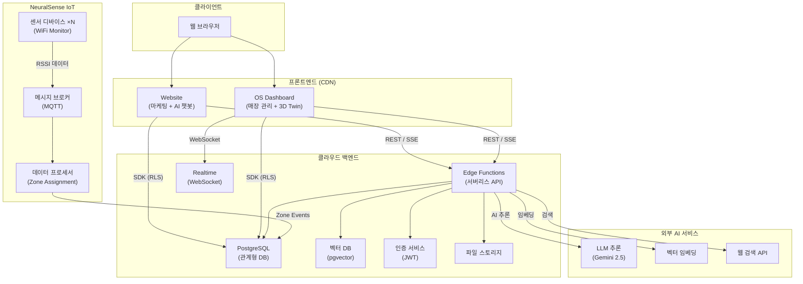
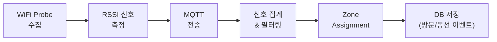
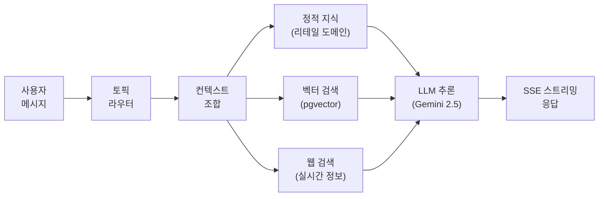
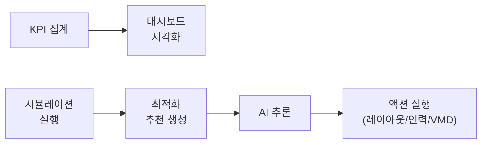
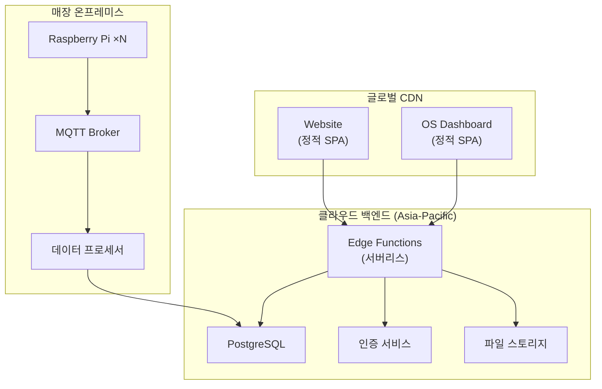

# NeuralTwin System Architecture (Public Overview)

> **Version**: 1.0
> **Last Updated**: 2026-02-25
> **Audience**: Partners, Investors, Technical Evaluators

---

## Table of Contents

1. [Executive Summary](#1-executive-summary)
2. [System Components](#2-system-components)
3. [High-Level Architecture](#3-high-level-architecture)
4. [Technology Stack](#4-technology-stack)
5. [Data Flow](#5-data-flow)
6. [AI Services](#6-ai-services)
7. [IoT Pipeline (NeuralSense)](#7-iot-pipeline-neuralsense)
8. [Security & Multi-Tenancy](#8-security--multi-tenancy)
9. [Deployment Architecture](#9-deployment-architecture)

---

## 1. Executive Summary

**NeuralTwin**은 오프라인 리테일 매장의 고객 행동을 IoT 센서로 실시간 수집하고, AI로 분석하여 매장 운영 최적화를 지원하는 SaaS 플랫폼입니다.

**핵심 가치 제안:**

```
IoT 센서 → 실시간 데이터 수집 → AI 분석 → 리테일 인사이트 → 매장 최적화
```

NeuralTwin은 모노레포 구조로 프론트엔드, 백엔드, IoT 시스템을 통합 관리하며, 공유 타입과 유틸리티를 중심으로 일관된 개발 경험을 제공합니다.

---

## 2. System Components

| 구성 요소 | 설명 | 대상 사용자 |
|-----------|------|------------|
| **Website** | 마케팅 웹사이트 + AI 리테일 챗봇 | 웹사이트 방문자 |
| **OS Dashboard** | 매장 관리 대시보드 + AI 어시스턴트 + 3D 디지털 트윈 | 매장 운영자 |
| **Backend API** | 서버리스 Edge Functions (~50개 API 엔드포인트) | 내부 |
| **NeuralSense** | IoT 센서 시스템 (WiFi Probe 기반 고객 동선 추적) | 매장 현장 |
| **Shared Packages** | 공유 타입·유틸리티 패키지 | 내부 개발 |

---

## 3. High-Level Architecture



---

## 4. Technology Stack

### 프론트엔드

| 항목 | 기술 |
|------|------|
| **프레임워크** | React 18, TypeScript |
| **빌드 도구** | Vite 5 |
| **스타일링** | Tailwind CSS |
| **상태 관리** | Zustand + TanStack Query |
| **3D 렌더링** | Three.js (OS Dashboard) |
| **다국어** | i18n (한국어/영어) |

### 백엔드

| 항목 | 기술 |
|------|------|
| **런타임** | Deno (서버리스 Edge Functions) |
| **데이터베이스** | PostgreSQL 17 |
| **벡터 검색** | pgvector (768-dim embedding) |
| **인증** | JWT 기반 인증 + Row Level Security |
| **실시간** | WebSocket (Realtime Subscriptions) |
| **파일 저장** | 클라우드 오브젝트 스토리지 |

### IoT (NeuralSense)

| 항목 | 기술 |
|------|------|
| **언어** | Python |
| **하드웨어** | Raspberry Pi |
| **프로토콜** | MQTT (메시지 브로커) |
| **센서** | WiFi Probe (802.11 프레임 분석) |

### AI

| 항목 | 기술 |
|------|------|
| **LLM** | Google Gemini 2.5 Pro / Flash |
| **임베딩** | gemini-embedding-001 (768-dim) |
| **지식 검색** | pgvector 기반 RAG |
| **웹 검색** | 외부 검색 API 연동 |

### 인프라 & 도구

| 항목 | 기술 |
|------|------|
| **모노레포** | pnpm workspace + Turborepo |
| **프론트 배포** | Vercel CDN |
| **백엔드 배포** | Supabase Cloud (서버리스) |
| **리전** | Asia-Pacific |

---

## 5. Data Flow

### 5.1 IoT 데이터 흐름



매장 내 설치된 복수의 센서 디바이스가 WiFi Probe 신호를 수집하고, RSSI(신호 강도)를 기반으로 고객의 위치를 존(Zone) 단위로 추정합니다. 캘리브레이션된 핑거프린트 데이터와 비교하여 실시간 존 할당이 이루어집니다.

### 5.2 AI 챗봇 데이터 흐름



### 5.3 대시보드 분석 흐름



---

## 6. AI Services

### 6.1 Website AI Chatbot (리테일 챗봇)

웹사이트 방문자를 위한 AI 챗봇으로, 리테일 도메인에 특화된 상담을 제공합니다.

**3-Layer Knowledge Architecture:**

| Layer | 소스 | 설명 |
|-------|------|------|
| **Layer 1: Static Knowledge** | 내장 도메인 지식 | 12개 리테일 토픽에 대한 전문 지식 |
| **Layer 2: Vector Knowledge** | pgvector 검색 | 임베딩 기반 유사 문서 검색 (RAG) |
| **Layer 3: Web Search** | 외부 검색 API | 최신 정보 보완 + 교차 검증 |

**주요 기능:**
- SSE 기반 실시간 스트리밍 응답
- 토픽 기반 자동 라우팅 (한/영 지원)
- 대화 맥락 유지 (컨텍스트 메모리)
- 리드 스코어링 (Awareness → Interest → Consideration → Decision)
- 고객 고충점 자동 추출 및 맞춤 제안

### 6.2 OS Dashboard AI Assistant

매장 운영자를 위한 AI 어시스턴트로, 대시보드 내에서 자연어로 매장을 관리할 수 있습니다.

**Intent Classification Architecture:**

| 인텐트 | 설명 | 예시 |
|--------|------|------|
| **Navigation** | 대시보드 UI 직접 제어 | "재고 페이지로 이동해줘" |
| **Chat** | 일반 대화 및 도움말 | "VMD가 뭐야?" |
| **Query** | KPI 및 데이터 조회 | "이번 달 매출 알려줘" |
| **Execution** | 시뮬레이션/최적화 실행 | "혼잡도 시뮬레이션 돌려줘" |

**주요 기능:**
- 인텐트 자동 분류 및 라우팅
- 자연어 KPI 쿼리
- 시뮬레이션 & 최적화 트리거
- 매장 페르소나 기반 맞춤 응답
- 세션 기반 대화 컨텍스트 유지

### 6.3 AI 모델 활용 요약

| 용도 | 모델 | 특성 |
|------|------|------|
| 웹 챗봇 (고품질 응답) | Gemini 2.5 Pro | 높은 추론 품질, 리테일 전문 |
| OS 어시스턴트 (빠른 응답) | Gemini 2.5 Flash | 낮은 지연, 실시간 상호작용 |
| 매장 최적화 추천 | Gemini 2.5 Pro/Flash | 레이아웃, 인력, VMD 최적화 |
| 벡터 임베딩 | gemini-embedding-001 | 768차원, RAG 검색용 |

---

## 7. IoT Pipeline (NeuralSense)

### 개요

NeuralSense는 매장 내 고객 동선을 WiFi 신호 기반으로 추적하는 IoT 시스템입니다. 별도의 앱 설치나 고객 동의 없이도 익명화된 디바이스 신호를 분석하여 존(Zone) 단위의 방문 패턴을 파악합니다.

### 시스템 구성

```
┌─────────────────────┐     ┌──────────────┐     ┌─────────────────────┐
│  Raspberry Pi ×N    │     │ MQTT Broker  │     │  Data Processor     │
│  (WiFi Monitor Mode)│────→│ (Mosquitto)  │────→│  (Zone Assignment)  │
│  · Scapy 패킷 캡처   │     │              │     │  · RSSI 집계         │
│  · RSSI 필터링       │     │              │     │  · 핑거프린트 매칭     │
│  · MQTT Publish     │     │              │     │  · 존 전환/체류 탐지   │
└─────────────────────┘     └──────────────┘     └────────┬────────────┘
                                                          │
                                                          ▼
                                                 ┌─────────────────┐
                                                 │  Cloud DB       │
                                                 │  · zone_events  │
                                                 │  · visits       │
                                                 │  · wifi_tracking│
                                                 └─────────────────┘
```

### Zone Assignment 알고리즘 (개요)

1. 복수의 센서 디바이스가 WiFi Probe 신호의 RSSI를 측정
2. 일정 시간 윈도우 내 수집된 RSSI를 디바이스별로 집계
3. 집계된 RSSI 핑거프린트를 사전 캘리브레이션 데이터와 비교
4. 가장 유사한 존(Zone)으로 할당
5. 존 전환(transition) 및 체류(dwell) 이벤트 생성

### 프라이버시 고려

- MAC 주소는 해시 처리되어 개인 식별 불가
- 위치 추적은 존(Zone) 단위의 대략적 영역으로만 수행
- 개인 기기와의 직접적 연결이나 통신 없음

---

## 8. Security & Multi-Tenancy

### 인증 및 권한

- **JWT 기반 인증**: 이메일/비밀번호 로그인 → JWT 토큰 발급
- **Role-Based Access Control (RBAC)**: 조직 소유자, 관리자, 멤버, 본사, 매장, 뷰어 등 세분화된 역할
- **Row Level Security (RLS)**: 데이터베이스 레벨에서 자동 접근 제어

### 멀티테넌시

```
Organization (조직/기업)
  └── Store (매장)
       └── Data (매장별 격리된 데이터)
```

- **조직 격리**: `org_id` 기반으로 기업 간 데이터 완전 분리
- **매장 격리**: `store_id` 기반으로 매장 간 데이터 분리
- **RLS 자동 적용**: 클라이언트 SDK 접근 시 인증된 사용자의 소속 조직/매장 데이터만 조회 가능

### 통신 보안

| 구간 | 프로토콜 | 설명 |
|------|---------|------|
| 브라우저 ↔ CDN | HTTPS | TLS 암호화 |
| 브라우저 ↔ Backend API | HTTPS | JWT 인증 + TLS |
| 브라우저 ↔ Realtime | WSS | WebSocket Secure |
| Backend ↔ DB | TLS | 내부 네트워크 + TLS |
| IoT ↔ MQTT Broker | MQTT | 내부 네트워크 |

---

## 9. Deployment Architecture

### 배포 구성



### 배포 요약

| 서비스 | 배포 환경 | 특성 |
|--------|----------|------|
| **Website** | Vercel CDN | 정적 SPA, 글로벌 CDN 배포, 자동 CI/CD |
| **OS Dashboard** | Vercel CDN | 정적 SPA, 코드 스플리팅 적용 |
| **Backend API** | Supabase Cloud | 서버리스, Asia-Pacific 리전, 자동 스케일링 |
| **Database** | Supabase Cloud | PostgreSQL 17, 관리형, 자동 백업 |
| **NeuralSense** | 매장 온프레미스 | Raspberry Pi + 로컬 프로세서, 물리 설치 |

### 빌드 파이프라인

```
Monorepo Build (Turborepo)
    │
    ├── 1. 공유 패키지 빌드 (types, shared)
    │
    ├── 2. 프론트엔드 앱 빌드 (Website, OS Dashboard)
    │       └── 의존 패키지 자동 선행 빌드
    │
    └── 3. Edge Functions (빌드 불필요, 직접 배포)
```

---

> **NeuralTwin** — IoT와 AI로 오프라인 리테일의 미래를 만듭니다.
