# REPO_ANALYSIS_C — supabase_NEURALTWIN 프로젝트 분석

---

## 섹션 1: 프로젝트 구조

### 1.1 디렉토리 트리 (3레벨 깊이)

```
supabase_NEURALTWIN/
├── .vscode/
│   ├── extensions.json
│   └── settings.json
├── neuraltwin-backend/
│   ├── .vscode/
│   │   ├── extensions.json
│   │   └── settings.json
│   └── supabase/
│       └── config.toml
├── supabase/
│   ├── .gitignore
│   ├── config.toml
│   └── functions/
│       ├── _shared/
│       │   ├── calculations/
│       │   ├── optimization/
│       │   ├── persona/
│       │   └── vmd/
│       ├── advanced-ai-inference/
│       ├── aggregate-all-kpis/
│       ├── aggregate-dashboard-kpis/
│       ├── ai-batch-qa-test/
│       ├── analyze-3d-model/
│       ├── api-connector/
│       ├── auto-map-etl/
│       ├── auto-process-3d-models/
│       ├── bright-processor/
│       ├── datasource-mapper/
│       ├── dynamic-handler/
│       ├── dynamic-responder/
│       ├── environment-proxy/
│       ├── etl-health/
│       ├── etl-scheduler/
│       ├── execute-import/
│       ├── generate-optimization/
│       │   ├── ai/
│       │   ├── data/
│       │   ├── feedback/
│       │   ├── prediction/
│       │   ├── schemas/
│       │   └── vmd/
│       ├── generate-template/
│       ├── graph-query/
│       ├── hyper-task/
│       ├── import-with-ontology/
│       ├── integrated-data-pipeline/
│       ├── inventory-monitor/
│       ├── knowledge-admin/
│       │   └── knowledge/
│       ├── neuraltwin-assistant/
│       │   ├── actions/
│       │   ├── config/
│       │   ├── constants/
│       │   ├── intent/
│       │   ├── response/
│       │   └── utils/
│       ├── parse-file/
│       ├── process-neuralsense-data/
│       ├── process-wifi-data/
│       ├── quick-handler/
│       ├── replay-import/
│       ├── retail-ai-inference/
│       ├── retail-chatbot/
│       │   ├── knowledge/
│       │   ├── memory/
│       │   └── search/
│       ├── rollback-import/
│       ├── run-simulation/
│       ├── simulation-data-mapping/
│       ├── smart-ontology-mapping/
│       ├── smooth-api/
│       ├── submit-contact/
│       ├── super-responder/
│       ├── sync-api-data/
│       ├── sync-holidays/
│       ├── sync-poi-context/
│       ├── sync-preset-data/
│       ├── sync-trend-signals/
│       ├── test-embedding/
│       ├── trigger-learning/
│       ├── unified-ai/
│       ├── unified-etl/
│       ├── upload-file/
│       ├── upscale-image/
│       └── validate-data/
```

### 1.2 주요 진입점 파일 목록

총 **53개**의 Edge Function 진입점 (`index.ts`):

| # | 함수명 | 경로 |
|---|--------|------|
| 1 | advanced-ai-inference | `supabase/functions/advanced-ai-inference/index.ts` |
| 2 | aggregate-all-kpis | `supabase/functions/aggregate-all-kpis/index.ts` |
| 3 | aggregate-dashboard-kpis | `supabase/functions/aggregate-dashboard-kpis/index.ts` |
| 4 | ai-batch-qa-test | `supabase/functions/ai-batch-qa-test/index.ts` |
| 5 | analyze-3d-model | `supabase/functions/analyze-3d-model/index.ts` |
| 6 | api-connector | `supabase/functions/api-connector/index.ts` |
| 7 | auto-map-etl | `supabase/functions/auto-map-etl/index.ts` |
| 8 | auto-process-3d-models | `supabase/functions/auto-process-3d-models/index.ts` |
| 9 | bright-processor | `supabase/functions/bright-processor/index.ts` |
| 10 | datasource-mapper | `supabase/functions/datasource-mapper/index.ts` |
| 11 | dynamic-handler | `supabase/functions/dynamic-handler/index.ts` |
| 12 | dynamic-responder | `supabase/functions/dynamic-responder/index.ts` |
| 13 | environment-proxy | `supabase/functions/environment-proxy/index.ts` |
| 14 | etl-health | `supabase/functions/etl-health/index.ts` |
| 15 | etl-scheduler | `supabase/functions/etl-scheduler/index.ts` |
| 16 | execute-import | `supabase/functions/execute-import/index.ts` |
| 17 | generate-optimization | `supabase/functions/generate-optimization/index.ts` |
| 18 | generate-template | `supabase/functions/generate-template/index.ts` |
| 19 | graph-query | `supabase/functions/graph-query/index.ts` |
| 20 | hyper-task | `supabase/functions/hyper-task/index.ts` |
| 21 | import-with-ontology | `supabase/functions/import-with-ontology/index.ts` |
| 22 | integrated-data-pipeline | `supabase/functions/integrated-data-pipeline/index.ts` |
| 23 | inventory-monitor | `supabase/functions/inventory-monitor/index.ts` |
| 24 | knowledge-admin | `supabase/functions/knowledge-admin/index.ts` |
| 25 | neuraltwin-assistant | `supabase/functions/neuraltwin-assistant/index.ts` |
| 26 | parse-file | `supabase/functions/parse-file/index.ts` |
| 27 | process-neuralsense-data | `supabase/functions/process-neuralsense-data/index.ts` |
| 28 | process-wifi-data | `supabase/functions/process-wifi-data/index.ts` |
| 29 | quick-handler | `supabase/functions/quick-handler/index.ts` |
| 30 | replay-import | `supabase/functions/replay-import/index.ts` |
| 31 | retail-ai-inference | `supabase/functions/retail-ai-inference/index.ts` |
| 32 | retail-chatbot | `supabase/functions/retail-chatbot/index.ts` |
| 33 | rollback-import | `supabase/functions/rollback-import/index.ts` |
| 34 | run-simulation | `supabase/functions/run-simulation/index.ts` |
| 35 | simulation-data-mapping | `supabase/functions/simulation-data-mapping/index.ts` |
| 36 | smart-ontology-mapping | `supabase/functions/smart-ontology-mapping/index.ts` |
| 37 | smooth-api | `supabase/functions/smooth-api/index.ts` |
| 38 | submit-contact | `supabase/functions/submit-contact/index.ts` |
| 39 | super-responder | `supabase/functions/super-responder/index.ts` |
| 40 | sync-api-data | `supabase/functions/sync-api-data/index.ts` |
| 41 | sync-holidays | `supabase/functions/sync-holidays/index.ts` |
| 42 | sync-poi-context | `supabase/functions/sync-poi-context/index.ts` |
| 43 | sync-preset-data | `supabase/functions/sync-preset-data/index.ts` |
| 44 | sync-trend-signals | `supabase/functions/sync-trend-signals/index.ts` |
| 45 | test-embedding | `supabase/functions/test-embedding/index.ts` |
| 46 | trigger-learning | `supabase/functions/trigger-learning/index.ts` |
| 47 | unified-ai | `supabase/functions/unified-ai/index.ts` |
| 48 | unified-etl | `supabase/functions/unified-etl/index.ts` |
| 49 | upload-file | `supabase/functions/upload-file/index.ts` |
| 50 | upscale-image | `supabase/functions/upscale-image/index.ts` |
| 51 | validate-data | `supabase/functions/validate-data/index.ts` |

공유 유틸리티 (`_shared/`):
- `_shared/calculations/index.ts` — 계산 모듈 진입점
- `neuraltwin-assistant/actions/queryActions/index.ts` — 쿼리 액션 진입점

### 1.3 총 파일 수 & 코드 라인 수

| 항목 | 값 |
|------|-----|
| **총 파일 수** (node_modules, .git 제외) | **148개** |
| **총 코드 라인 수** | **70,576줄** |

**언어별 라인 수:**

| 언어 | 파일 수 | 라인 수 | 비율 |
|------|---------|---------|------|
| TypeScript (`.ts`) | 139 | 70,512 | 99.9% |
| JSON (`.json`) | 5 | 64 | ~0.1% |
| TOML (`.toml`) | 2 | — | 설정 |
| gitignore | 2 | — | 설정 |

> **참고:** 이 프로젝트는 100% TypeScript(Deno) 기반이며 프론트엔드 코드(TSX, CSS, HTML)가 없습니다. 백엔드 Supabase Edge Functions 전용 프로젝트입니다.

**가장 큰 파일 Top 10:**

| 파일 | 라인 수 |
|------|---------|
| `advanced-ai-inference/index.ts` | 4,972 |
| `generate-optimization/index.ts` | 2,989 |
| `generate-optimization/vmd/vmdEngine.ts` | 1,953 |
| `retail-chatbot/index.ts` | 1,915 |
| `ai-batch-qa-test/index.ts` | 1,911 |
| `retail-chatbot/systemPrompt.ts` | 1,906 |
| `generate-optimization/data/associationMiner.ts` | 1,589 |
| `run-simulation/index.ts` | 1,561 |
| `generate-optimization/data/flowAnalyzer.ts` | 1,345 |
| `generate-optimization/feedback/autoLearning.ts` | 1,298 |

**함수별 파일 분포 (다중 파일 함수):**

| 함수명 | 파일 수 | 비고 |
|--------|---------|------|
| `neuraltwin-assistant` | 34 | 가장 복잡한 함수. 7개 하위 디렉토리 (actions, config, constants, intent, response, utils) |
| `retail-chatbot` | 26 | 대규모 챗봇. knowledge, memory, search 하위 디렉토리 |
| `_shared` | 13 | 공유 유틸리티. calculations, optimization, persona, vmd |
| `generate-optimization` | 11 | 최적화 엔진. ai, data, feedback, prediction, schemas, vmd |
| `knowledge-admin` | 6 | 지식 관리 |
| `advanced-ai-inference` | 2 | AI 추론 + 학습 |
| `integrated-data-pipeline` | 2 | 데이터 파이프라인 |
| 기타 44개 함수 | 각 1 | 단일 `index.ts` 진입점 |

### 1.4 사용 중인 프레임워크 & 주요 라이브러리

> **참고:** 이 프로젝트는 전통적인 `package.json` 기반이 아닌 **Deno + Supabase Edge Functions** 프로젝트입니다. 의존성은 URL 기반 import로 관리됩니다.

| 구분 | 라이브러리 | Import 소스 | 용도 |
|------|-----------|-------------|------|
| **런타임** | Deno 2.x | 내장 | Edge Function 런타임 |
| **프레임워크** | Supabase Edge Functions | Supabase Platform | 서버리스 함수 호스팅 |
| **DB 클라이언트** | @supabase/supabase-js | `esm.sh/@supabase/supabase-js@2` | Supabase DB/Auth/Storage 접근 |
| **HTTP 서버** | Deno std/http | `deno.land/std@0.168.0/http/server.ts` | HTTP 요청 처리 (`serve`) |
| **스프레드시트** | xlsx | `esm.sh/xlsx@0.18.5` | Excel/CSV 파일 파싱 |

**@supabase/supabase-js 버전 혼재:**

| 버전 | 사용 파일 수 |
|------|-------------|
| `@2.89.0` | 15개 |
| `@2.79.0` | 13개 |
| `@2.49.1` | 11개 |
| `@2` (latest) | 6개 |
| `@2.84.0` | 3개 |
| `@2.80.0` | 1개 |
| `@2.39.3` | 1개 |
| `@2.7.1` | 2개 |

### 1.5 설정 파일 목록

| 파일 | 용도 |
|------|------|
| `supabase/config.toml` | Supabase 로컬 개발 설정 (DB, Auth, Storage, Edge Runtime 등) |
| `neuraltwin-backend/supabase/config.toml` | neuraltwin-backend 서브프로젝트 Supabase 설정 |
| `.vscode/settings.json` | VS Code Deno 확장 설정 (lint, unstable flags) |
| `.vscode/extensions.json` | 권장 VS Code 확장 (`denoland.vscode-deno`) |
| `neuraltwin-backend/.vscode/settings.json` | neuraltwin-backend VS Code 설정 |
| `neuraltwin-backend/.vscode/extensions.json` | neuraltwin-backend 권장 확장 |
| `supabase/functions/retail-chatbot/deno.json` | retail-chatbot 함수 Deno 설정 (컴파일러 옵션, import map) |
| `supabase/.gitignore` | Supabase 디렉토리 Git 제외 규칙 |
| `neuraltwin-backend/supabase/.gitignore` | neuraltwin-backend Supabase Git 제외 규칙 |

---

## 섹션 2: 의존성 맵

> 이 프로젝트는 전통적인 `package.json`이 **없습니다**. Deno 런타임 기반으로 URL import를 사용합니다.
> 아래는 실제 코드에서 사용 중인 외부 의존성을 `package.json` 의존성 분류 방식으로 정리한 것입니다.

### 2.1 프레임워크 코어

| 패키지 | 버전 | Import 소스 | 설명 |
|--------|------|-------------|------|
| **Deno Runtime** | 2.x | 내장 | Edge Function 런타임 엔진 |
| **Supabase Edge Functions** | — | Supabase Platform | 서버리스 함수 배포/실행 플랫폼 |
| **Deno std/http** | `0.168.0` | `deno.land/std@0.168.0/http/server.ts` | HTTP 서버 (`serve` 함수) |

### 2.2 UI 라이브러리

해당 없음 — 이 프로젝트는 백엔드 전용이며 프론트엔드 UI 코드를 포함하지 않습니다.

### 2.3 상태 관리

해당 없음 — 서버리스 함수 기반으로 클라이언트 상태 관리가 필요하지 않습니다.

### 2.4 데이터 페칭

| 패키지 | 버전 | Import 소스 | 설명 |
|--------|------|-------------|------|
| **@supabase/supabase-js** | 2.x (다수 버전 혼재) | `esm.sh/@supabase/supabase-js@2.*` | Supabase DB 클라이언트 (CRUD, RPC, Storage, Auth) |

### 2.5 유틸리티

| 패키지 | 버전 | Import 소스 | 설명 |
|--------|------|-------------|------|
| **xlsx** | `0.18.5` | `esm.sh/xlsx@0.18.5` | Excel/CSV 파일 파싱 (parse-file, hyper-task) |

**프로젝트 내부 공유 유틸리티 (`_shared/`):**

| 모듈 | 파일 | 설명 |
|------|------|------|
| calculations | `_shared/calculations/index.ts` | 핵심 계산 모듈 |
| roiPredictor | `_shared/calculations/roiPredictor.ts` | ROI 예측 |
| roiPredictor_v2 | `_shared/calculations/roiPredictor_v2.ts` | ROI 예측 v2 |
| trafficFlow | `_shared/calculations/trafficFlow.ts` | 트래픽 흐름 분석 |
| validation | `_shared/calculations/validation.ts` | 데이터 유효성 검증 |
| integratedOptimization | `_shared/optimization/integratedOptimization.ts` | 통합 최적화 로직 |
| storePersonaLoader | `_shared/persona/storePersonaLoader.ts` | 매장 페르소나 로딩 |
| vmdRulesetLoader | `_shared/vmd/vmdRulesetLoader.ts` | VMD 규칙셋 로딩 |
| aiResponseLogger | `_shared/aiResponseLogger.ts` | AI 응답 로깅 |
| chatEventLogger | `_shared/chatEventLogger.ts` | 채팅 이벤트 로깅 |
| chatLogger | `_shared/chatLogger.ts` | 채팅 로깅 |
| rateLimiter | `_shared/rateLimiter.ts` | 요청 속도 제한 |
| safeJsonParse | `_shared/safeJsonParse.ts` | 안전한 JSON 파싱 |

### 2.6 개발 도구

| 도구 | 설정 파일 | 설명 |
|------|-----------|------|
| **Deno Lint** | `.vscode/settings.json` | TypeScript 코드 린팅 |
| **VS Code Deno Extension** | `.vscode/extensions.json` | Deno 개발 환경 지원 |
| **Supabase CLI** | `supabase/config.toml` | 로컬 개발, DB 마이그레이션, 함수 배포 |

### 2.7 버전 충돌 위험 패키지

| 패키지 | 충돌 상태 | 상세 |
|--------|-----------|------|
| **@supabase/supabase-js** | :warning: **8개 버전 혼재** | `@2.7.1`, `@2.39.3`, `@2.49.1`, `@2.79.0`, `@2.80.0`, `@2.84.0`, `@2.89.0`, `@2` (latest) |

**권장 조치:**
- `@supabase/supabase-js`의 버전을 **단일 버전 (최신 `@2.89.0`)으로 통일** 권장
- Deno의 URL 기반 import 특성상 서로 다른 버전이 별도 모듈로 로드되어 **번들 크기 증가** 및 **타입 불일치** 가능성 있음
- `deno.land/std@0.168.0`은 구버전이나 `serve` 함수만 사용하므로 기능적 문제는 없음

---

## 섹션 3: 환경 변수

> 이 프로젝트에는 `.env` 또는 `.env.example` 파일이 **없습니다**. 모든 환경 변수는 Supabase 플랫폼의 환경 변수 관리 시스템을 통해 주입되며, `Deno.env.get()` 으로 접근합니다.

### 3.1 사용 중인 환경 변수 목록

| 변수명 | 용도 | 사용 빈도 | 주요 사용 파일 |
|--------|------|-----------|---------------|
| `SUPABASE_URL` | Supabase 프로젝트 URL. 모든 Supabase 클라이언트 초기화에 필수. | **60+ 회** (거의 모든 함수) | 모든 Edge Function의 `index.ts` |
| `SUPABASE_SERVICE_ROLE_KEY` | Supabase 서비스 역할 키. RLS를 우회하는 관리자 수준 DB 접근에 사용. | **60+ 회** (거의 모든 함수) | 모든 Edge Function의 `index.ts` |
| `SUPABASE_ANON_KEY` | Supabase 익명(퍼블릭) 키. RLS가 적용되는 클라이언트 수준 접근에 사용. | **~10 회** | `sync-preset-data`, `upscale-image`, `auto-map-etl`, `retail-chatbot` |
| `LOVABLE_API_KEY` | Lovable AI 서비스 API 키. AI 추론, 이미지 업스케일링, 최적화 생성 등에 사용. | **~12 회** | `advanced-ai-inference`, `unified-ai`, `run-simulation`, `generate-optimization`, `retail-chatbot`, `analyze-3d-model`, `auto-process-3d-models`, `retail-ai-inference`, `smart-ontology-mapping`, `upscale-image`, `test-embedding`, `auto-map-etl` |
| `GOOGLE_AI_API_KEY` | Google AI API 키. 텍스트 임베딩 생성에 사용 (Google Generative AI Embedding). | **~4 회** | `retail-chatbot/knowledge/embeddings.ts`, `knowledge-admin/knowledge/embeddings.ts` |
| `SERPER_API_KEY` | Serper 웹 검색 API 키. 실시간 웹 검색 기능에 사용. | **2 회** | `retail-chatbot/webSearch.ts` |
| `OPENWEATHERMAP_API_KEY` | OpenWeatherMap API 키. 날씨 데이터 조회에 사용 (매장 최적화 시 환경 요인 반영). | **1 회** | `generate-optimization/data/environmentLoader.ts` |
| `DATA_GO_KR_API_KEY` | 한국 공공데이터포털 API 키. 공휴일, 지역 이벤트 등 공공 데이터 조회에 사용. | **1 회** | `generate-optimization/data/environmentLoader.ts` |

### 3.2 config.toml에서 참조되는 환경 변수 (Supabase CLI용)

아래 변수들은 `supabase/config.toml`에서 `env()` 문법으로 참조되며, Supabase CLI 로컬 개발 시 사용됩니다:

| 변수명 | 용도 |
|--------|------|
| `OPENAI_API_KEY` | Supabase Studio의 AI 어시스턴트 기능 |
| `SUPABASE_AUTH_SMS_TWILIO_AUTH_TOKEN` | Twilio SMS 인증 토큰 |
| `SUPABASE_AUTH_EXTERNAL_APPLE_SECRET` | Apple OAuth 시크릿 |
| `SECRET_VALUE` | DB Vault / Edge Runtime 시크릿 (주석 처리됨) |
| `SENDGRID_API_KEY` | SendGrid SMTP 이메일 발송 (주석 처리됨) |
| `S3_HOST` | S3 호스트 URL (실험적 기능) |
| `S3_REGION` | S3 리전 (실험적 기능) |
| `S3_ACCESS_KEY` | S3 액세스 키 (실험적 기능) |
| `S3_SECRET_KEY` | S3 시크릿 키 (실험적 기능) |

### 3.3 환경 변수 사용 패턴

```typescript
// 일반적인 패턴 — 모든 Edge Function에서 공통
const supabaseUrl = Deno.env.get('SUPABASE_URL')!;
const supabaseServiceKey = Deno.env.get('SUPABASE_SERVICE_ROLE_KEY')!;
const supabase = createClient(supabaseUrl, supabaseServiceKey);

// API 키 패턴 — 필요한 함수에서만 사용
const apiKey = Deno.env.get('LOVABLE_API_KEY') ?? '';

// 환경 프록시 — 동적 환경 변수 접근
Deno.env.get(requestedKey);  // environment-proxy 함수에서 동적 키 접근
```

### 3.4 환경 변수 분류

```
필수 (모든 함수에서 필요):
├── SUPABASE_URL
└── SUPABASE_SERVICE_ROLE_KEY

AI/ML 기능:
├── LOVABLE_API_KEY          ← AI 추론, 최적화, 시뮬레이션
└── GOOGLE_AI_API_KEY        ← 벡터 임베딩

외부 데이터 API:
├── SERPER_API_KEY           ← 웹 검색
├── OPENWEATHERMAP_API_KEY   ← 날씨 데이터
└── DATA_GO_KR_API_KEY       ← 한국 공공데이터

선택적 (일부 함수):
└── SUPABASE_ANON_KEY        ← 퍼블릭 접근용 클라이언트
```

---

## 섹션 4: Edge Functions 전체 인벤토리

### 4.1 함수 인벤토리 테이블

> 총 **51개** Edge Function. 모든 함수는 **POST** 메서드를 사용하며, CORS preflight용 **OPTIONS**를 지원합니다.

| # | 함수명 | 용도 (한줄) | HTTP 메서드 | 인증 필요 여부 | 의존하는 테이블 | 호출하는 서비스 |
|---|--------|------------|-------------|---------------|----------------|----------------|
| 1 | `advanced-ai-inference` | 다목적 AI 추론 엔진 (인과분석, 이상탐지, 예측, 레이아웃/동선/혼잡도/인력 시뮬레이션) | POST | Yes (JWT) | `furniture`, `furniture_slots`, `products`, `zones_dim`, `staff`, `ai_response_logs` | Lovable AI Gateway (Gemini 2.5 Flash) |
| 2 | `aggregate-all-kpis` | 전체 날짜 범위 방문/구매 데이터를 집계하여 대시보드 KPI 일괄 생성 | POST | Yes (JWT) | `ontology_entity_types`, `graph_entities`, `stores`, `dashboard_kpis` | — |
| 3 | `aggregate-dashboard-kpis` | 특정 날짜의 방문/구매 엔티티를 집계하여 단일 날짜 KPI 생성 | POST | Yes (JWT) | `ontology_entity_types`, `graph_entities`, `stores`, `dashboard_kpis` | — |
| 4 | `ai-batch-qa-test` | AI 시뮬레이션/최적화 함수의 배치 QA 테스트 및 파인튜닝 데이터 품질 검증 | POST | No (service_role) | `ai_batch_test_results` | Edge Functions (`run-simulation`, `generate-optimization`) |
| 5 | `analyze-3d-model` | 3D 모델 파일명을 AI 분석하여 온톨로지 엔티티 타입에 자동 매칭 | POST | Yes (JWT decode) | `ontology_entity_types` | Lovable AI Gateway (Gemini 2.5 Flash) |
| 6 | `api-connector` | 외부 API 연결 테스트, 데이터 동기화, 필드 매핑 미리보기 | POST | No (service_role) | `api_connections`, `api_sync_logs`, `raw_imports`, `api_mapping_templates`, 동적 타겟 테이블 | 사용자 설정 외부 API (동적 URL) |
| 7 | `auto-map-etl` | AI 기반 CSV/데이터 컬럼을 온톨로지 스키마에 자동 매핑 | POST | Yes (JWT) | `ontology_entity_types`, `ontology_relation_types` | Lovable AI Gateway (Gemini 2.5 Flash) |
| 8 | `auto-process-3d-models` | 업로드된 3D 모델 파일 자동 분석/분류 및 AI 기반 지능형 배치 | POST | Yes (JWT decode) | `ontology_entity_types`, `graph_entities`, Storage: `3d-models` | Lovable AI Gateway (Gemini 2.5 Flash) |
| 9 | `bright-processor` | 업로드된 CSV/Excel 데이터의 타입별 규칙 검증 및 에러 리포팅 | POST | Yes (JWT + 소유권) | `upload_sessions`, `raw_imports` | — |
| 10 | `datasource-mapper` | 데이터소스 등록, 스키마 추론, 엔티티/관계 매핑 CRUD 관리 | POST | Yes (JWT) | `data_sources`, `data_source_tables`, `data_source_sync_logs`, `ontology_entity_mappings`, `ontology_entity_types`, `ontology_relation_mappings`, `ontology_relation_types` | — |
| 11 | `dynamic-handler` | 파일 업로드 및 임포트 세션 생성 (CSV, Excel, JSON, 3D 모델) | POST | Yes (JWT) | `upload_sessions`, Storage: `user-imports` | — |
| 12 | `dynamic-responder` | 시뮬레이션 허브 데이터소스 매핑 상태 조회, API 연동/해제 | POST | Yes (JWT) | `products`, `customers`, `inventory_levels`, `purchases`, `visits`, `dashboard_kpis`, `wifi_tracking`, `graph_entities`, `graph_relations`, `api_connections` | — |
| 13 | `environment-proxy` | 외부 환경 데이터(날씨/공휴일) API 프록시 및 DB 자동 저장 | POST | No | `weather_data`, `holidays_events` | OpenWeatherMap API, 한국 공공데이터포털 API |
| 14 | `etl-health` | ETL 파이프라인 헬스체크 (레이어별 상태, 레코드 수, 이슈 진단) | POST | No (service_role) | `raw_imports`, `zone_events`, `funnel_events`, `daily_kpis_agg`, `etl_runs` | — |
| 15 | `etl-scheduler` | 스케줄 기반 조직별 ETL 파이프라인 자동 실행 | POST | No (service_role) | `organizations` | Edge Function (`unified-etl`) |
| 16 | `execute-import` | ETL 실행 — 매핑 설정에 따라 원본 데이터를 타겟 테이블로 변환/저장 | POST | Yes (JWT + 소유권) | `upload_sessions`, `raw_imports`, `user_data_imports`, `transactions`, `products`, `line_items`, `inventory_levels` | — |
| 17 | `generate-optimization` | AI 기반 매장 레이아웃/VMD/인력배치 최적화 추천 생성 | POST | Yes (JWT, 선택적) | `furniture`, `zones_dim`, `products`, `product_placements`, `zone_daily_metrics`, `product_performance_agg`, `furniture_slots`, `staff`, `layout_optimization_results`, `store_personas`, `vmd_rulesets`, `ai_response_logs` | Lovable AI Gateway (Gemini 2.5 Flash) |
| 18 | `generate-template` | 임포트 타입별(상품/고객/거래/직원/재고) 샘플 CSV/JSON 템플릿 생성 | POST | No | — | — |
| 19 | `graph-query` | 온톨로지 그래프 질의 (N-Hop, 최단경로, PageRank, 커뮤니티 탐지) | POST | Yes (JWT) | `graph_entities`, `graph_relations`, `ontology_relation_types`, RPC: `graph_n_hop_query`, `graph_shortest_path` | — |
| 20 | `hyper-task` | Excel/CSV 파일 파싱 및 upload_session 생성 (raw_imports 저장) | POST | Yes (JWT) | `upload_sessions`, `raw_imports`, Storage: `user-imports` | — |
| 21 | `import-with-ontology` | 온톨로지 기반 데이터 임포트 — 엔티티/관계 자동 생성 및 매핑 | POST | Yes (JWT) | `raw_imports`, `user_data_imports`, `ontology_entity_types`, `graph_entities`, `ontology_relation_types`, `graph_relations` | — |
| 22 | `integrated-data-pipeline` | 통합 데이터 파이프라인 — 온톨로지 매핑 캐시 기반 자동 ETL 처리 | POST | Yes (JWT) | `user_data_imports`, `ontology_mapping_cache`, `graph_entities`, `graph_relations` | Edge Functions (`smart-ontology-mapping`, `unified-etl`) |
| 23 | `inventory-monitor` | 재고 수준 모니터링 및 자동 발주 제안 생성 | POST | Yes (JWT) | `inventory_levels`, `auto_order_suggestions` | — |
| 24 | `knowledge-admin` | 리테일 지식 청크 CRUD 관리 (목록, 추가, 수정, 삭제) | POST | No (service_role) | `retail_knowledge_chunks` | — |
| 25 | `neuraltwin-assistant` | NeuralTwin 대시보드 AI 어시스턴트 — 자연어 질의 + 매장 데이터 연동 | POST | Yes (JWT + 조직/매장 검증) | `organization_members`, `stores`, `products`, `chat_conversations`, `chat_messages`, `chat_events`, RPC: `get_overview_kpis`, `get_zone_metrics` 외 11개 | Lovable AI Gateway (Gemini 2.5 Flash) |
| 26 | `parse-file` | 업로드된 파일(CSV/Excel/JSON) 파싱 및 raw_imports 저장, 세션 업데이트 | POST | Yes (JWT) | `upload_sessions`, `raw_imports`, Storage: `user-imports` | — |
| 27 | `process-neuralsense-data` | NEURALSENSE 센서(WiFi/BLE) 데이터 수신 → zone_events/visits/funnel ETL | POST | No (service_role) | `raw_imports`, `etl_runs`, `zones_dim`, `zone_events`, `visits`, `funnel_events` | — |
| 28 | `process-wifi-data` | WiFi 트래킹 CSV 파일을 Storage에서 다운로드하여 파싱 후 DB 저장 | POST | Yes (JWT) | `wifi_tracking`, `wifi_zones`, `stores`, Storage: `store-data` | — |
| 29 | `quick-handler` | ETL 실행 — upload_sessions 매핑 설정 기반 타겟 테이블 변환/저장 | POST | Yes (JWT + 소유권) | `upload_sessions`, `raw_imports`, `user_data_imports`, `transactions`, `products`, `line_items`, `inventory_levels`, `customers`, `staff` | — |
| 30 | `replay-import` | raw_imports 원본 데이터 재처리(replay) — ETL 파이프라인 재실행 | POST | No (service_role) | `raw_imports`, `etl_runs` | Edge Function (`unified-etl`) |
| 31 | `retail-ai-inference` | 온톨로지 그래프 + 리테일 개념 + AI 결합 추론 인사이트 생성 | POST | Yes (JWT) | `graph_entities`, `graph_relations`, `daily_kpis_agg`, `zones_dim`, `zone_daily_metrics`, `hourly_metrics`, `store_visits`, `ai_inference_results` | Lovable AI Gateway (Gemini 2.5 Flash), RPC: `compute_all_retail_concepts` |
| 32 | `retail-chatbot` | 웹사이트 방문자용 리테일 AI 챗봇 (SSE 스트리밍, 토픽 라우팅, 리드 캡처) | POST | 선택적 (JWT 또는 session_id) | `chat_conversations`, `chat_messages`, `chat_leads`, `chat_events` | Lovable AI Gateway (Gemini 2.5 Pro), Jina Reader, 웹 검색 |
| 33 | `rollback-import` | 완료된 데이터 임포트를 롤백 (임포트 레코드 삭제, 상태 복원) | POST | Yes (JWT + 소유권) | `user_data_imports`, `raw_imports`, `upload_sessions`, 동적 타겟 테이블, `line_items` | — |
| 34 | `run-simulation` | AI 기반 매장 시뮬레이션 (고객 행동, 혼잡도, 병목, 동선 분석) | POST | 선택적 (JWT) | `zones_dim`, `furniture`, `zone_transitions`, `zone_daily_metrics`, `daily_kpis_agg`, `graph_entities`, `graph_relations`, `ontology_entity_types`, `ontology_relation_types`, `simulation_history` | Lovable AI Gateway (Gemini 2.5 Flash) |
| 35 | `simulation-data-mapping` | 시뮬레이션 허브 데이터소스 매핑 상태 조회, 온톨로지 건강도 계산 | POST | Yes (JWT) | `products`, `customers`, `inventory_levels`, `purchases`, `visits`, `dashboard_kpis`, `wifi_tracking`, `graph_entities`, `graph_relations`, `api_connections` | — |
| 36 | `smart-ontology-mapping` | AI 기반 온톨로지 자동 매핑 — 컬럼 분석 → 엔티티/관계 타입 자동 생성 | POST | 조건부 (JWT 또는 user_id 파라미터) | `user_data_imports`, `ontology_entity_types`, `ontology_relation_types` | Lovable AI Gateway (Gemini 2.5 Pro) |
| 37 | `smooth-api` | 임포트 타입별 샘플 CSV/JSON 템플릿 생성 반환 (stateless) | POST | No | — | — |
| 38 | `submit-contact` | 웹사이트 Contact Form 제출 처리 및 Zapier 알림 전송 | POST | No (공개) | `contact_submissions` | Zapier Webhook |
| 39 | `super-responder` | 임포트 롤백 기능 (rollback-import과 동일 코드, placeholder) | POST | Yes (JWT + 소유권) | `user_data_imports`, `raw_imports`, `upload_sessions`, 동적 타겟 테이블, `line_items` | — |
| 40 | `sync-api-data` | 스케줄/직접 API 연결 통한 외부 데이터 동기화 (Phase 7 스키마) | POST | No (service_role) | `data_sync_schedules`, `external_data_sources`, `data_sync_logs`, `api_connections`, `raw_imports`, `user_data_imports`, 동적 타겟 테이블 | 동적 외부 API, Edge Functions (`api-connector`, `integrated-data-pipeline`) |
| 41 | `sync-holidays` | 외부 소스에서 공휴일 데이터 동기화 및 DB 저장 | POST | Yes (JWT + 역할 검증) | `organization_members`, `external_data_sources`, `holidays_events`, `data_sync_logs` | — (mock, 향후 Calendarific/Nager.Date) |
| 42 | `sync-poi-context` | 매장 주변 POI 데이터 동기화 및 상권 컨텍스트 생성 | POST | Yes (JWT + 역할 검증) | `organization_members`, `stores`, `external_data_sources`, `store_trade_area_context`, `data_sync_logs` | — (mock, 향후 Foursquare/Google Places/Kakao) |
| 43 | `sync-preset-data` | API 연결 기반 외부 데이터 자동 감지/프리셋 테이블 저장 | POST | Yes (JWT + 역할 검증) | `organization_members`, `api_connections`, `weather_data`, `economic_indicators`, `holidays_events`, `regional_data` | 동적 외부 API (OpenWeatherMap 등) |
| 44 | `sync-trend-signals` | 카테고리/브랜드별 트렌드 시그널 데이터 외부 동기화 | POST | Yes (JWT + 역할 검증) | `organization_members`, `external_data_sources`, `products`, `trend_signals`, `data_sync_logs` | — (mock, 향후 Google Trends/Naver DataLab) |
| 45 | `test-embedding` | Lovable Gateway 임베딩 API 지원 여부 테스트 (임시 함수) | Any | No | — | Lovable AI Gateway (embeddings endpoint) |
| 46 | `trigger-learning` | 피드백 축적 기반 자동 학습 트리거 (페르소나 업데이트, 신뢰도 조정) | POST | No (service_role) | `learning_sessions`, `optimization_feedback`, `store_personas` | — |
| 47 | `unified-ai` | AI 기능 통합 엔드포인트 (KPI 추천, 이상탐지, 패턴분석, 관계추론) | POST | Yes (JWT) | `daily_kpis_agg`, `graph_entities`, `ai_recommendations`, `graph_relations`, `ontology_entity_types`, `ontology_relation_types` | Lovable AI Gateway (Gemini 2.5 Flash) |
| 48 | `unified-etl` | 4가지 ETL 파이프라인 통합 (raw→L2, L1→L2, L2→L3, 스키마 ETL) | POST | Yes (JWT 또는 service_role) | `raw_imports`, `user_data_imports`, `customers`, `products`, `purchases`, `line_items`, `visits`, `funnel_events`, `stores`, `daily_kpis_agg`, `zone_transitions`, `zones_dim`, `zone_daily_metrics`, `ontology_entity_types`, `graph_entities`, `ontology_relation_types`, `graph_relations`, `etl_runs` | — |
| 49 | `upload-file` | 파일 업로드 처리 및 임포트 세션 생성 | POST | Yes (JWT) | `upload_sessions`, Storage: `user-imports` | — |
| 50 | `upscale-image` | AI 활용 이미지 업스케일링 (해상도 향상 및 디테일 강화) | POST | Yes (JWT) | — | Lovable AI Gateway (Gemini 2.5 Flash Image Preview) |
| 51 | `validate-data` | 업로드 데이터의 타입별 규칙 검증 및 에러/경고 리포팅 | POST | Yes (JWT + 소유권) | `upload_sessions`, `raw_imports` | — |

### 4.2 인증 패턴 분류

| 인증 유형 | 함수 수 | 함수 목록 |
|-----------|---------|----------|
| **JWT 필수** | 24 | `aggregate-all-kpis`, `aggregate-dashboard-kpis`, `auto-map-etl`, `bright-processor`, `datasource-mapper`, `dynamic-handler`, `dynamic-responder`, `execute-import`, `graph-query`, `hyper-task`, `import-with-ontology`, `integrated-data-pipeline`, `inventory-monitor`, `neuraltwin-assistant`, `parse-file`, `process-wifi-data`, `quick-handler`, `retail-ai-inference`, `rollback-import`, `simulation-data-mapping`, `unified-ai`, `upload-file`, `upscale-image`, `validate-data` |
| **JWT + 역할 검증** (NEURALTWIN_MASTER) | 4 | `sync-holidays`, `sync-poi-context`, `sync-preset-data`, `sync-trend-signals` |
| **JWT decode (수동)** | 2 | `analyze-3d-model`, `auto-process-3d-models` |
| **JWT 선택적** | 3 | `retail-chatbot`, `run-simulation`, `generate-optimization` |
| **조건부** (JWT 또는 user_id) | 1 | `smart-ontology-mapping` |
| **하이브리드** (JWT 또는 service_role) | 1 | `unified-etl` |
| **인증 없음** (service_role 직접) | 10 | `ai-batch-qa-test`, `api-connector`, `environment-proxy`, `etl-health`, `etl-scheduler`, `knowledge-admin`, `process-neuralsense-data`, `replay-import`, `trigger-learning`, `super-responder`* |
| **인증 없음** (완전 공개) | 4 | `generate-template`, `smooth-api`, `submit-contact`, `test-embedding` |
| **JWT + 소유권 검증** | 5 | `bright-processor`, `execute-import`, `quick-handler`, `rollback-import`, `validate-data` |

> *`super-responder`는 `rollback-import`과 동일 코드를 포함하는 placeholder입니다.

### 4.3 외부 서비스 호출 맵

| 외부 서비스 | 엔드포인트 | 사용 함수 |
|------------|-----------|----------|
| **Lovable AI Gateway** (Chat) | `ai.gateway.lovable.dev/v1/chat/completions` | `advanced-ai-inference`, `analyze-3d-model`, `auto-map-etl`, `auto-process-3d-models`, `generate-optimization`, `retail-ai-inference`, `retail-chatbot`, `run-simulation`, `smart-ontology-mapping`, `unified-ai`, `upscale-image` |
| **Lovable AI Gateway** (Embeddings) | `ai.gateway.lovable.dev/v1/embeddings` | `test-embedding` |
| **OpenWeatherMap** | `api.openweathermap.org/data/2.5/weather` | `environment-proxy` |
| **한국 공공데이터포털** | `apis.data.go.kr/.../getRestDeInfo` | `environment-proxy` |
| **Zapier Webhook** | `hooks.zapier.com/hooks/catch/...` | `submit-contact` |
| **사용자 설정 동적 API** | DB `api_connections` 테이블의 URL | `api-connector`, `sync-api-data`, `sync-preset-data` |
| **내부 Edge Function 호출** | `${SUPABASE_URL}/functions/v1/*` | `ai-batch-qa-test` → `run-simulation`/`generate-optimization`, `etl-scheduler` → `unified-etl`, `replay-import` → `unified-etl`, `sync-api-data` → `api-connector`/`integrated-data-pipeline` |

### 4.4 함수 간 내부 호출 관계

```
etl-scheduler ─────────────→ unified-etl
replay-import ─────────────→ unified-etl
ai-batch-qa-test ──────────→ run-simulation
                   └───────→ generate-optimization
sync-api-data ─────────────→ api-connector
              └────────────→ integrated-data-pipeline
integrated-data-pipeline ──→ smart-ontology-mapping
                     └─────→ unified-etl
```

### 4.5 `_shared/` 공통 유틸리티 디렉토리

#### 파일 목록 및 용도

| 파일 | 용도 | 접근 테이블 | 사용하는 함수 |
|------|------|------------|-------------|
| `calculations/index.ts` | 계산 모듈 통합 엔트리포인트 + Gemini Function Calling Tool 정의 | — | `generate-optimization` |
| `calculations/roiPredictor.ts` | 상품 배치 ROI(투자수익률) 계산 (노출수, 전환수, 매출, 이익) | — | (via index.ts) |
| `calculations/roiPredictor_v2.ts` | 리테일 증분 기반 ROI 예측 v2 (현재 vs 제안 위치 비교, 회수기간, 리스크) | — | (via index.ts) |
| `calculations/trafficFlow.ts` | Zone별 트래픽 흐름 계산 (유동인구, 혼잡도, 병목 확률) | — | (via index.ts) |
| `calculations/validation.ts` | 계산 결과 범위 검증, 이상치 탐지(IQR/Z-score), 일관성 검증 | — | (via index.ts) |
| `optimization/integratedOptimization.ts` | 레이아웃↔인력배치 교차 최적화 (직원 위치 제안, 가구 미세조정) | — | `generate-optimization` |
| `persona/storePersonaLoader.ts` | 매장 페르소나 DB 로드 및 AI 프롬프트 컨텍스트 변환 | `store_personas` | `generate-optimization` |
| `vmd/vmdRulesetLoader.ts` | VMD 룰셋 DB 로드 및 AI 프롬프트 주입 텍스트 변환 | `vmd_rulesets`, `vmd_rule_applications` | `generate-optimization` |
| `aiResponseLogger.ts` | AI 응답 자동 기록 (파인튜닝용 학습 데이터 수집, 파싱 성공률 추적) | `ai_response_logs` | `generate-optimization`, `advanced-ai-inference`, `run-simulation` |
| `chatEventLogger.ts` | 챗봇 이벤트(세션 시작, handover, 에러 등) 기록 | `chat_events` | `neuraltwin-assistant` |
| `chatLogger.ts` | 챗봇 대화 세션 생성/조회 및 메시지 저장/조회 | `chat_conversations`, `chat_messages` | `neuraltwin-assistant` |
| `rateLimiter.ts` | 사용자별 분당 요청 수 제한 (메모리 기반) | — | `neuraltwin-assistant` |
| `safeJsonParse.ts` | AI 응답 안전 JSON 파싱 (코드블록 제거, 후행 콤마 수정, 폴백) | — | `retail-ai-inference`, `run-simulation` |

#### 기능 클러스터

```
AI 최적화 엔진 클러스터 (→ generate-optimization 전용):
├── calculations/*        ← 순수 계산 (트래픽, ROI, 검증)
├── optimization/*        ← 교차 최적화 (레이아웃↔인력)
├── persona/*             ← 매장 페르소나 로딩
└── vmd/*                 ← VMD 룰셋 로딩

AI 인프라 클러스터 (→ 여러 AI 함수에서 공유):
├── aiResponseLogger.ts   ← AI 응답 로깅/추적
└── safeJsonParse.ts      ← AI JSON 응답 안전 파싱

챗봇 인프라 클러스터 (→ neuraltwin-assistant 전용):
├── chatLogger.ts         ← 대화/메시지 CRUD
├── chatEventLogger.ts    ← 이벤트 추적
└── rateLimiter.ts        ← 요청 제한
```

### 4.6 전체 DB 테이블 참조 맵

> 프로젝트 전체에서 참조되는 고유 테이블 수: **약 55개**

| 테이블명 | 참조하는 함수 수 | 주요 함수 |
|---------|-----------------|----------|
| `graph_entities` | 10+ | `aggregate-*-kpis`, `auto-process-3d-models`, `dynamic-responder`, `import-with-ontology`, `integrated-data-pipeline`, `run-simulation`, `simulation-data-mapping`, `unified-ai`, `unified-etl` |
| `graph_relations` | 7+ | `dynamic-responder`, `import-with-ontology`, `integrated-data-pipeline`, `retail-ai-inference`, `run-simulation`, `simulation-data-mapping`, `unified-ai` |
| `ontology_entity_types` | 9+ | `aggregate-*-kpis`, `analyze-3d-model`, `auto-map-etl`, `auto-process-3d-models`, `datasource-mapper`, `import-with-ontology`, `run-simulation`, `unified-ai`, `unified-etl` |
| `products` | 7+ | `advanced-ai-inference`, `dynamic-responder`, `execute-import`, `generate-optimization`, `neuraltwin-assistant`, `simulation-data-mapping`, `sync-trend-signals` |
| `upload_sessions` | 6+ | `bright-processor`, `dynamic-handler`, `execute-import`, `hyper-task`, `parse-file`, `validate-data` |
| `raw_imports` | 6+ | `api-connector`, `bright-processor`, `etl-health`, `execute-import`, `process-neuralsense-data`, `replay-import`, `sync-api-data`, `unified-etl`, `validate-data` |
| `zones_dim` | 5+ | `generate-optimization`, `process-neuralsense-data`, `retail-ai-inference`, `run-simulation`, `unified-etl` |
| `daily_kpis_agg` | 4+ | `etl-health`, `retail-ai-inference`, `run-simulation`, `unified-ai` |
| `user_data_imports` | 5+ | `execute-import`, `import-with-ontology`, `integrated-data-pipeline`, `rollback-import`, `sync-api-data` |
| `dashboard_kpis` | 3+ | `aggregate-all-kpis`, `aggregate-dashboard-kpis`, `dynamic-responder`, `simulation-data-mapping` |
| `furniture` | 3 | `advanced-ai-inference`, `generate-optimization`, `run-simulation` |
| `api_connections` | 4+ | `api-connector`, `dynamic-responder`, `simulation-data-mapping`, `sync-api-data`, `sync-preset-data` |
| `stores` | 4+ | `aggregate-*-kpis`, `neuraltwin-assistant`, `process-wifi-data`, `sync-poi-context`, `unified-etl` |
| `store_personas` | 2 | `trigger-learning`, `_shared/storePersonaLoader` → `generate-optimization` |

### 4.7 DB RPC 함수 참조 맵

| RPC 함수명 | 호출하는 Edge Function |
|-----------|----------------------|
| `compute_all_retail_concepts` | `retail-ai-inference` |
| `graph_n_hop_query` | `graph-query` |
| `graph_shortest_path` | `graph-query` |
| `increment_message_count` | `retail-chatbot` |
| `handover_chat_session` | `retail-chatbot` |
| `increment_chat_message_count` | `_shared/chatLogger` → `neuraltwin-assistant` |
| `get_store_persona_context` | `_shared/storePersonaLoader` → `generate-optimization` |
| `get_overview_kpis` | `neuraltwin-assistant` (sub-module) |
| `get_zone_metrics` | `neuraltwin-assistant` (sub-module) |
| `get_customer_segments` | `neuraltwin-assistant` (sub-module) |
| `get_product_performance` | `neuraltwin-assistant` (sub-module) |
| `get_inventory_status` | `neuraltwin-assistant` (sub-module) |
| `get_store_goals` | `neuraltwin-assistant` (sub-module) |
| `get_hourly_entry_counts` | `neuraltwin-assistant` (sub-module) |
| `get_zones_dim_list` | `neuraltwin-assistant` (sub-module) |
| `get_applied_strategies` | `neuraltwin-assistant` (sub-module) |
| `get_inventory_movements` | `neuraltwin-assistant` (sub-module) |
| `get_data_control_tower_status` | `neuraltwin-assistant` (sub-module) |

---

## 섹션 5: DB 스키마 전체 맵

> **분석 방법 (Phase 1-A)**: 마이그레이션 파일 없음 (`supabase/migrations/` 디렉토리 비어있음), `database.types.ts` 파일 없음.
> Edge Function 코드의 `.from()`, `.select()`, `.insert()`, `.eq()`, `.rpc()` 패턴을 분석하여 **코드 기반 역공학**으로 스키마를 추출함.
>
> **검증 (Phase 1-C, 2026-02-23)**: Supabase MCP `list_tables` / `execute_sql`로 실제 DB 조회 완료.
> 실제 DB에는 **153개 테이블 + 12개 뷰** 존재. 코드 역공학으로 포착된 76개 테이블은 모두 실제 DB에 존재하며, **77개 테이블이 추가로 확인됨 (문서 커버리지 49.7%)**.

### 5.1 코드에서 추출된 테이블 목록 (76개 테이블)

#### 5.1.1 Core Business (매장/조직/상품) — 11개

| 테이블명 | 주요 컬럼 (코드에서 추출) | 용도 | 참조 함수 수 |
|---------|------------------------|------|------------|
| `stores` | id, org_id, area_sqm, store_name, location, latitude, longitude, address, metadata | 매장 정보 | 8 |
| `organizations` | id | 조직/기업 정보 | 1 |
| `organization_members` | user_id, role, org_id | 조직 멤버십 | 4 |
| `products` | id, sku, name/product_name, category, price, brand, display_type, compatible_display_types, store_id | 상품 마스터 | 7 |
| `customers` | id, org_id, store_id | 고객 정보 | 2 |
| `transactions` | id, store_id, total_amount, transaction_datetime | 거래 내역 | 3 |
| `purchases` | id, store_id, org_id, purchase_date | 구매 기록 | 2 |
| `line_items` | id, transaction_id, product_id, quantity, unit_price, line_total, store_id, transaction_date | 거래 상세 품목 | 5 |
| `inventory_levels` | store_id | 재고 수준 | 3 |
| `auto_order_suggestions` | id, status | 자동 발주 제안 | 1 |
| `staff` | id, staff_code, staff_name, role, department, is_active, avatar_position, assigned_zone_id, store_id | 직원 정보 | 2 |

#### 5.1.2 Spatial / Zone (공간 분석) — 8개

| 테이블명 | 주요 컬럼 (코드에서 추출) | 용도 | 참조 함수 수 |
|---------|------------------------|------|------------|
| `zones_dim` | id, zone_code, zone_name, zone_type, area_sqm, center_x, center_z, coordinates, capacity, store_id, org_id, is_active | 구역 차원 테이블 | 7 |
| `zone_events` | id, store_id, org_id, created_at | 구역 이벤트 | 2 |
| `zone_transitions` | store_id, transition_time, transition_date | 구역 간 이동 | 3 |
| `zone_daily_metrics` | zone_id, visitors, conversions, revenue, avg_dwell_time_seconds, store_id, metric_date | 구역별 일간 지표 | 4 |
| `visits` | id, entry_time, visit_date, store_id, org_id | 방문 기록 | 3 |
| `store_visits` | store_id | 매장 방문 집계 | 1 |
| `funnel_events` | store_id, event_date, org_id | 퍼널 이벤트 | 3 |
| `hourly_metrics` | store_id | 시간대별 지표 | 1 |

#### 5.1.3 Furniture & Layout (가구/레이아웃) — 5개

| 테이블명 | 주요 컬럼 (코드에서 추출) | 용도 | 참조 함수 수 |
|---------|------------------------|------|------------|
| `furniture` | id, furniture_code, furniture_name, furniture_type, zone_id, position_x/y/z, rotation_x/y/z, movable, store_id | 가구/집기 배치 | 3 |
| `furniture_slots` | furniture_id, store_id | 가구 슬롯 | 2 |
| `product_placements` | product_id | 상품 진열 위치 | 2 |
| `layout_optimization_results` | (insert only) | 레이아웃 최적화 결과 | 1 |
| `product_associations` | (insert) | 상품 연관 규칙 | 1 |

#### 5.1.4 Graph / Ontology (지식 그래프) — 7개

| 테이블명 | 주요 컬럼 (코드에서 추출) | 용도 | 참조 함수 수 |
|---------|------------------------|------|------------|
| `ontology_entity_types` | id, name, user_id | 온톨로지 엔티티 유형 정의 | 9 |
| `ontology_relation_types` | id, name, user_id | 온톨로지 관계 유형 정의 | 5 |
| `ontology_entity_mappings` | (insert) | 엔티티 매핑 규칙 | 1 |
| `ontology_relation_mappings` | (select) | 관계 매핑 규칙 | 1 |
| `ontology_mapping_cache` | id, user_id, data_type | 매핑 캐시 | 1 |
| `graph_entities` | id, label, entity_type_id, properties, user_id, store_id | 그래프 엔티티 노드 | 12 |
| `graph_relations` | source_entity_id, target_entity_id, weight, relation_type_id, user_id, store_id | 그래프 관계 엣지 | 7 |

#### 5.1.5 Data Import / ETL (데이터 수집) — 7개

| 테이블명 | 주요 컬럼 (코드에서 추출) | 용도 | 참조 함수 수 |
|---------|------------------------|------|------------|
| `upload_sessions` | id, file_path, session_id | 파일 업로드 세션 | 7 |
| `raw_imports` | id, raw_data, status, file_name, created_at, store_id, org_id, session_id, file_path, file_type, row_count | 원본 데이터 저장 | 10 |
| `user_data_imports` | id, user_id, file_name, data_type, total_rows, status, created_at, store_id, raw_data, row_count, file_path, file_type | 사용자 데이터 가져오기 | 9 |
| `etl_runs` | id, started_at, status, store_id, org_id | ETL 실행 이력 | 5 |
| `data_sources` | id, user_id | 데이터 소스 정의 | 1 |
| `data_source_tables` | (insert) | 데이터 소스 테이블 | 1 |
| `data_source_sync_logs` | (insert/update) | 데이터 소스 동기화 로그 | 1 |

#### 5.1.6 External Data & Sync (외부 데이터) — 11개

| 테이블명 | 주요 컬럼 (코드에서 추출) | 용도 | 참조 함수 수 |
|---------|------------------------|------|------------|
| `external_data_sources` | (*) | 외부 데이터 소스 | 3 |
| `data_sync_logs` | (insert) | 동기화 로그 | 3 |
| `data_sync_schedules` | id, data_source_id | 동기화 스케줄 | 1 |
| `api_connections` | id, name, provider, data_category, is_active, status, total_records_synced, last_sync, description, type, connection_category, connection_type, store_id, user_id | API 연결 설정 | 5 |
| `api_sync_logs` | (insert/update) | API 동기화 로그 | 1 |
| `api_mapping_templates` | (*) | API 매핑 템플릿 | 1 |
| `weather_data` | latitude, longitude, (*) | 날씨 데이터 | 3 |
| `holidays_events` | id, (*) | 공휴일/이벤트 | 3 |
| `economic_indicators` | (insert) | 경제 지표 | 1 |
| `regional_data` | (insert) | 지역 데이터 | 1 |
| `trend_signals` | id | 트렌드 시그널 | 1 |

#### 5.1.7 AI & Analytics (AI/분석) — 7개

| 테이블명 | 주요 컬럼 (코드에서 추출) | 용도 | 참조 함수 수 |
|---------|------------------------|------|------------|
| `ai_inference_results` | (insert) | AI 추론 결과 | 1 |
| `ai_recommendations` | (*) | AI 추천 | 1 |
| `ai_response_logs` | id, function_name, parse_success, used_fallback, execution_time_ms, error_message, created_at, store_id | AI 응답 로그 | 1 (_shared) |
| `ai_batch_test_results` | id | AI 배치 테스트 결과 | 1 |
| `daily_kpis_agg` | id, store_id, calculated_at, kpi_date, date, org_id | 일간 KPI 집계 | 4 |
| `dashboard_kpis` | id, user_id, store_id, date | 대시보드 KPI | 3 |
| `product_performance_agg` | product_id, revenue, units_sold, conversion_rate | 상품 성과 집계 | 1 |

#### 5.1.8 Chat System (채팅) — 5개

| 테이블명 | 주요 컬럼 (코드에서 추출) | 용도 | 참조 함수 수 |
|---------|------------------------|------|------------|
| `chat_conversations` | id, message_count | 채팅 대화 | 2 (+ _shared) |
| `chat_messages` | id, conversation_id, channel_data | 채팅 메시지 | 2 (+ _shared) |
| `chat_leads` | (insert) | 채팅 리드 (잠재 고객) | 1 |
| `chat_events` | id, conversation_id, event_type | 채팅 이벤트 | 1 (+ _shared) |
| `chat_context_memory` | user_profile, conversation_id | 대화 컨텍스트 메모리 | 1 |

#### 5.1.9 WiFi Tracking — 2개

| 테이블명 | 주요 컬럼 (코드에서 추출) | 용도 | 참조 함수 수 |
|---------|------------------------|------|------------|
| `wifi_tracking` | store_id | WiFi 추적 데이터 | 2 |
| `wifi_zones` | (insert/upsert) | WiFi 구역 매핑 | 1 |

#### 5.1.10 Learning & Optimization (학습/최적화) — 7개

| 테이블명 | 주요 컬럼 (코드에서 추출) | 용도 | 참조 함수 수 |
|---------|------------------------|------|------------|
| `strategy_feedback` | id, store_id, strategy_type, result_measured, feedback_type, roi_accuracy, actual_roi, expected_roi, created_at | 전략 피드백 | 1 |
| `learning_sessions` | id, store_id | 학습 세션 | 2 |
| `optimization_feedback` | (*) | 최적화 피드백 | 1 |
| `stored_model_parameters` | (*) | 저장된 모델 파라미터 | 1 |
| `learning_adjustments` | (insert) | 학습 조정 기록 | 1 |
| `prediction_records` | (*) | 예측 기록 | 1 |
| `store_trade_area_context` | id | 매장 상권 컨텍스트 | 1 |

#### 5.1.11 Persona & Knowledge (페르소나/지식) — 4개

| 테이블명 | 주요 컬럼 (코드에서 추출) | 용도 | 참조 함수 수 |
|---------|------------------------|------|------------|
| `store_personas` | id, store_id, is_active | 매장 페르소나 | 2 (+ _shared) |
| `retail_knowledge_chunks` | id, topic_id, chunk_type, source, title, embedding | 소매 지식 청크 (벡터) | 1 |
| `vmd_rulesets` | is_active, confidence_level, rule_category, rule_code | VMD 규칙셋 | 1 (_shared) |
| `vmd_rule_applications` | (insert) | VMD 규칙 적용 기록 | 1 (_shared) |

#### 5.1.12 Simulation & Misc — 2개

| 테이블명 | 주요 컬럼 (코드에서 추출) | 용도 | 참조 함수 수 |
|---------|------------------------|------|------------|
| `simulation_history` | (insert) | 시뮬레이션 실행 이력 | 1 |
| `contact_submissions` | (insert) | 문의/연락 제출 | 1 |

### 5.1A 실제 DB 테이블 전체 목록 (153개 테이블 + 12개 뷰)

> **조회 방법**: Supabase MCP `list_tables` + `execute_sql` (2026-02-23)
> **프로젝트**: NEURALTWIN_backend (`bdrvowacecxnraaivlhr`), 리전: ap-northeast-1, 스키마: public

#### 테이블 (153개)

| # | 테이블명 | 컬럼 수 | # | 테이블명 | 컬럼 수 |
|---|---------|---------|---|---------|---------|
| 1 | `ai_batch_test_results` | 16 | 2 | `ai_inference_logs` | 17 |
| 3 | `ai_inference_results` | 10 | 4 | `ai_insights` | 12 |
| 5 | `ai_model_performance` | 19 | 6 | `ai_recommendations` | 18 |
| 7 | `ai_response_logs` | 26 | 8 | `ai_scene_analysis` | 9 |
| 9 | `alerts` | 14 | 10 | `analysis_history` | 8 |
| 11 | `api_connections` | 46 | 12 | `api_mapping_templates` | 20 |
| 13 | `api_sync_logs` | 26 | 14 | `applied_strategies` | 25 |
| 15 | `assistant_command_cache` | 9 | 16 | `auto_order_suggestions` | 13 |
| 17 | `beacon_events` | 9 | 18 | `beacons` | 8 |
| 19 | `camera_events` | 10 | 20 | `chat_context_memory` | 10 |
| 21 | `chat_conversations` | 13 | 22 | `chat_daily_analytics` | 11 |
| 23 | `chat_events` | 6 | 24 | `chat_leads` | 8 |
| 25 | `chat_messages` | 11 | 26 | `column_mappings` | 8 |
| 27 | `contact_submissions` | 12 | 28 | `customer_segments` | 13 |
| 29 | `customer_segments_agg` | 16 | 30 | `customers` | 14 |
| 31 | `daily_kpis_agg` | 29 | 32 | `daily_sales` | 10 |
| 33 | `dashboard_kpis` | 22 | 34 | `data_source_sync_logs` | 10 |
| 35 | `data_source_tables` | 8 | 36 | `data_sources` | 16 |
| 37 | `data_sync_logs` | 10 | 38 | `data_sync_schedules` | 14 |
| 39 | `economic_indicators` | 13 | 40 | `etl_runs` | 18 |
| 41 | `external_data_sources` | 12 | 42 | `feedback_reason_codes` | 7 |
| 43 | `field_transform_rules` | 13 | 44 | `funnel_events` | 18 |
| 45 | `funnel_metrics` | 11 | 46 | `furniture` | 33 |
| 47 | `furniture_facings` | 4 | 48 | `furniture_height_zones` | 7 |
| 49 | `furniture_slots` | 21 | 50 | `graph_entities` | 14 |
| 51 | `graph_relations` | 11 | 52 | `holidays_events` | 17 |
| 53 | `hourly_metrics` | 17 | 54 | `hq_guidelines` | 14 |
| 55 | `hq_notifications` | 11 | 56 | `hq_store_messages` | 16 |
| 57 | `import_type_schemas` | 9 | 58 | `inventory` | 9 |
| 59 | `inventory_history` | 12 | 60 | `inventory_levels` | 10 |
| 61 | `inventory_movements` | 13 | 62 | `invitations` | 12 |
| 63 | `kpi_snapshots` | 15 | 64 | `kpis` | 12 |
| 65 | `layout_optimization_results` | 24 | 66 | `learning_adjustments` | 14 |
| 67 | `learning_sessions` | 10 | 68 | `license_billing_history` | 10 |
| 69 | `licenses` | 15 | 70 | `line_items` | 18 |
| 71 | `model_3d_files` | 15 | 72 | `models` | 10 |
| 73 | `notification_settings` | 9 | 74 | `onboarding_progress` | 18 |
| 75 | `ontology_entity_mappings` | 11 | 76 | `ontology_entity_types` | 16 |
| 77 | `ontology_mapping_cache` | 12 | 78 | `ontology_relation_inference_queue` | 9 |
| 79 | `ontology_relation_mappings` | 9 | 80 | `ontology_relation_types` | 13 |
| 81 | `ontology_schema_versions` | 7 | 82 | `ontology_schemas` | 11 |
| 83 | `optimization_feedback` | 14 | 84 | `optimization_tasks` | 18 |
| 85 | `organization_members` | 8 | 86 | `organization_settings` | 12 |
| 87 | `organizations` | 7 | 88 | `pos_integrations` | 21 |
| 89 | `prediction_records` | 7 | 90 | `product_associations` | 26 |
| 91 | `product_models` | 7 | 92 | `product_performance_agg` | 19 |
| 93 | `product_placements` | 15 | 94 | `products` | 27 |
| 95 | `profiles` | 5 | 96 | `purchases` | 12 |
| 97 | `push_subscriptions` | 5 | 98 | `quickstart_guides` | 13 |
| 99 | `raw_imports` | 24 | 100 | `realtime_inventory` | 20 |
| 101 | `realtime_transactions` | 25 | 102 | `recommendation_applications` | 19 |
| 103 | `regional_data` | 13 | 104 | `report_schedules` | 13 |
| 105 | `retail_concept_values` | 7 | 106 | `retail_concepts` | 14 |
| 107 | `retail_knowledge_chunks` | 11 | 108 | `roi_measurements` | 13 |
| 109 | `sample_data_templates` | 23 | 110 | `scenarios` | 11 |
| 111 | `shift_schedules` | 14 | 112 | `simulation_configs` | 11 |
| 113 | `simulation_history` | 15 | 114 | `staff` | 22 |
| 115 | `staff_assignments` | 20 | 116 | `store_comments` | 11 |
| 117 | `store_goals` | 12 | 118 | `store_personas` | 14 |
| 119 | `store_scenes` | 12 | 120 | `store_trade_area_context` | 11 |
| 121 | `store_visits` | 16 | 122 | `stored_model_parameters` | 9 |
| 123 | `stores` | 33 | 124 | `strategy_daily_metrics` | 7 |
| 125 | `strategy_feedback` | 21 | 126 | `subscriptions` | 19 |
| 127 | `sync_endpoints` | 23 | 128 | `sync_logs` | 14 |
| 129 | `tasks` | 15 | 130 | `transactions` | 14 |
| 131 | `trend_signals` | 11 | 132 | `upload_sessions` | 24 |
| 133 | `user_activity_logs` | 8 | 134 | `user_alerts` | 16 |
| 135 | `user_data_imports` | 26 | 136 | `user_guide_completions` | 4 |
| 137 | `v_org_id` | 1 | 138 | `visit_zone_events` | 12 |
| 139 | `visits` | 9 | 140 | `vmd_rule_applications` | 12 |
| 141 | `vmd_rulesets` | 23 | 142 | `vmd_zone_types` | 6 |
| 143 | `weather_data` | 14 | 144 | `web_events` | 10 |
| 145 | `wifi_events` | 11 | 146 | `wifi_tracking` | 11 |
| 147 | `wifi_zones` | 9 | 148 | `zone_daily_metrics` | 21 |
| 149 | `zone_events` | 16 | 150 | `zone_metrics` | 12 |
| 151 | `zone_performance` | 15 | 152 | `zone_transitions` | 9 |
| 153 | `zones_dim` | 25 | | | |

#### 뷰 (12개)

| # | 뷰 이름 | 컬럼 수 |
|---|--------|---------|
| 1 | `ai_parse_success_stats` | 7 |
| 2 | `v_ai_response_stats` | 10 |
| 3 | `v_batch_test_failures` | 8 |
| 4 | `v_batch_test_linked_analysis` | 12 |
| 5 | `v_batch_test_scenario_stats` | 8 |
| 6 | `v_batch_test_summary` | 12 |
| 7 | `v_finetuning_dataset` | 11 |
| 8 | `v_furniture_vmd_summary` | 17 |
| 9 | `v_user_orgs` | 2 |
| 10 | `v_vmd_rules_summary` | 11 |
| 11 | `v_zone_vmd_summary` | 13 |
| 12 | `zones` | 19 |

### 5.1B 문서 vs 실제 DB 비교 (스키마 Diff)

> **비교 기준**: 섹션 5.1 코드 역공학 76개 vs 실제 DB 153개 테이블

#### 문서에는 있는데 실제 DB에 없는 테이블: 0개

코드 역공학으로 추출한 76개 테이블은 **모두 실제 DB에 존재**합니다.

#### 실제 DB에는 있는데 문서에 없는 테이블: 77개

| 카테고리 | 수 | 테이블명 |
|---------|---|---------|
| **AI & Analytics** | 6 | `ai_inference_logs`, `ai_insights`, `ai_model_performance`, `ai_scene_analysis`, `analysis_history`, `kpis` |
| **Core Business 확장** | 7 | `customer_segments`, `customer_segments_agg`, `daily_sales`, `inventory`, `inventory_history`, `inventory_movements`, `shift_schedules` |
| **HQ Management** | 5 | `hq_guidelines`, `hq_notifications`, `hq_store_messages`, `store_comments`, `store_goals` |
| **IoT Tracking** | 5 | `beacon_events`, `beacons`, `camera_events`, `web_events`, `wifi_events` |
| **User / Auth / Onboarding** | 6 | `invitations`, `onboarding_progress`, `profiles`, `user_activity_logs`, `user_guide_completions`, `quickstart_guides` |
| **System / Notification** | 5 | `alerts`, `notification_settings`, `push_subscriptions`, `user_alerts`, `report_schedules` |
| **System / Misc** | 6 | `assistant_command_cache`, `kpi_snapshots`, `models`, `organization_settings`, `sample_data_templates`, `tasks` |
| **Learning & Optimization 확장** | 5 | `applied_strategies`, `feedback_reason_codes`, `optimization_tasks`, `recommendation_applications`, `roi_measurements` |
| **Graph / Ontology 확장** | 5 | `ontology_relation_inference_queue`, `ontology_schema_versions`, `ontology_schemas`, `retail_concept_values`, `retail_concepts` |
| **Subscription / License** | 3 | `license_billing_history`, `licenses`, `subscriptions` |
| **External Data & Sync 확장** | 3 | `pos_integrations`, `sync_endpoints`, `sync_logs` |
| **Data Import / ETL 확장** | 3 | `column_mappings`, `field_transform_rules`, `import_type_schemas` |
| **Furniture & Layout (VMD/3D)** | 3 | `furniture_facings`, `furniture_height_zones`, `vmd_zone_types` |
| **Spatial / Zone 확장** | 3 | `visit_zone_events`, `zone_metrics`, `zone_performance` |
| **3D / Spatial** | 3 | `model_3d_files`, `product_models`, `store_scenes` |
| **POS Realtime** | 2 | `realtime_inventory`, `realtime_transactions` |
| **Simulation 확장** | 2 | `scenarios`, `simulation_configs` |
| **Strategy** | 2 | `staff_assignments`, `strategy_daily_metrics` |
| **Chat System 확장** | 1 | `chat_daily_analytics` |
| **기타** | 2 | `funnel_metrics`, `v_org_id` |

#### 커버리지 요약

| 구분 | 수 |
|------|---|
| 코드 역공학 테이블 (섹션 5.1) | 76 |
| 실제 DB 테이블 | 153 |
| 실제 DB 뷰 | 12 |
| 문서에만 있는 테이블 | **0** |
| DB에만 있는 테이블 | **77** |
| **문서 커버리지** | **49.7%** |

#### 주요 누락 원인

코드 역공학은 Edge Function에서 Supabase 클라이언트를 통해 직접 호출하는 테이블만 포착하므로 다음이 누락됨:
- **마스터/참조 테이블**: `kpis`, `furniture_facings`, `furniture_height_zones`, `vmd_zone_types`, `feedback_reason_codes`
- **RPC/트리거 전용 테이블**: DB 내부 함수에서만 참조되는 테이블
- **프론트엔드 직접 호출 테이블**: Edge Function을 거치지 않고 클라이언트에서 직접 조회하는 테이블 (`profiles`, `organizations_settings` 등)
- **시스템/인프라 테이블**: `subscriptions`, `licenses`, `invitations`, `onboarding_progress`
- **후속 추가 테이블**: 코드 분석 시점 이후 마이그레이션으로 추가된 테이블

### 5.2 테이블 관계도 (Mermaid ERD)

```mermaid
erDiagram
    organizations ||--o{ stores : "has"
    organizations ||--o{ organization_members : "has"
    stores ||--o{ zones_dim : "contains"
    stores ||--o{ furniture : "placed_in"
    stores ||--o{ products : "sells"
    stores ||--o{ staff : "employs"
    stores ||--o{ visits : "receives"
    stores ||--o{ transactions : "processes"
    stores ||--o{ purchases : "records"
    stores ||--o{ inventory_levels : "tracks"
    stores ||--o{ zone_daily_metrics : "measures"
    stores ||--o{ daily_kpis_agg : "aggregates"
    stores ||--o{ dashboard_kpis : "displays"
    stores ||--o{ wifi_tracking : "monitors"
    stores ||--o{ store_personas : "defines"
    stores ||--o{ store_visits : "counts"
    stores ||--o{ hourly_metrics : "analyzes"
    stores ||--o{ api_connections : "connects"

    zones_dim ||--o{ zone_events : "triggers"
    zones_dim ||--o{ zone_transitions : "records"
    zones_dim ||--o{ zone_daily_metrics : "aggregates"
    zones_dim ||--o{ furniture : "contains"

    furniture ||--o{ furniture_slots : "has"
    furniture_slots ||--o{ product_placements : "holds"

    transactions ||--o{ line_items : "contains"
    products ||--o{ line_items : "sold_as"
    products ||--o{ product_placements : "placed_at"
    products ||--o{ product_performance_agg : "measured_by"
    products ||--o{ product_associations : "associated_with"

    ontology_entity_types ||--o{ graph_entities : "categorizes"
    ontology_entity_types ||--o{ ontology_entity_mappings : "mapped_by"
    ontology_relation_types ||--o{ graph_relations : "categorizes"
    ontology_relation_types ||--o{ ontology_relation_mappings : "mapped_by"
    graph_entities ||--o{ graph_relations : "source"
    graph_entities ||--o{ graph_relations : "target"

    upload_sessions ||--o{ raw_imports : "contains"
    raw_imports ||--o{ user_data_imports : "processed_to"
    user_data_imports ||--o{ etl_runs : "triggers"

    external_data_sources ||--o{ data_sync_logs : "logs"
    data_sync_schedules ||--o{ data_sync_logs : "executes"
    api_connections ||--o{ api_sync_logs : "logs"
    api_connections ||--o{ api_mapping_templates : "uses"

    chat_conversations ||--o{ chat_messages : "contains"
    chat_conversations ||--o{ chat_events : "triggers"
    chat_conversations ||--o{ chat_leads : "generates"
    chat_conversations ||--o{ chat_context_memory : "stores"

    learning_sessions ||--o{ learning_adjustments : "produces"
    strategy_feedback ||--o{ learning_sessions : "feeds"
    stored_model_parameters ||--o{ prediction_records : "predicts"
```



### 5.3 RPC 함수 전체 목록

> **Phase 1-A**: 코드 역공학으로 23개 함수 포착
> **Phase 1-C (2026-02-24)**: `database.types.ts`에서 **96개 함수** 확인 — 73개 추가 발견

#### 5.3.1 코드에서 확인된 RPC 함수 (23개, Phase 1-A)

| RPC 함수명 | 호출 위치 |
|-----------|----------|
| `compute_all_retail_concepts` | retail-ai-inference |
| `graph_n_hop_query` | graph-query |
| `graph_shortest_path` | graph-query |
| `search_knowledge` | retail-chatbot/vectorStore |
| `search_knowledge_trgm` | retail-chatbot/vectorStore |
| `increment_message_count` | retail-chatbot |
| `increment_chat_message_count` | _shared/chatLogger |
| `handover_chat_session` | retail-chatbot |
| `get_store_persona_context` | _shared/storePersonaLoader |
| `get_success_patterns` | advanced-ai-inference/learning |
| `get_failure_patterns` | advanced-ai-inference/learning |
| `calculate_confidence_adjustment` | advanced-ai-inference/learning |
| `get_data_control_tower_status` | neuraltwin-assistant |
| `get_overview_kpis` | neuraltwin-assistant |
| `get_zone_metrics` | neuraltwin-assistant |
| `get_customer_segments` | neuraltwin-assistant |
| `get_product_performance` | neuraltwin-assistant |
| `get_inventory_status` | neuraltwin-assistant |
| `get_store_goals` | neuraltwin-assistant |
| `get_hourly_entry_counts` | neuraltwin-assistant |
| `get_zones_dim_list` | neuraltwin-assistant |
| `get_applied_strategies` | neuraltwin-assistant |
| `get_inventory_movements` | neuraltwin-assistant |

#### 5.3.2 전체 RPC 함수 목록 (96개, database.types.ts 기준)

##### AI / 분석 (8개)

| RPC 함수명 | 반환 타입 | 용도 |
|-----------|----------|------|
| `aggregate_ai_performance` | Json | AI 모델 성능 집계 |
| `calculate_data_quality_score` | Json | 데이터 품질 점수 계산 |
| `cleanup_old_ai_response_logs` | number | 오래된 AI 응답 로그 정리 |
| `cleanup_old_batch_test_results` | number | 오래된 배치 테스트 결과 정리 |
| `compute_all_retail_concepts` | Json | 리테일 개념 일괄 계산 |
| `export_public_schema` | Json | 퍼블릭 스키마 내보내기 |
| `get_schema_metadata` | Json | 스키마 메타데이터 조회 |
| `search_knowledge` | Record[] | 벡터 유사도 검색 |

##### KPI / 대시보드 (8개)

| RPC 함수명 | 반환 타입 | 용도 |
|-----------|----------|------|
| `get_daily_kpis_summary` | Record[] | 일간 KPI 요약 |
| `get_funnel_stats` | Record[] | 퍼널 통계 |
| `get_hourly_entry_counts` | Record[] | 시간대별 입장 수 |
| `get_hourly_traffic` | Record[] | 시간대별 트래픽 |
| `get_kpi_lineage` | Json | KPI 데이터 리니지 |
| `get_overview_kpis` | Record[] | KPI 개요 |
| `get_visit_statistics` | Record[] | 방문 통계 |
| `get_zone_metrics` | Record[] | 구역 지표 |

##### 매장 / 고객 / 상품 (10개)

| RPC 함수명 | 반환 타입 | 용도 |
|-----------|----------|------|
| `get_customer_segments` | Record[] | 고객 세그먼트 |
| `get_product_performance` | Record[] | 상품 성과 |
| `get_inventory_status` | Record[] | 재고 상태 |
| `get_inventory_movements` | Record[] | 재고 이동 내역 |
| `get_store_goals` | Record[] | 매장 목표 |
| `get_zones_dim_list` | Record[] | 구역 차원 목록 |
| `compute_cross_sell_affinity` | Record[] | 교차 판매 친화도 계산 |
| `compute_inventory_turnover` | Record[] | 재고 회전율 계산 |
| `compute_zone_conversion_funnel` | Record[] | 구역 전환 퍼널 계산 |
| `compute_zone_heatmap` | Record[] | 구역 히트맵 계산 |

##### VMD / 가구 / 슬롯 (7개)

| RPC 함수명 | 반환 타입 | 용도 |
|-----------|----------|------|
| `calculate_furniture_visibility` | number | 가구 가시성 계산 |
| `check_slot_display_compatibility` | boolean | 슬롯-디스플레이 호환성 |
| `check_slot_product_compatibility` | boolean | 슬롯-상품 호환성 |
| `get_applicable_vmd_rules` | Record[] | 적용 가능한 VMD 규칙 |
| `get_available_slots_for_display_type` | Record[] | 디스플레이 유형별 가용 슬롯 |
| `get_compatible_slots_for_product` | Record[] | 상품 호환 슬롯 |
| `get_store_persona_context` | Json | 매장 페르소나 컨텍스트 |

##### 전략 / 학습 / ROI (11개)

| RPC 함수명 | 반환 타입 | 용도 |
|-----------|----------|------|
| `calculate_confidence_adjustment` | Json | 신뢰도 조정 계산 |
| `get_applied_strategies` | Record[] | 적용된 전략 조회 |
| `get_association_summary` | Json | 연관 규칙 요약 |
| `get_category_affinities` | Json | 카테고리 친화도 |
| `get_failure_patterns` | Json | 실패 패턴 |
| `get_product_associations` | Json | 상품 연관 규칙 |
| `get_roi_by_category` | Record[] | 카테고리별 ROI |
| `get_roi_summary` | Record[] | ROI 요약 |
| `get_strategy_roi_trend` | Record[] | 전략 ROI 추이 |
| `get_success_patterns` | Json | 성공 패턴 |
| `ensure_store_persona` | string | 매장 페르소나 보장 |

##### 그래프 / 온톨로지 (2개)

| RPC 함수명 | 반환 타입 | 용도 |
|-----------|----------|------|
| `graph_n_hop_query` | Json | 그래프 N-홉 탐색 |
| `graph_shortest_path` | Json | 그래프 최단 경로 |

##### 리테일 개념 캐시 (2개)

| RPC 함수명 | 반환 타입 | 용도 |
|-----------|----------|------|
| `get_cached_concept_value` | Json | 캐시된 개념 값 조회 |
| `save_concept_value` | string | 개념 값 저장 |

##### 채팅 (2개)

| RPC 함수명 | 반환 타입 | 용도 |
|-----------|----------|------|
| `handover_chat_session` | number | 채팅 세션 이관 |
| `search_knowledge_trgm` | Record[] | 트라이그램 텍스트 검색 |

##### 데이터 파이프라인 / ETL (7개)

| RPC 함수명 | 반환 타입 | 용도 |
|-----------|----------|------|
| `create_import_session` | string | 임포트 세션 생성 |
| `get_active_import_sessions` | Record[] | 활성 임포트 세션 |
| `get_import_schema` | Record[] | 임포트 스키마 조회 |
| `get_import_target_table` | string | 임포트 대상 테이블 |
| `update_import_session_status` | boolean | 임포트 세션 상태 갱신 |
| `generate_sample_sales_data` | void | 샘플 매출 데이터 생성 |
| `generate_sample_visit_data` | void | 샘플 방문 데이터 생성 |

##### API 연결 / 동기화 (18개)

| RPC 함수명 | 반환 타입 | 용도 |
|-----------|----------|------|
| `create_api_connection` | Json | API 연결 생성 |
| `create_sync_log` | Json | 동기화 로그 생성 |
| `calculate_next_sync_time` | string | 다음 동기화 시간 계산 |
| `execute_api_sync` | Json | API 동기화 실행 |
| `get_all_data_sources` | Json | 전체 데이터 소스 조회 |
| `get_api_connections_dashboard` | Json | API 연결 대시보드 |
| `get_api_mapping_template` | Json | API 매핑 템플릿 |
| `get_connection_settings` | Json | 연결 설정 조회 |
| `get_connections_due_for_sync` | Record[] | 동기화 예정 연결 |
| `get_context_data_sources` | Json | 컨텍스트 데이터 소스 |
| `get_data_control_tower_status` | Json | 데이터 컨트롤 타워 상태 |
| `get_sync_history` | Json | 동기화 이력 |
| `get_sync_statistics` | Json | 동기화 통계 |
| `get_sync_status` | Json | 동기화 상태 |
| `record_sync_result` | Json | 동기화 결과 기록 |
| `test_api_connection` | Json | API 연결 테스트 |
| `update_connection_after_sync` | Json | 동기화 후 연결 갱신 |
| `update_connection_settings` | Json | 연결 설정 갱신 |

##### 권한 / 사용자 관리 (14개)

| RPC 함수명 | 반환 타입 | 용도 |
|-----------|----------|------|
| `can_access_membership` | boolean | 멤버십 접근 가능 여부 |
| `get_user_org_id` | string | 사용자 조직 ID |
| `get_user_orgs` | Record[] | 사용자 조직 목록 |
| `get_user_role` | app_role | 사용자 역할 조회 |
| `has_valid_license` | boolean | 유효 라이선스 확인 |
| `is_neuraltwin_admin` | boolean | NeuralTwin 관리자 여부 |
| `is_org_admin` | boolean | 조직 관리자 여부 |
| `is_org_admin_simple` | boolean | 조직 관리자 여부 (간소) |
| `is_org_member` | boolean | 조직 멤버 여부 |
| `is_org_member_simple` | boolean | 조직 멤버 여부 (간소) |
| `is_org_member_with_license` | boolean | 라이선스 보유 멤버 여부 |
| `is_org_owner` | boolean | 조직 소유자 여부 |
| `migrate_user_to_organization` | string | 사용자 조직 마이그레이션 |
| `user_can_access_store` | boolean | 매장 접근 가능 여부 |

##### 동기화 로그 (1개)

| RPC 함수명 | 반환 타입 | 용도 |
|-----------|----------|------|
| `update_sync_log` | Json | 동기화 로그 갱신 |

##### Ensure / 시스템 (6개)

| RPC 함수명 | 반환 타입 | 용도 |
|-----------|----------|------|
| `ensure_system_context_connections` | Json | 시스템 컨텍스트 연결 보장 |

> **참고**: `increment_message_count`, `increment_chat_message_count`는 코드에서 호출되지만 `database.types.ts`에 미등록 — DB 트리거/내부 함수일 가능성

### 5.4 RLS 정책 & 인덱스 분석

> **주의**: 마이그레이션 파일이 없어 RLS 정책과 인덱스 정보를 코드에서 직접 확인할 수 없음.
> 아래는 코드 패턴에서 추론한 보안 모델임.

#### 인증 기반 데이터 접근 패턴

| 접근 패턴 | 테이블 예시 | 설명 |
|----------|-----------|------|
| **user_id 기반 RLS 추정** | graph_entities, graph_relations, ontology_entity_types, dashboard_kpis, user_data_imports | `.eq('user_id', ...)` 패턴으로 사용자별 데이터 격리 |
| **store_id 기반 필터링** | zones_dim, furniture, products, zone_daily_metrics, daily_kpis_agg, visits | `.eq('store_id', ...)` 패턴으로 매장별 데이터 격리 |
| **org_id 기반 필터링** | stores, purchases, visits, raw_imports | `.eq('org_id', ...)` 패턴으로 조직별 데이터 격리 |
| **service_role 직접 접근** | etl_runs, raw_imports, upload_sessions | 인증 없이 service_role key로 접근 (ETL 파이프라인) |
| **복합 필터링** | graph_entities (user_id + store_id), api_connections (store_id + user_id) | 다중 조건으로 데이터 격리 |

#### 추정 인덱스 요구사항

코드의 쿼리 패턴에서 자주 사용되는 필터/정렬 컬럼 기반 추정:

| 테이블 | 추정 인덱스 컬럼 | 근거 |
|-------|----------------|------|
| `graph_entities` | (user_id), (store_id), (entity_type_id) | 3가지 필터 조합 빈번 |
| `graph_relations` | (user_id), (source_entity_id), (target_entity_id) | 그래프 탐색 쿼리 |
| `raw_imports` | (id), (store_id), (status), (created_at) | 상태별/시간별 조회 |
| `daily_kpis_agg` | (store_id, kpi_date), (calculated_at) | 날짜 범위 쿼리 |
| `zone_daily_metrics` | (store_id, metric_date), (zone_id) | 매장+날짜 복합 조회 |
| `chat_messages` | (conversation_id) | 대화별 메시지 조회 |
| `ontology_entity_types` | (name), (user_id) | 이름/사용자 기반 조회 |
| `retail_knowledge_chunks` | (topic_id), (embedding) - GIN/IVFFlat | 벡터 검색 |

---

## 섹션 6: Realtime & Storage

### 6.1 Supabase Realtime 사용 현황

| 항목 | 상태 |
|------|------|
| **Realtime 채널 (`.channel()`)** | ❌ 미사용 |
| **Postgres Changes 구독 (`.on()`)** | ❌ 미사용 |
| **Broadcast** | ❌ 미사용 |
| **Presence** | ❌ 미사용 |
| **config.toml Realtime 설정** | `enabled = true` (기본값, 실제 사용 없음) |

> **참고**: 코드 내 `realtime`이라는 단어는 시뮬레이션 타입 옵션(`'realtime' | 'predictive' | 'scenario'`)에서만 사용되며, Supabase Realtime 기능과는 무관함.

### 6.2 Supabase Storage 사용 현황

#### Storage 버킷 목록 (3개)

| 버킷명 | 용도 | 사용 함수 | 작업 |
|-------|------|----------|------|
| `user-imports` | 사용자 데이터 파일 업로드 저장 | upload-file, dynamic-handler, parse-file, hyper-task, integrated-data-pipeline | upload, download, remove |
| `3d-models` | 3D 모델 메타데이터 파일 | auto-process-3d-models | download |
| `store-data` | 매장 WiFi 데이터 파일 | process-wifi-data | download |

#### Storage 작업 상세

| 작업 | 사용 위치 | 설명 |
|------|----------|------|
| **upload** | `upload-file/index.ts:135`, `dynamic-handler/index.ts:135` | `user-imports` 버킷에 파일 업로드 |
| **download** | `parse-file/index.ts:355`, `hyper-task/index.ts:351`, `process-wifi-data/index.ts:73`, `auto-process-3d-models/index.ts:227`, `integrated-data-pipeline/csv-parser.ts:19,68` | 업로드된 파일 다운로드하여 처리 |
| **remove** | `upload-file/index.ts:175`, `dynamic-handler/index.ts:175` | 에러 발생 시 업로드 파일 정리 (롤백) |
| **getPublicUrl** | ❌ 미사용 | 공개 URL 생성 없음 |
| **createSignedUrl** | ❌ 미사용 | 서명된 URL 생성 없음 |

#### Storage 데이터 흐름

```
[사용자] → upload-file/dynamic-handler
            │ storage.upload("user-imports")
            ▼
       upload_sessions 테이블 (세션 기록)
            │
            ▼
      parse-file / hyper-task / integrated-data-pipeline
            │ storage.download() → 파일 파싱
            ▼
       raw_imports 테이블 (원본 데이터 저장)
            │
            ▼
       unified-etl / import-with-ontology
            │ ETL 처리
            ▼
       graph_entities + graph_relations (그래프 DB)
```

### 6.3 config.toml Storage 설정

```toml
[storage]
enabled = true
file_size_limit = "50MiB"    # 최대 파일 크기: 50MB

# S3 프로토콜: 비활성화
# 이미지 변환: 비활성화 (Pro 플랜 필요)

[storage.analytics]
enabled = false

[storage.vector]
enabled = false
```

---

## 섹션 7: 마이그레이션 히스토리

### 7.1 마이그레이션 파일 현황

| 항목 | 값 |
|------|-----|
| **마이그레이션 디렉토리** | `supabase/migrations/` |
| **마이그레이션 파일 수** | **0개** (디렉토리 비어있음) |
| **스키마 정의 방식** | 외부 (Supabase Dashboard 또는 원격 DB에서 직접 관리 추정) |
| **config.toml 마이그레이션 설정** | `enabled = true`, `schema_paths = []` |
| **Seed 파일** | `./seed.sql` (config에 설정됨, 파일 존재 미확인) |

### 7.2 스키마 관리 방식 분석

```
Phase 1-A 시점:
┌─────────────────────────────────────────────────┐
│  supabase/migrations/  →  비어있음 (0 파일)      │
│  database.types.ts     →  없음                   │
│  schema.sql            →  없음                   │
│  seed.sql              →  config에 참조됨         │
└─────────────────────────────────────────────────┘

Phase 1-C 이후 (2026-02-24):
┌─────────────────────────────────────────────────────────┐
│  supabase/migrations/  →  placeholder 1개               │
│  supabase/database.types.ts  →  ✅ 생성됨 (11,605줄)    │
│  supabase/schema.sql         →  ✅ 생성됨 (153개 DDL)   │
│  seed.sql              →  config에 참조됨                │
└─────────────────────────────────────────────────────────┘
```

#### 추정되는 스키마 관리 패턴

1. **Dashboard-First 접근**: Supabase Dashboard UI에서 직접 테이블 생성/수정
2. **마이그레이션 미사용**: `supabase db diff`나 `supabase migration new` 미활용
3. ~~**타입 생성 미사용**~~: Phase 1-C에서 `supabase gen types typescript` 실행하여 `database.types.ts` 생성 완료
4. **코드-스키마 동기화 없음**: 코드에서 테이블/컬럼명을 문자열로 직접 참조 (생성된 타입 파일을 아직 코드에서 import하지 않음)

#### 리스크 요약

| 리스크 | 심각도 | 설명 |
|--------|-------|------|
| 스키마 버전 관리 없음 | 🔴 높음 | DB 변경 이력 추적 불가, 롤백 불가 |
| 타입 안전성 없음 | 🔴 높음 | 76개 테이블의 컬럼 타입을 코드에서 검증 불가 |
| 환경 간 스키마 동기화 불가 | 🟡 중간 | dev/staging/prod 간 일관성 보장 수단 없음 |
| 팀 협업 어려움 | 🟡 중간 | DB 변경사항을 Git으로 리뷰/공유 불가 |

### 7.3 neuraltwin-backend 서브 프로젝트

```
neuraltwin-backend/supabase/
├── config.toml          (project_id = "neuraltwin-backend")
├── .gitignore
├── .temp/               (빈 디렉토리)
└── functions/           (빈 디렉토리)
```

| 항목 | 값 |
|------|-----|
| **마이그레이션 파일** | 없음 |
| **Edge Functions** | 없음 |
| **상태** | 빈 스캐폴딩 (초기 `supabase init`만 실행된 상태) |
| **DB 버전** | PostgreSQL 17 |

---

## 8. 외부 서비스 연결 (External Service Integrations)

### 8.1 AI/ML 서비스

#### Lovable AI Gateway (주요 AI 엔진)
- **엔드포인트**: `https://ai.gateway.lovable.dev/v1/chat/completions`
- **모델**: `gemini-2.5-flash-preview-04-17` (Google Gemini 2.5 Flash)
- **환경변수**: `LOVABLE_API_KEY`
- **사용 함수** (11개):
  | 함수 | 용도 |
  |------|------|
  | `advanced-ai-inference` | 고급 AI 추론 (다중 프롬프트 체인) |
  | `unified-ai` | 통합 AI 인터페이스 |
  | `run-simulation` | 시뮬레이션 실행 |
  | `generate-optimization` | 최적화 생성 |
  | `retail-chatbot` | 소매 챗봇 (가장 복잡, 1,915줄) |
  | `analyze-3d-model` | 3D 모델 분석 |
  | `auto-process-3d-models` | 3D 모델 자동 처리 |
  | `retail-ai-inference` | 소매 AI 추론 |
  | `smart-ontology-mapping` | 스마트 온톨로지 매핑 |
  | `upscale-image` | 이미지 업스케일링 |
  | `test-embedding` | 임베딩 테스트 |

#### Lovable AI Gateway (임베딩)
- **엔드포인트**: `https://ai.gateway.lovable.dev/v1/embeddings`
- **모델**: `text-embedding-004`
- **사용 함수**: `test-embedding`

#### Google Generative AI
- **패키지**: `@google/generative-ai` (esm.sh 경유)
- **모델**: `text-embedding-004`
- **환경변수**: `GOOGLE_AI_API_KEY`
- **사용 함수**: `retail-chatbot` (벡터 임베딩), `knowledge-admin` (지식 관리)

### 8.2 데이터 API

#### OpenWeatherMap
- **엔드포인트**: `https://api.openweathermap.org/data/2.5/weather`
- **환경변수**: `OPENWEATHERMAP_API_KEY`
- **사용 함수**: `environment-proxy`
- **용도**: 날씨 데이터 수집 (소매 분석용 환경 데이터)

#### 공공데이터포털 (data.go.kr)
- **엔드포인트**: `https://apis.data.go.kr/...`
- **환경변수**: `DATA_GO_KR_API_KEY`
- **사용 함수**: `environment-proxy`
- **용도**: 한국 공공데이터 (환경, 기상 등)

#### Serper (웹 검색)
- **엔드포인트**: `https://google.serper.dev/search`
- **환경변수**: `SERPER_API_KEY`
- **사용 함수**: `retail-chatbot` (`webSearch.ts` 모듈)
- **용도**: 실시간 웹 검색 결과 제공

### 8.3 자동화/웹훅

#### Zapier Webhook
- **엔드포인트**: `https://hooks.zapier.com/hooks/catch/...`
- **사용 함수**: `submit-contact`
- **용도**: 문의 폼 제출 시 외부 워크플로우 트리거
- **⚠️ 주의**: 웹훅 URL이 코드에 하드코딩되어 있음 (보안 위험)

### 8.4 동적 API 연결

#### api-connector / sync-api-data 패턴
```
┌─────────────────────┐     ┌──────────────────┐     ┌──────────────────┐
│  api_connections    │────▶│  api-connector   │────▶│  DB 저장         │
│  (DB 테이블)        │     │  (Edge Function)  │     │  (raw_imports)   │
│  - api_url          │     │  - 동적 HTTP 호출  │     │                  │
│  - auth_type        │     │  - 데이터 변환      │     │                  │
│  - headers          │     │                    │     │                  │
└─────────────────────┘     └──────────────────┘     └──────────────────┘
```
- **DB 테이블**: `api_connections`에 저장된 URL/인증 정보로 동적 API 호출
- **인증 방식**: Bearer, API Key, Basic Auth 등 지원
- **사용 함수**: `api-connector`, `sync-api-data`, `integrated-data-pipeline`

### 8.5 내부 함수 간 호출 (Function-to-Function)

```
etl-scheduler ──────────────→ unified-etl
replay-import ──────────────→ unified-etl
ai-batch-qa-test ───────────→ run-simulation + generate-optimization
sync-api-data ──────────────→ api-connector + integrated-data-pipeline
integrated-data-pipeline ───→ smart-ontology-mapping + unified-etl
```
- **호출 방식**: `fetch()` + `SUPABASE_URL` + `/functions/v1/{function-name}`
- **인증**: `SUPABASE_ANON_KEY` 또는 `SUPABASE_SERVICE_ROLE_KEY` (Bearer 토큰)

### 8.6 환경변수 전체 목록

| 환경변수 | 서비스 | 필수 여부 | 사용 범위 |
|----------|--------|-----------|-----------|
| `SUPABASE_URL` | Supabase API | ✅ 필수 | 전체 함수 (60회+) |
| `SUPABASE_SERVICE_ROLE_KEY` | Supabase Admin | ✅ 필수 | 전체 함수 (60회+) |
| `SUPABASE_ANON_KEY` | Supabase Public | 선택 | 4개 함수 |
| `LOVABLE_API_KEY` | Lovable AI Gateway | ✅ 필수 | 11개 함수 |
| `GOOGLE_AI_API_KEY` | Google AI | 선택 | 2개 함수 |
| `OPENWEATHERMAP_API_KEY` | OpenWeatherMap | 선택 | 1개 함수 |
| `DATA_GO_KR_API_KEY` | 공공데이터포털 | 선택 | 1개 함수 |
| `SERPER_API_KEY` | Serper 웹검색 | 선택 | 1개 함수 |

> **참고**: `.env` 파일은 프로젝트에 존재하지 않음. 모든 환경변수는 Supabase 대시보드에서 관리됨.

---

## 9. 공유 가능한 타입 및 인터페이스 (Shared Types & Interfaces)

### 9.1 현황 요약

> **Phase 1-A 시점**: 이 프로젝트에는 중앙 집중식 타입 시스템이 없었음. 각 Edge Function이 독립적으로 타입을 정의.
>
> **Phase 1-C 이후 (2026-02-24)**: `supabase gen types typescript`로 `supabase/database.types.ts` (11,605줄) 생성 완료.
> 152개 테이블 + 12개 뷰 + 96개 RPC 함수 + 2개 Enum의 완전한 타입 정의를 보유하게 됨.
> 단, 아직 Edge Function 코드에서 이 타입 파일을 import하지 않으며, 기존 인라인 타입 방식 유지 중.

### 9.2 _shared/ 모듈 분석

```
supabase/functions/_shared/
├── cors.ts              # CORS 헤더 상수
├── supabase-client.ts   # Supabase 클라이언트 팩토리
├── ai-client.ts         # AI API 호출 유틸리티
├── types.ts             # 공유 타입 (제한적)
├── database.types.ts    # Supabase 생성 DB 타입 (있는 경우)
└── [기타 유틸리티]
```

### 9.3 반복되는 인라인 타입 패턴

각 함수에서 반복적으로 정의되는 주요 타입 패턴:

#### CORS 헤더 (거의 모든 함수에서 중복)
```typescript
// 53개 함수 중 대부분에서 동일하게 반복
const corsHeaders = {
  'Access-Control-Allow-Origin': '*',
  'Access-Control-Allow-Headers': 'authorization, x-client-info, apikey, content-type',
};
```

#### Supabase 클라이언트 생성 (모든 함수에서 중복)
```typescript
// 패턴 1: 직접 생성 (가장 빈번)
const supabase = createClient(
  Deno.env.get('SUPABASE_URL')!,
  Deno.env.get('SUPABASE_SERVICE_ROLE_KEY')!
);

// 패턴 2: _shared/supabase-client.ts 사용 (일부 함수)
import { createSupabaseClient } from '../_shared/supabase-client.ts';
```

#### 요청/응답 타입 (함수별 인라인 정의)
```typescript
// 각 함수에서 로컬로 정의 (공유 안 됨)
interface RequestBody {
  user_id: string;
  store_id?: string;
  // ... 함수별 상이
}
```

### 9.4 retail-chatbot 내부 타입 시스템 (가장 정교)

`retail-chatbot`은 16개 이상의 파일로 구성된 가장 복잡한 함수로, 자체 타입 시스템을 보유:

```typescript
// retail-chatbot/types.ts (추정 구조)
interface ChatMessage {
  role: 'user' | 'assistant' | 'system';
  content: string;
}

interface ChatContext {
  store_id: string;
  user_id: string;
  session_id: string;
  messages: ChatMessage[];
}

interface ToolCall {
  name: string;
  arguments: Record<string, unknown>;
}
```

### 9.5 database.types.ts 분석 (Phase 1-C)

> **파일**: `supabase/database.types.ts` (11,605줄)
> **생성**: `supabase gen types typescript --project-id bdrvowacecxnraaivlhr`

#### 타입 파일 구조

```typescript
export type Database = {
  public: {
    Tables: { /* 152개 테이블 - Row, Insert, Update, Relationships */ }
    Views: { /* 12개 뷰 - Row */ }
    Functions: { /* 96개 RPC 함수 - Args, Returns */ }
    Enums: { /* 2개 enum */ }
    CompositeTypes: { /* 없음 */ }
  }
}
```

#### Enum 정의 (2개)

| Enum | 값 | 용도 |
|------|---|------|
| `app_role` | `ORG_OWNER`, `ORG_ADMIN`, `ORG_MEMBER`, `NEURALTWIN_ADMIN`, `NEURALTWIN_MASTER`, `ORG_HQ`, `ORG_STORE`, `ORG_VIEWER` | 사용자 역할 (8종) |
| `chat_channel` | `website`, `os_app` | 채팅 채널 (2종) |

#### 주요 Foreign Key 관계 (database.types.ts Relationships 기반)

| 소스 테이블 | 소스 컬럼 | → 참조 테이블 | 참조 컬럼 |
|-----------|----------|-------------|----------|
| `ai_inference_logs` | store_id | → `stores` | id |
| `ai_insights` | org_id, store_id | → `organizations`, `stores` | id |
| `alerts` | org_id, store_id | → `organizations`, `stores` | id |
| `api_connections` | store_id | → `stores` | id |
| `api_sync_logs` | api_connection_id, etl_run_id, org_id, raw_import_id, sync_endpoint_id | → `api_connections`, `etl_runs`, `organizations`, `raw_imports`, `sync_endpoints` | id |
| `applied_strategies` | org_id, store_id | → `organizations`, `stores` | id |
| `auto_order_suggestions` | product_id | → `products` | id |
| `beacon_events` | beacon_id, org_id, store_id | → `beacons`, `organizations`, `stores` | id |
| `chat_conversations` | store_id | → `stores` | id |
| `chat_events` | conversation_id | → `chat_conversations` | id |
| `chat_leads` | conversation_id | → `chat_conversations` | id |
| `chat_messages` | conversation_id | → `chat_conversations` | id |
| `customer_segments` | org_id, store_id | → `organizations`, `stores` | id |
| `organization_members` | org_id | → `organizations` | id |
| `products` | store_id | → `stores` | id |
| `stores` | org_id | → `organizations` | id |
| `transactions` | store_id | → `stores` | id |

> 전체 FK 관계는 `database.types.ts`의 각 테이블 `Relationships` 섹션에서 확인 가능

#### 각 테이블 타입 구조 (예시: stores)

```typescript
// database.types.ts에서 자동 생성된 타입 사용법
import { Database } from './database.types'

type Store = Database['public']['Tables']['stores']['Row']       // SELECT 결과
type StoreInsert = Database['public']['Tables']['stores']['Insert'] // INSERT 입력
type StoreUpdate = Database['public']['Tables']['stores']['Update'] // UPDATE 입력

// 실제 Row 타입 (33개 컬럼 모두 타입 지정됨)
// Store.id: string
// Store.store_name: string | null
// Store.org_id: string | null
// Store.area_sqm: number | null
// Store.status: string | null
// ... (33개 컬럼)
```

#### 이전 암묵적 타입과의 비교

| 항목 | Phase 1-A (코드 역공학) | Phase 1-C (database.types.ts) |
|------|----------------------|------------------------------|
| 테이블 수 | 76개 | 152개 |
| 컬럼 타입 | 추정 (string, number 등) | 정확 (nullable 포함) |
| FK 관계 | 코드 패턴에서 추론 | 명시적 Relationships 정의 |
| RPC 함수 | 23개 (호출 코드에서 추출) | 96개 (전체 시그니처 포함) |
| Enum | 미발견 | 2개 (app_role, chat_channel) |
| Insert/Update 구분 | 불가 | Row/Insert/Update 분리 |

### 9.6 타입 공유 개선 권장사항

| 문제 | 현재 상태 | 권장 조치 |
|------|-----------|-----------|
| **CORS 헤더 중복** | 53개 함수에서 반복 정의 | `_shared/cors.ts`로 통합 (일부 이미 사용) |
| **Supabase 클라이언트 중복** | 매 함수에서 `createClient()` 호출 | `_shared/supabase-client.ts`로 통합 |
| ~~**DB 타입 부재**~~ | ✅ `database.types.ts` 생성 완료 (Phase 1-C) | Edge Function에서 `import { Database } from '../database.types'` 적용 필요 |
| **타입 미활용** | 생성된 타입 파일을 코드에서 미사용 | `createClient<Database>(url, key)` 패턴으로 전환 |
| **인터페이스 미공유** | 함수별 인라인 정의 | `_shared/types/` 디렉토리 생성 및 공통 인터페이스 추출 |
| **AI 응답 타입** | 각 함수에서 자체 파싱 | `_shared/ai-types.ts` 생성 |

---

## 10. 빌드, 배포 및 CI/CD (Build, Deploy & CI/CD)

### 10.1 빌드 시스템

이 프로젝트는 **전통적인 빌드 시스템이 없습니다**.

| 항목 | 상태 |
|------|------|
| package.json | ❌ 없음 |
| node_modules | ❌ 없음 |
| webpack/vite/esbuild | ❌ 없음 |
| npm/yarn/pnpm | ❌ 사용하지 않음 |
| **Deno 런타임** | ✅ 빌트인 TypeScript 컴파일 |
| **URL 기반 import** | ✅ esm.sh, deno.land/std |

### 10.2 런타임 및 의존성

#### Deno 2.x 런타임
- **TypeScript**: 별도 컴파일 없이 Deno가 직접 실행
- **HTTP 서버**: `deno.land/std@0.168.0/http/server.ts`의 `serve()` 함수
- **Import 방식**: URL 기반 (npm 패키지 미사용)

#### 핵심 의존성
| 패키지 | 소스 | 버전 | 용도 |
|---------|------|------|------|
| `@supabase/supabase-js` | esm.sh | 2.x (8개 버전 혼재) | DB/Auth 클라이언트 |
| `deno/std/http` | deno.land | 0.168.0 | HTTP 서버 |
| `xlsx` | esm.sh | 0.18.5 | Excel/CSV 파싱 |
| `@google/generative-ai` | esm.sh | 최신 | 임베딩 생성 |

#### ⚠️ 버전 혼재 문제
`@supabase/supabase-js`의 버전이 함수마다 다름:
```
@2.7.1, @2.39.3, @2.49.1, @2.79.0, @2.80.0, @2.84.0, @2.89.0, @2 (latest)
```
**→ @2.89.0 이상으로 통일 권장**

### 10.3 배포 (Deployment)

#### 배포 명령어
```bash
# 전체 함수 배포
supabase functions deploy

# 특정 함수 배포
supabase functions deploy [function-name]

# 로컬 개발 시작
supabase start

# DB 마이그레이션 적용
supabase db push

# 원격 프로젝트 연결
supabase link --project-ref {PROJECT_ID}
```

#### 배포 구조
```
https://{PROJECT_ID}.supabase.co/functions/v1/{function-name}
```
- 각 함수가 독립적 서버리스 엔드포인트로 배포
- 53개 함수 × 독립 배포 = 53개 엔드포인트

### 10.4 CI/CD 파이프라인

#### 현재 상태: **CI/CD 없음**

| CI/CD 도구 | 상태 |
|------------|------|
| GitHub Actions (`.github/workflows/`) | ❌ 없음 |
| GitLab CI (`.gitlab-ci.yml`) | ❌ 없음 |
| Jenkins (`Jenkinsfile`) | ❌ 없음 |
| CircleCI (`.circleci/`) | ❌ 없음 |
| Travis CI (`.travis.yml`) | ❌ 없음 |

#### 현재 배포 방식
- **수동 배포**: `supabase functions deploy` CLI 명령 직접 실행
- **테스트 자동화 없음**: 유닛/통합 테스트 프레임워크 미구성
- **린팅**: Deno 내장 린터만 VS Code에서 사용

### 10.5 설정 파일

#### `supabase/config.toml` (주요 설정)
```toml
project_id = "supabase_NEURALTWIN"

[db]
major_version = 17     # PostgreSQL 17

[api]
port = 54321           # 로컬 API 포트

[studio]
port = 54323           # 로컬 Studio 포트

[auth]
site_url = "http://127.0.0.1:3000"
jwt_expiry = 3600      # 1시간

[edge_runtime]
policy = "per_worker"  # 핫 리로드용
```

#### `.vscode/settings.json` (개발 환경)
```json
{
  "deno.enablePaths": ["supabase/functions"],
  "deno.lint": true,
  "deno.unstable": [
    "bare-node-builtins", "byonm", "sloppy-imports",
    "webgpu", "broadcast-channel", "worker-options",
    "cron", "kv", "ffi", "fs", "http", "net"
  ]
}
```

#### `supabase/functions/retail-chatbot/deno.json`
```json
{
  "compilerOptions": {
    "allowJs": true,
    "lib": ["deno.window"],
    "strict": true
  },
  "imports": {
    "@supabase/supabase-js": "https://esm.sh/@supabase/supabase-js@2"
  }
}
```

### 10.6 스토리지 설정

| 버킷 | 용도 | 파일 크기 제한 |
|-------|------|---------------|
| `user-imports` | 사용자 업로드 CSV/Excel | 50 MiB |
| `store-data` | 매장별 데이터 | 50 MiB |
| `3d-models` | 3D 모델 파일 | 50 MiB |

### 10.7 DB 마이그레이션

| 항목 | 상태 |
|------|------|
| 마이그레이션 시스템 | ✅ config.toml에 설정됨 |
| SQL 마이그레이션 파일 | ❌ 레포에 없음 |
| Seed 데이터 | ✅ `seed.sql` 경로 설정 |
| DB 버전 | PostgreSQL 17 |

---

## 11. 특이사항 및 기술 부채 (Notable Issues & Technical Debt)

### 11.1 심각도별 분류

#### 🔴 높음 (High Priority)

##### H1. 보안: 웹훅 URL 하드코딩
- **위치**: `submit-contact/index.ts`
- **내용**: Zapier 웹훅 URL이 소스코드에 직접 포함
- **위험**: URL 노출 시 스팸/악용 가능
- **권장**: 환경변수로 이동 (`ZAPIER_WEBHOOK_URL`)

##### H2. 보안: CORS 완전 개방
- **위치**: 53개 함수 전체
- **내용**: `'Access-Control-Allow-Origin': '*'` (모든 도메인 허용)
- **위험**: CSRF 공격, 비인가 도메인에서 API 호출 가능
- **권장**: 프로덕션에서는 특정 도메인으로 제한

##### H3. 에러 처리: 환경변수 무검증
- **위치**: 대부분의 함수
- **내용**: `Deno.env.get('KEY')!` (non-null assertion)
- **위험**: 환경변수 미설정 시 런타임 크래시 (디버깅 어려움)
- **권장**: 시작 시 환경변수 유효성 검증 로직 추가

##### H4. 인증/권한: RLS 우회
- **위치**: 전체 함수 (60회 이상)
- **내용**: `SUPABASE_SERVICE_ROLE_KEY`를 기본으로 사용 (RLS 무시)
- **위험**: 모든 함수가 DB 전체 접근 권한을 가짐
- **권장**: 가능한 경우 `SUPABASE_ANON_KEY` + RLS 정책 활용

#### 🟡 중간 (Medium Priority)

##### M1. 의존성: supabase-js 버전 파편화
- **내용**: 8가지 버전이 혼재 (`@2.7.1` ~ `@2.89.0`)
- **영향**: 번들 크기 증가, 동작 불일치 가능
- **권장**: Import Map을 사용하여 단일 버전으로 통일

##### M2. 코드 품질: CORS 헤더 53회 중복
- **내용**: 거의 동일한 CORS 설정이 53개 함수에 복사
- **영향**: 유지보수 부담, 변경 시 누락 위험
- **권장**: `_shared/cors.ts` 모듈로 통합 (일부 함수는 이미 사용 중)

##### M3. 코드 품질: Supabase 클라이언트 생성 중복
- **내용**: `createClient()` 호출이 함수마다 반복
- **영향**: 설정 변경 시 모든 함수 수정 필요
- **권장**: `_shared/supabase-client.ts`로 팩토리 패턴 통일

##### M4. 타입 안전성: 공유 타입 시스템 부재
- **내용**: 중앙 집중식 TypeScript 타입 정의 없음
- **영향**: 함수 간 데이터 구조 불일치 가능, 리팩토링 어려움
- **권장**: `supabase gen types typescript` 실행 후 `_shared/database.types.ts` 생성

##### M5. CI/CD: 자동화 파이프라인 없음
- **내용**: GitHub Actions 등 CI/CD 미구성
- **영향**: 수동 배포만 가능, 테스트 자동화 불가
- **권장**: 최소한 `supabase functions deploy` + Deno lint를 CI로 구성

##### M6. 테스트: 테스트 코드 없음
- **내용**: 유닛 테스트, 통합 테스트 프레임워크 미구성
- **영향**: 코드 변경 시 회귀 버그 감지 불가
- **권장**: `deno test` 기반 테스트 프레임워크 도입

#### 🟢 낮음 (Low Priority)

##### L1. 구조: neuraltwin-backend 중복 디렉토리
- **내용**: `/neuraltwin-backend/supabase/`에 빈 스캐폴딩 존재
- **영향**: 혼란 유발, 불필요한 파일
- **권장**: 사용하지 않는다면 삭제

##### L2. 문서화: .env.example 부재
- **내용**: 필요한 환경변수 목록이 코드에만 존재
- **영향**: 새 개발자 온보딩 어려움
- **권장**: `.env.example` 파일 생성 (값은 비워두고 키만 나열)

##### L3. 코드 스타일: 에러 응답 형식 불일치
- **내용**: 함수마다 에러 응답 구조가 다름
  ```typescript
  // 패턴 A: { error: "message" }
  // 패턴 B: { error: true, message: "..." }
  // 패턴 C: { success: false, error: "..." }
  ```
- **권장**: 통일된 에러 응답 형식 정의

##### L4. 설정: VS Code Deno 불안정 플래그 과다
- **내용**: 10개 이상의 `deno.unstable` 플래그 활성화
- **영향**: 불필요한 불안정 API 노출
- **권장**: 실제 사용하는 플래그만 유지

### 11.2 기술 부채 요약 대시보드

```
┌─────────────────────────────────────────────────────────┐
│              기술 부채 요약                                │
├──────────────────────┬──────────────────────────────────┤
│  🔴 높음 (4건)       │ 보안 3건, 인증 1건                 │
│  🟡 중간 (6건)       │ 코드품질 3건, 타입 1건, CI/CD 2건   │
│  🟢 낮음 (4건)       │ 구조 1건, 문서 1건, 스타일 2건      │
├──────────────────────┼──────────────────────────────────┤
│  총 14건             │                                    │
└──────────────────────┴──────────────────────────────────┘
```

### 11.3 권장 개선 로드맵

```
Phase 1 (즉시) ─────────────────────────────────────
  ├─ 웹훅 URL 환경변수 이동
  ├─ 환경변수 유효성 검증 추가
  └─ supabase gen types로 DB 타입 생성

Phase 2 (단기) ─────────────────────────────────────
  ├─ _shared/ 모듈 통합 (CORS, 클라이언트, 에러)
  ├─ supabase-js 버전 통일 (Import Map)
  └─ .env.example 생성

Phase 3 (중기) ─────────────────────────────────────
  ├─ GitHub Actions CI/CD 파이프라인 구축
  ├─ Deno 테스트 프레임워크 도입
  ├─ CORS 정책 강화 (도메인 제한)
  └─ RLS 기반 접근 제어 전환 (가능한 함수부터)

Phase 4 (장기) ─────────────────────────────────────
  ├─ neuraltwin-backend 디렉토리 정리
  ├─ 통합 에러 응답 표준 적용
  └─ 불안정 플래그 최소화
```

---

### 전체 프로젝트 통계 요약

| 항목 | 수치 |
|------|------|
| **Edge Functions** | 53개 |
| **공유 모듈** (`_shared/`) | 13개 |
| **총 TypeScript 파일** | ~100개 |
| **DB 테이블** | 76개 |
| **환경변수** | 8개 (필수 3개 + 선택 5개) |
| **외부 서비스** | 6개 (AI 2개 + 데이터 2개 + 검색 1개 + 자동화 1개) |
| **기술 부채** | 14건 (높음 4, 중간 6, 낮음 4) |
| **CI/CD** | 미구성 |
| **테스트** | 미구성 |

---

*분석 일시: 2026-02-23*
*분석 도구: Claude Code*
